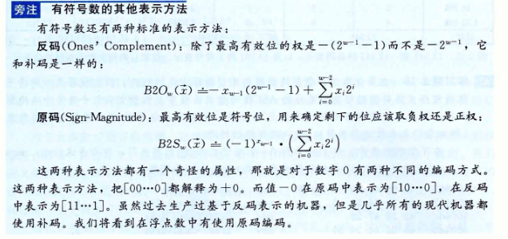
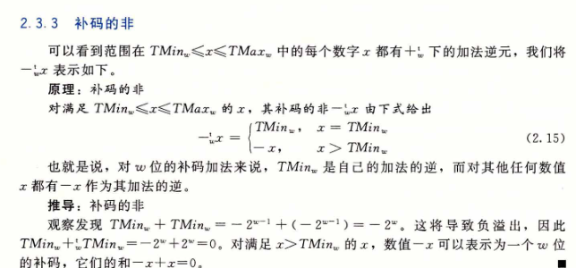
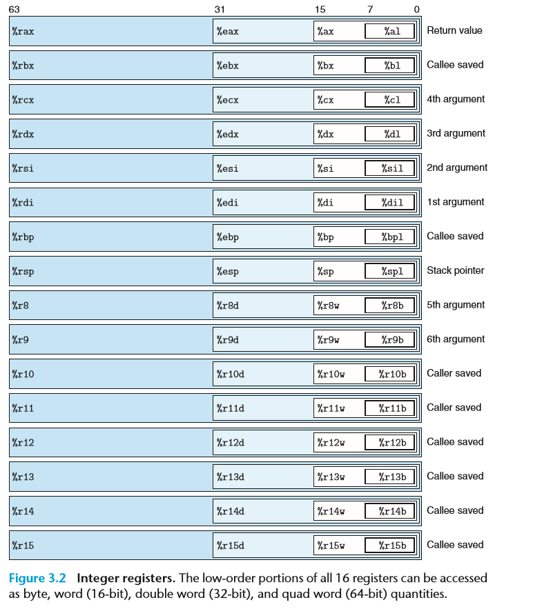

# Textbooks

- Computer Systems: A Programmer's Perspective, Third Edition (cs:app3e) Pearson,2016
- http://csapp.cs.cmu.edu/
- The C Programming Language, Second Edition, Prentice Hall, 1988

I think a  really good strategy for studying and preparing for this course would be to **read each chapter three times**

# Aim

- 了解编译系统

  - **优化程序性能**

    比如：

    1. 一个switch语句是否总是比一系列的if-else语句高效的多？

       [switch是如何实现的](#循环和switch)

    2. 一个函数调用的开销有多大？

    3. while循环比for循环更有效吗?

    4. 指针引用比数组索引更有效吗？

    5. 为什么将循环求和的结果放到一个本地变量中，会比将其放到一个通过引用索引传递过来的参数中，运行起来快很多呢？

    6. 为什么我们只是简单的重新排列一下算术表达式的括号就能让函数运行的更快？

  - 理解链接时出现的错误

    1. 连接器报告说它无法解析一个引用，这是什么意思
    2. 静态变量和全局变量的区别是什么？
    3. 如果你在不同的C文件中定义了名字相同的两个全局变量会发生什么？
    4. **静态库和动态 库的区别是什么？**
    5. 我们在命令行上排列库的顺序有什么影响？
    6. 为什么有些链接错误直到运行时才会出现

  - 避免安全漏洞。 常见的漏洞攻击: 缓冲区溢出攻击


# 第一周(chapter I)

**计算需要先有菜谱，然后有执行步骤，最后有数据结构与算法，最后才是实现**

信息就是位+上下文

源程序就是一个由值0和1组成的位(又成bit比特)，8位被组织成一组，称为字节byte

> 一定要理解bit和byte的关系，最高有效**byte**字节包含bit[x<sub>w-1</sub>,x<sub>w-2</sub>x<sub>w-3</sub> ….. x<sub>w-8</sub>], 最低有效字节包含位[x<sub>7</sub>, x<sub>6</sub>, …., x<sub>0</sub>]

上下文context: 操作系统保持追踪进程运行所需的所有状态信息. 包括许多信息,比如PC和寄存器文件的当前值,以及主存的内容.

在任何一个时刻,单处理器系统都只能执行一个进程的代码,当操作系统决定要把控制权从当前进程转移到某个新进程时,就会进行**上下文切换context switch** 即保存当前进程的上下文,恢复新进程的上下文,然后将控制权传递到新进程.

示例场景中有两个并发的进程,shell进程和hello进程,最开始只有shell进程在运行,即等待命令行上的输入. 当我们让它运行hello程序时,shell通过调用一个专门的函数,即**系统调用**,来执行我们的请求,系统调用会将控制权传递给操作系统, 操作系统保存shell进程的上下文,创建一个新的hell进程及其上下文,然后将控制权传给新的hello进程, hello进程终止后,操作系统恢复shell进程的上下文, 并将控制权传回给它.<sup>P12</sup>

从一个进程到另一个进程的转换是**由操作系统内核(kernel)管理的** 内核是操作系统代码常驻内存的部分. 当应用程序需要操作系统的某些操作时, 比如读写文件, 它就执行一条特殊的system call 系统调用指令,将控制权传递给内核, 然后内核执行被请求的操作并返回应用程序, 注意,内核不是一个独立的进程,相反,他是系统管理全部进程所用代码和数据结构的集合

## 进制转换

字母'a' ~ 'z' 的ASCII码为 0x61 ~ 0x7Az

## 整数和浮点数

除了最高有效位1， 整数的所有未都嵌在浮点数中。

例子:

12345的整型为0x00003039, 浮点数0x4640E400

3510593为0x00359141, 3510593.0为0x4A564504

​              0011 0101 1001 0001 0100 0001
​             001 101 0110 0100 0101 0000 01
0100 1001 0101 0110 0100 0101 0000 0100

## 布尔代数 Boolean algebra

|signal | logical operations  | |
|--|--|--|
|~ tilde | Complement 补集 取反| A&B = 1 when both A=1 and B=1 |
|& ampersand | Intersection 与 相同为1/0 不同为0|  A|B = 1 when either A = 1 or B = 1 |
|\| | Union OR 或 相同为0/1 不同为1| ~A =1 when A = 0 |
|^ | symmetric difference  EXCLUSIVE-OR 异或 相同为0， 不同为1| A^B = 1 when either A = 1 Or B = 1, but not A = B |


十进制计算的时候: ~y = -y - 1

symmetric difference  对称差:两个集合的对称差是只属于其中一个集合，而不属于另一个集合的元素组成的集合 

**当p=1 and q = 0 Or p =1 and q=1 是 P^Q =1, 即 什么数和1异或都等于1**

布尔代数和整数运算有很多相似之处，具有分配律，集合律等

整数运算的一个属性是每个值x都有一个加法逆元(additive inverse)-x,  使得x+(-x)=0 

布尔代数这里的"加法"运算是^ , 也就是**对于任何值a来说，这里a^a=0**

应用:[只出现一次的数字](https://leetcode-cn.com/problems/single-number/)

[寻找重复数](https://leetcode-cn.com/problems/find-the-duplicate-number/)

## 位级运算和逻辑运算，移位运算

首先要分清它们之间的优先级(按照从左至右结合性规则依次递减，!,移位>><<, &,^,|,&&,||)，如果不清楚，请**加上括号**

逻辑运算:

! 经常读作bang, 表示非

> 认为所有非0的参数都表示**True** 返回1/0x01, 参数0表示**flase** 返回0/0x00, <sup>P37-39</sub> 

而Golang中是不支持integer 与boolean 互相转换的

> Early Termination: 如果对第一个参数求值就能确定表达式的结果, 逻辑运算符就不会对第二个参数求值

应用:`a&&5/a`将不会造成被零除, p&&*p++也不会导致间接引用空指针

shift Operations:
> 从左至右结合
> 逻辑右移logical shift 和算术右移 Arithmetic shift 的区别: 算术右移是在左端补k个最高有效位的值,即是0就补0,1就补1

# 第二周

## C语言中的有符号数与无符号数

**TMAX<sub>w</sub> = 2<sup>w-1</sup> - 1** 

**TMIN<sub>w</sub> = -2<sup>w-1</sup>** 

> 在本节中，我们描述用位来编码整数的两种不同的方式: 一种只能表示非负数(无符号数)，一种能够表示负数、零和正数.<sup>P41</sup> 
>
> C 语言标准中没有指定**有符号数**要采用某种表示，但是几乎所有的机器都**使用补码 two's Complement**
>
> 在计算内部 整数也都是按照**补码存放的**

有符号数是用补码来表示的

> ```c
> short sx = -12345;
> unsigned uy = sx;
> ```
>
> X当把short 4byte 16bit 转换成 unsigned 8bytes 32bit时， 我们要先改变大小，之后再完成从有符号到无符号的转换，也就是说(unsigned) sx 等价于 (unsigned)(int)sx。

补码的计算规则有两种

1.    二进制转换补码的方法:
   $$
      B2Tw(\mathop{{x}}\limits^{{\to}})
      =−x\mathop{{}}\nolimits_{{w−1}}2\mathop{{}}\nolimits^{{w−1}} +\mathop{\sum}\limits_{{i=0}}^
      {{w−2}} \mathop{{x}}\nolimits_{{4}}\mathop{{2}}\nolimits^{{i}}
   $$

   $$
   B2T4([1011]) =− 1*2^3+0*2^2+1*2^1+1*2^0 =−8 + 0+2+1 =−5
   $$

2. 补码转换二进制的方法:  

   先写正数的二进制表示2^N，对于负数

   1.   整数的B取反加1， 即`~x+1`
   2. 按照BtT的反规则推. 首位是`-2^N`

改变大小，就要扩展这个数字sx的位表示，从16位cf f7到32位ff ff cf f7，这个规则是C语言标准要求的

> x=9 和y=12的位表示分别为[1001]和[1100], 它们的和是21,5位的表示为[10101], 丢弃最高位是[0101] 也就是十进制的5,这和值21 mod 16 = 5是一致的

截断一个数字可能会改变它的值–>溢出的一种形式(a form of overflow)

> 通过观察发现x+y>=x, 因此如果s没有溢出,我们能够肯定s>=x. 另一方面,如果s确实溢出了,我们就有s=x+y-2<sup>w</sup>. 假设y<2<sup>w</sup> < 0, 因此s=x+(y-2<sup>w</sup>) < x

##### 为什么选择补码来表示有符号数



### 补码的非



**当一个无符号数y等于TMIN时， -y也等于TMIN**， 因为转换成了TMATX+1，又溢出成了TMIN

#### 补码非的位级表示

- 在C语言中，**对于任意整数值x,计算表达式`-x` 和`~x+1`得到的结果完全一样**

  [0101] 5    [1010]~x    [1011]incr(-x) -5 

  ```c
  int x;
  int y;
  unsigned ux = x;
  unsigned uy = y;
  ```
  判读真假: `x*~y + uy*ux = == -x` 

- 第二种方法: 建立在将位向量分为两部分的基础上， 假设k是最右边的1的位置，(只要x != 0 就能找到这样的k)。我们对位k左边的所有位取反

### 如何判断溢出

无符号数加法溢出: 在范围0<=x, y <= UMax<sub>w</sub> 中的x和y, 当且仅当s<x(等价地s<y)时,发生了溢出

```c
// unsigned scomplement
int uadd_ok(unsigned x, unsigned y) {
    unsigned sum = x + y;
    printf("%u %u %u\n", sum, x, y);
    return sum >= x;
}
```

有符号数加法溢出:  对满足Tmin<sub>w</sub>	<= x, y <= Tmax<sub>w</sub> 的x 和 y ， 令 s = x + $ \mathop{{}}\nolimits^{{t}}\nolimits_{{w}}y$. 当且仅当 x > 0, y > 0, 但 s <=0 时，计算s发生了正溢出，当且仅当x<0, y<0， 但 s >=0 时 s发生了负溢出

```c
// two's complement
int tadd_ok(int x, int y) {
    int sum = x + y;
    // 正溢出
    int pos_over = x >=0 && y >= 0 && sum < 0;
    // 负溢出 true 返回 1 false 返回 0
    int neg_over = x < 0 && y < 0 && sum >= 0 ;
    //      !1 && !1
    return !pos_over && !neg_over ;
}
```

有符号减法溢出: 

乘法溢出:

```c
int tmult_ok(int x, int y) {
   int p = x*y;
   /* Either x is zero, or dividing p by x gives y */
    return !x || p/x == y;
}
```

乘法溢出: 

```c
// c/c++ 其他高级语言基本不允许 不同type的value 比大小
int tmult_ok(int x, int y) {
    int64_t pll = (int64_t) x * y;

    return pll == (int) pll;
}
```
> c 中 利用 不同类型进行比较的例子
>
> ```c
> #define int size_t;
> int ele_cnt;
> 
> uint64_t required_size = ele_cnt * (uint64_t) ele_size;
> size_t request_size = (size_t) required_size;
> if (required_size != request_size )
>     /* Overflow must have occurred. Abort operation */
>     return NULL;
> void *result = malloc(request_size);
> if (result == NULL) 
>     /* malloc failed */
>     return NULL;
> ```
>
> 

### 运算操作

**本质: 一个mod2^N的 同余类上的运算, 满2^N会溢出，抛弃进位**, 

> 同类余:
> 两个整数a,b,若它们除以正整数m所得的余数相等，则称a,b对于模m同余。
> 26 = 24 (mod 12)
>
> 12 = 26 (mod 12)

只要使用**加法和移位**，就可以完成所有加减乘除运算

模数加法形成了一种数据结构，称为阿贝尔群

#### 加法

有符号数在补码表示下, 无论加法是否溢出 (x+y)-y总是会求值得到x. 这是因为**补码加**会形成一个阿贝尔群

> 在大多数机器上，整数乘法指令相当慢，需要10个或者更多的时钟周期，而其他整数运算(例如 加法、减法、危机运算、和移位)只需要1个时钟周期， 因此 **编译器**试着用移位和加法运算的组合来代替乘以常数因子的乘法

#### 减法

减法会转换为加法。按补码形式进行运算。unsigned int 加减乘除法也会按照补码计算，不过最后会按无符号规则进行输出

> **无符号数只是C语言抽象出来的一个概念。**机器码中没有区分无符号数和有符号数，只是看寄存器的标志位SF（Sign Flag）来决定它的符号，加、减法运算都是统一由加法器来实现的。
>
> [A+B]补=[A]补 + [B]补
>
> [A-B]补=[A]补 + [-B]补

#### 乘法

先说结论: 有符号数和无符号数**截断后的乘积的bit表示是相同的**
```
        1110 -2 14  
        1101 -3 13
             6   182 
             0x6   0xb6
   1011 0110 
    // w =4 时 bit是一样的
```

### 关于整数运算的最后思考

计算机执行的"整数"运算 实际上是一种模运算形式

## 浮点数

> **注意,二进制下 形如0.111...1<sub>2</sub>, 表示刚好小于1的数**
>
> 二进制小数的表示的一个简单办法是: **讲一个数转化为形如$\frac{x}{2^k}$的小数**. 假分数的整数部分按2的幂从小到大表示,分数部分按2的负幂从大到小表示. 即`8 4 2 1 . 1/2 1/4 1/8`

### IEEE

$V=(-1)^s*M*x^E$

| 缩写 | 作用                          |
| ---- | ----------------------------- |
| s    | sign bit 符号位               |
| e    | exponent 阶码                 |
| f    | fraction/frac 分数            |
| M    | implicit leading 1, 隐式的1+f |
| Bias | 偏移量 $2^{{k-1}}-1$          |

float: s=1 k=8 f=23  Bias=127

double: s=1 k=11 f=52 Bias=1023

##### Normalized Form

Let's illustrate with an example, suppose that the 32-bit pattern is `1 1000 0001 011 0000 0000 0000 0000 0000`, with:

- `S = 1`
- `E = 1000 0001`
- `F = 011 0000 0000 0000 0000 0000`

In the *normalized form*, the actual fraction is normalized with an implicit leading 1 in the form of `1.F`. In this example, the actual fraction is `1.011 0000 0000 0000 0000 0000 = 1 + 1×2^-2 + 1×2^-3 = 1.375D`.

The sign bit represents the sign of the number, with `S=0` for positive and `S=1` for negative number. In this example with `S=1`, this is a negative number, i.e., `-1.375D`.

In normalized form, the actual exponent is `E-127` (so-called excess"-127" or bias"-127"). This is because we need to represent both positive and negative exponent. With an 8-bit E, ranging from 0 to 255, the excess-127 scheme could provide actual exponent of -127 to 128. In this example, `E-127=129-127=2D`.

Hence, the number represented is `-1.375×2^2=-5.5D`.

#### 舍入
IEEE采用的标准是 向最接近的值舍入(round-to-nearest) 即向偶数舍入(round-to-even). 最终要求的结果是: 最低有效数字是偶数

如: 1.5 和 2.5 都舍入成2


对于非中间数的. 则找一个最接近的匹配值 如1.4-->1 1.6-->2 

将 向偶数舍入法运用在二进制小数上: 我们将最低有效位的值0认为是偶数, 1认为是奇数

奇数向上舍入并+1,  偶数截断就好

中间值(Half way) when bits to right of rounding position = 100..<sub>2</sub> 

应用: round to nearest 1/4 (2 bits right of binary point)  小数点的第一位等于1/2. 这里保留2位,所以第三位可以看成小数点后的第一位

2 3/16 10.00**110<sub>2</sub>  10.01<sub>2</sub> (>1/2 up)  2 1/4

2 7/8 10.11**100<sub>2</sub>** 11.00<sub>2</sub>  (=1/2 up)    3

2 5/8 10.10**100<sub>2</sub>** 10.10<sub>2</sub>  (=1/2 down)   2 1/2

## 第二章 Representing and Manipulating Information 总结

unsigned int 用 bit 直接表述

signed int 计算机用two's complement 实现 

溢出这种问题要注意

shift Operations: 在计算字节大小， 传输数据的大小， 硬件设备的大小时相当有用

kib >> 10 >> 10

Kib    Mib   Gib

浮点数要考虑的情况较多， 这里只记录常规形式 理解在计算机里是如何表达的即可

# 第三周


寄存器:

- 程序计数器 PC 给出将要执行的小一条指令在内存中的地址
- 整数寄存器文件   存储地址或整数数据，保存临时数据
- 条件码寄存器     最近执行的算术或逻辑指令的状态信息，用来实现控制或数据流中的条件变化，比如if while等
- 一组 向量寄存器  存放一个或多个整数或浮点数

> 机器代码只是简单的将内存看成一个很大的、按字节寻址的数组。汇编代码不区分有符号或无符号整数，不区分各种类型的指针

> 程序内存包含： 程序的可执行机器代码，操作系统需要的一些信息，用来管理过程调用和返回的运行时栈，用户分配的内存块(比如说用malloc库函数分配的)。

#### 寄存器


| code                        | 意义                                                         |
| --------------------------- | ------------------------------------------------------------ |
| %rip                        | PC 程序计数器，                                              |
| push                        | 压入程序栈                                                   |
| pushq                       | 将四字(quad words)压入栈                                     |
| movb movw movl  movq  S,D      D<-S | 传送字节  传送字  传送双字 传送四字                          |
| movzbl movzbw movzlq movzwq S, R   R<-(零扩展)S | 做零扩展后传送置字节，字,双字，四字                          |
| movsbl movsbw movsbl movsbq   S, R   R<-(符号扩展)S | 做符号扩展后传送到字节， 字 双字 四字                        |
| leaq S,D     D<-&S          | 加载有效地址(load effective address) 将有效地址写入到目的操作数[即生成指针]，还可以进行普通的算术操作 |
| cltq | 把%eax符号扩展到%rax |
| CMP   S1, S2                | 比较。  根据两个操作数之差来设置条件码，与SUB指令的行为是一样的，但是不会9修改dest里的值，只会设置四个condition flags |
| TEST  S1, S2                | 测试.   TEST指令的行为与AND指令一样<br />test %rax, %rax 用来检测%rax是零、负数、还是正数，至于是>= 0还是==0还是<=0，依据值类型而定 |

> word 字 16bit
>
> double words 双字 32bit
>
> quad words 四字 64bit

| C declaration | Intel data type | Assembly-code suffix 汇编后缀 | Size (bytes) |
| ------------- | --------------- | ------------------- | ------------ |
| char | Byte | b    | 1    |
| short | Word | w | 2  |
|int | Double word | l| 4|
|long| Quad word |q| 8 |
|char *| Quad word |q |8 |
|float| Single precision 单精度 | s| 4|
|double | Double precision 双精度 | l |8|



**整数寄存器，16个寄存器的低位部分都可以作为字节，字，双字，四字**

| Register | Usage                                                        | Preserved across function calls 在函数调用中保存 |
| -------- | ------------------------------------------------------------ | ------------------------------- |
| %rax     | 1st return register, number of vector registers  used        | No                              |
| %rbx     | callee-saved register; base pointer                          | Yes                             |
| %rcx     | pass 4th integer argument to functions                       | No                              |
| %rdx     | pass 3rd argument to functions, 2nd return register          | No                              |
| %rsp     | **stack point**                                              | Yes                             |
| %rbp     | callee-saved register, **frame pointer**                     | Yes                             |
| %rsi     | used to pass 2nd argument to functions                       | No                              |
| %rdi     | used to pass 1st argument to functions                       | No                              |
| %r10    | temp register, used for passing a function's static chain ptr | No                              |
| %11  | temp register | No                              |
|%r12,%r13,%r14,%r15| callee-saved register|Yes|

必须记忆的 

| register | 作用 |
| -------- | ---- |
| %rax  | 返回值，Temporary data |
| %rbx | 被调用者保护 |
| %rbp  | 帧指针     被调用者保存 |
| %rsp | 栈指针Location of runtime stack, 用来指明 run-time栈的结束位置 , used to indicate the end position in the run-time stack |
| %rip | 程序计数器/指令指针instruction point, 当前正在执行指令的地址location of current code control point. |

l或b结尾的是8位，x/i结尾的是16位，e开头的是32位，r开头的是64位

>  **为什么C中只能最多返回一个值**? 因为只有一个寄存器%rax
>
> 发散之go
>
> 1. go自己实现了栈
> 2. 参数传递依赖于栈（存疑？待求证）
> 3. 参数返回也是保存在栈帧。（这也就是go可以有多个返回值的原因）

#### operand Specifiers /操作数指示符

- 立即数寻址 $Imm

  在ATT格式的汇编代码中，书写方式是**$后面跟一个整数(c标准表示的)** 如`$-577 或 $0x1F`

- 寄存器寻址 **r<sub>a</sub>** 

  符号**r<sub>a</sub>** 表示任意寄存器a

- 存取器寻址 

  M<sub>b</sub>[Addr] 表示 **对存储在内存中从地址Addr开始的b个字节值的引用**

- 间接寻址 (**r<sub>a</sub>** )

| Type | Form | Operand value | Name |
| ---- | ---- | ------------- | ---- |
|Immediate |$Imm |Imm |Immediate |
|Register |ra |R[ra] |Register |
|Memory |Imm |M[Imm]| Absolute |
|Memory |(ra) |M[R[ra]] |Indirect|
|Memory |Imm(rb)| M[Imm+R[rb]]| Base + displacement |
|Memory |(rb,ri)| M[R[rb]+R[ri]]| Indexed |
|Memory |Imm(rb,ri)| M[Imm+R[rb]+R[ri]] |Indexed|
|Memory |(,ri,s) |M[R[ri]. s] |Scaled indexed |
|Memory |Imm(,ri,s) |M[Imm+R[ri]. s]| Scaled indexed |
|Memory |(rb,ri,s)| M[R[rb]+R[ri]. s] |Scaled indexed |
|Memory |Imm(rb,ri,s)| M[Imm+R[rb]+R[ri]. s] |Scaled indexed|

#### 压入和弹出栈数据

> 栈可以实现为一个数组，在x86-64中，程序栈存放在内存中某个区域。**栈向下增长,从高地址向低地址增长,栈顶指针值会减 8的倍数, 栈顶元素的地址是所有栈中元素地址中最低的**，%rsp 保存着栈顶元素的地址

`pushq %rbp`的行为等价于下面两条指令

```assmbly
subq $8, %rsp      Decrement stack point 
movq %rbp, (%rsp)  Store %rbp on stack 
```

#### shift Operations:

1. 移位量是一个立即数或者放在单字节寄存器%cl中
2. 移位操作对w位长的数据值进行操作，移位量是由%cl寄存器的低m位决定的，这里2<sup>m</sup>=w,高位会被忽略

#### 特殊的算术运算

> P134 对于大多数的64位除法应用来说，除数也常常是是一个64位的值，这个值应该存放在%rax, %rdx的位应该设置为全0(无符号运算)或%rax的符号位(有符号运算), 有符号运算的操作可以用指令cqto来完成。这条指令不需要操作数—–它隐含读出%rax的符号位，并将它复制到%rdx的所有位

#### Condition Code

描述了最近的算术或逻辑操作的属性，可以检查这些寄存器来执行条件分支指令。

条件码通常不会直接读取，常用的使用方法有三种:

1. 可以根据条件码的某种组合，将一个字节设置为0 or 1，
2. 可以条件跳转到程序的某个其他的部分
3. 可以有条件地传送数据

#### 循环和switch

- 跳转表通过数组或者平衡二叉树实现，
- case是负数或case从极大值开始会增加bias偏置量,通过加或减去bias让第一个case等于0，以免出现**负数索引**
- case具有大跨度且数量较少[即相对稀疏]的情况会转换为if—elseif-else树																																																																																																																																						

> 一个switch语句是否总是比一系列的if-else语句高效的多？
>
> 答: 先来说清楚switch的基本概念。
>
> - 可以根据一个整数索引值进行多重分支(multiway branching)
> - 使用跳转表(jump table)，优点执行switch case语句的时间和switch case的数量无关
> - gcc根据case的数量和switch的稀疏程度来翻译switch语句
> - switch的case较多(4 or more ) 并且值的范围跨度比较小时，就会使用跳转表

### 过程

> 当过程P调用过程Q时，P的代码必须首先把参数复制到适当的寄存器中。P168
>
> 通过寄存器最多传递6个整型(整数和指针)参数
>
> **超过6个部分通过栈来传递，通过栈传递参数时,所有的数据大小都向8的倍数对齐**
>
> 使用地址运算符&，调用代码必须分配一个栈帧stack frame
>
> 寄存器%rbx,%rbp和%r12~%r15 被划分为被调用者保存寄存器callee saved register。过程P调用过程Q时，Q必须保存这些寄存器的值。要么根本不去改变它，要不push %rbx 到栈中返回前pop %rbx
>
> > **Callee-saved registers** (AKA **non-volatile** registers, or **call-preserved**) are used to hold **long-lived values** that should be preserved across calls.
>
> 其他的寄存器(除了栈指针%rsp)被划分为 caller saved 调用者保存寄存器，这就意味着任何函数都能修改它们， 在调用之前是否保存这个数据是调用者(父函数)的责任
>
> > **Caller-saved registers** (AKA **volatile** registers, or **call-clobbered**) are used to hold **temporary** quantities that need not be preserved across calls.

每次函数调用都有它自己私有的状态信息(保存的返回值和被调用者保存寄存器的值)存储空间，如果需要，它还可以提供局部变量的存储[即栈空间]


> 当参数少于7个时， 参数从左到右放入寄存器: rdi, rsi, rdx, rcx, r8, r9。
> 当参数为7个以上时， 前 6 个与前面一样， 但后面的依次从 “右向左” 放入栈中，从右向左是为了准确的开辟内存空间
>
> 参数个数大于 7 个的时候
> H(a, b, c, d, e, f, g, h);
> a->%rdi, b->%rsi, c->%rdx, d->%rcx, e->%r8, f->%r9
> h->8(%esp)
> g->(%esp)
> call H
>
> [Reference](http://abcdxyzk.github.io/blog/2012/11/23/assembly-args/)

# 第四周

对抗缓冲区溢出(buffer overflow)攻击

1. 栈随机化

2. 栈破坏检测

   The instruction argument`%fs:40` is an indication that the canary value is read from memory using segmented addressing

   指令参数%fs:40知名金丝雀值用 段寻址从内存中读入

3. 限制可执行代码区域

### tools

#### gcc
```
gcc
-Og 告诉编译器使用会生成符合原始C代码整体结构的机器代码的优化级别
-O1
-O2 公司常用
-S 生成 汇编代码
-c 生成 目标代码  是二进制格式的
```

#### objdump

反汇编`objdump -d 可执行文件`

#### gdb

```shell
gdb 可执行文件

(gdb) disassemble sumstore // disassemble procedure

(gdb) x/14xb sumstore // Examine the 14 bytes starting at sumstore

(gdb) bt // print stack
(gdb) run // run
(gdb) break XX // XX可以是printf main等
(gdb) n // next 下一步
(gdb) stepi // 执行1条指令
(gdb) stepi 4 // 执行4条指令
(gdb) nexti  // 类似stepi 但以函数调用为单位
(gdb) p $rcs // 以整数值查看寄存器里面的值 或 i registers rcx
(gdb) tui enable / tui diable  // 开/关 windows
(gdb) layout regs //显示通用寄存器窗口
(gdb) layout split // Display the source, assembly, and command windows.
(gdb) tui reg float // 浮点寄存器
(gdb) b // 断点
(gdb) clear number // 清楚断点 number是文件中的行号 info b 可以获取断点信息 clear 删除断点是基于行的，不是把所有的断点都删除。
(gdb) delete [breakpoints num] [range] // delete可删除单个断点，也可删除一个断点的集合，这个集合用连续的断点号来描述。

设置参数
(gdb) set args … // 设置函数运行参数
(gdb) set args psol.txt

检查数据
(gdb) print $rax   // 以十进制输出%rax的内容
(gdb) print /x $rax  // 以十六进制输出%rax的内容
(gdb) print /t $rax  // 以二进制输出%rax的内容
(gdb) print 0x100  // 输出0x100的十进制表示
(gdb) print (char*)(0x402400) ;查看内存中字符串
(gdb) help x
Examine memory: x/FMT ADDRESS.
ADDRESS is an expression for the memory address to examine.
FMT is a repeat count followed by a format letter and a size letter.
Format letters are o(octal), x(hex), d(decimal), u(unsigned decimal),
  t(binary), f(float), a(address), i(instruction), c(char), s(string)
  and z(hex, zero padded on the left).Size letters are b(byte), h(halfword), w(word), g(giant, 8 bytes).
 (gdb) x/2g 0x7fffffffe818  检查从地址0x7ffffffe818开始的双(8字节)字
 (gdb) x/20b multstore 检查函数multstroe 的前20个字节
 (gdb) x/s x/s 0x402400  // 检查地址0x402400的值并以字符串形式输出
   0x402400:       "Border relations with Canada have never been better."
 (gdb) x ($rsp+0x10) 同上
 (gdb) x/6c $rbx
0x6038c0 <input_strings+320>:   97 'a'  98 'b'  99 'c'  100 'd' 101 'e' 102 'f'

https://github.com/hellogcc/100-gdb-tips/blob/master/src/index.md
```

https://www.lanqiao.cn/courses/221

https://www.lanqiao.cn/courses/83

因为%rbx存了上一个函数保存的信息，当前函数需要用到这个寄存器，就先把这个寄存器里的值先存到内存栈上，完成之后再把内存栈的值restore回%rbx。  有点进程切换保存上下文的味道

### 总结

结合第三章的内容和读书会第一期所思: 与二进制直接打交道的情况比较少，与16进制打交道比较多，如：java的进程号、进程地址都是16进制，socket的source IP  port和 dest IP port也是16进制，还有一种更加常见strace或pref所显示的调用栈更加是16进制+机器码。还有一个很典型的core文件

所以以我看来 汇编带给我的更多是 运维排查方面的提高，毕竟直接使用汇编语言的场景还是很少的

# 第五周

第6章 存取器层次结构

### 名词解释

| 名词                                            | 解释                                                         |
| ----------------------------------------------- | ------------------------------------------------------------ |
| RAM 随机访问存储器(Random-Access Memory)        |                                                              |
| SRAM 静态随机访问存储器                         | 高速缓存存储器，既可以在CPU芯片上，也可以在片下。采用六晶体管电路来实现, 只要有电，就会永远地保持它的值 |
| DRAM 动态                                       | 即常见的内存，采用电容来显示，对干扰非常敏感                 |
| DDR3 SDRAM(Double Data-Rate Synchronous DRAM)   | 双倍速率同步DRAM  使用两个时钟沿作为控制信号，从而使DRAM的速度翻倍 |
| ROM(Read-Only Memory) 只读存储器                | 非易失性存储器                                               |
| EEPROM(Electrically Erasable Programmable ROM)  | 电子可擦写可编程ROM                                          |
| 总线事务(bus transaction)                       | CPU和主存之间的数据传送，分为读事务和写事务                  |
| PCIe(Peripheral Component Interconnect express) | 外围设备互连总线，对接I/O设备                                |
| DMA传送(Direct Memory Access transfer)          | 直接内存访问 传送                                            |

### 局部性

- 时间局部性

- 空间局部性

  | 名词                                       | 解释                                                         |
  | ------------------------------------------ | ------------------------------------------------------------ |
  | 顺序引用模式(sequential reference pattern) | 步长为1的引用模式(stride-1 reference pattern)， 一般而言，随着步长的增加，空间局部性下降 |
  | cache                                      | 读作"cash"                                                   |
  |                                            |                                                              |

  存储器层次结构的中心思想是: 对于每个k, 位于k层的更快更小的存储设备作为位于k+1层的更大更慢的存储设备的缓存。换句话说，层次结构中的每一层都缓存来自较低一层的数据对象

**MMU是CPU芯片的一部分，而TLB(快表)是MMU的一部分**。TLB(Translation Lookaside Buffer): 被用作地址翻译，专门用于改进虚拟地址到物理地址转换速度的缓存。**其访问速度非常快，和寄存器相当，比L1访问还快。**

### 编写高速缓存友好的代码

1. 让最常见的情况运行的快。

   集中再核心函数里的循环上

2. 尽量减小每个循环内部的缓存不命中数量

   1. 对局部变量的反复引用。一旦从存储器读入一个数据对象，就尽可能多地使用它
   2. 按照数据对象存储在内存中的顺序、以步长为1的 读数据
   3. 多维数组进行操作的程序中，空间局部性尤其重要

