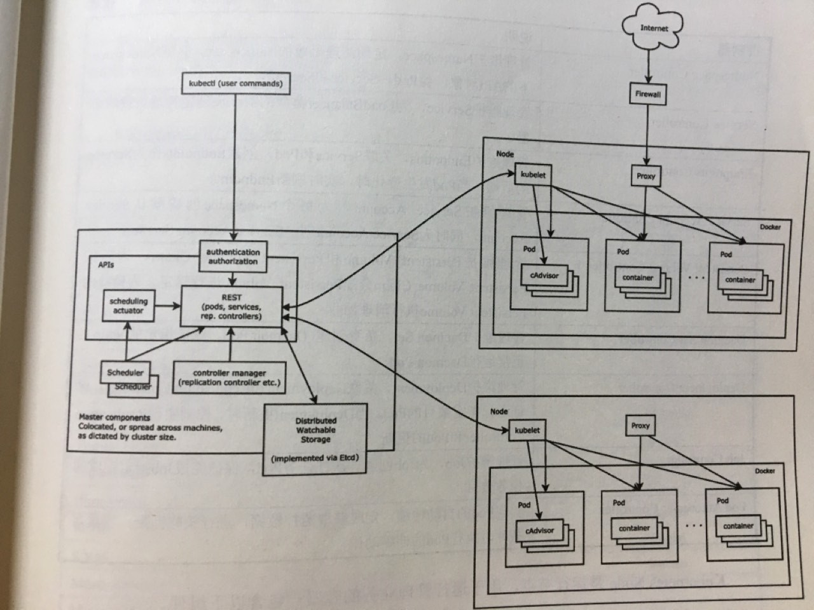

# 源码级别

http://blog.csdn.net/u010278923/article/details/52276333
http://blog.csdn.net/u010278923/article/category/6361923
http://www.cnblogs.com/xuxinkun/p/5753725.html


The worker node(s) host the pods that are the components(组件) of the application

The master node(s) manages the worker nodes and the pods in the cluster. Multiple master nodes are used to provide a cluster with failover and high availability.




# Master

- kube-apiserver

  The API server is a component of the Kubernetes [control plane](https://kubernetes.io/docs/reference/glossary/?all=true#term-control-plane) that exposes the Kubernetes API. The API server is the front end for the Kubernetes control plane.

- etcd

​       Consistent and highly-available key value store 用于存储所有集群信息 类似zookeeper

- kube-scheduler

  调度器

- kube-controller-manager
  逻辑上，每一个控制器是一个separate(单独的)进程,但是为了降低复杂性,他们都跑在一个进程里

  These controllers include:

    - Node Controller: Responsible for noticing and responding when nodes go down.
    - Replication Controller: Responsible for maintaining the correct number of pods for every replication controller object in the system.
    - Endpoints Controller: Populates the Endpoints object (that is, joins Services & Pods).
    - Service Account & Token Controllers: Create default accounts and API access tokens for new namespaces.

-  cloud-controller-manager与 kCM 类似
  [自建暂无需了解](https://kubernetes.io/zh/docs/concepts/architecture/cloud-controller/)

# Node

1. kubelet
确保容器跑在pod里，通过一系列的PodSpecs
kubelet采用一组通过各种机制提供的PodSpecs(pod配置)，并确保那些PodSpecs中描述的容器运行正常。kubelet无法管理不是由Kubernetes创建的容器。

2. kube-proxy
network proxy that runs on each node in your cluster,实现Kubernetes Service概念的一部分
3. Container Runtime
The container runtime is the software that is responsible(负责) for running containers.

# 插件

所有插件都在 `kube-system` namespace

- DNS
- WEB UI(Dashboard)
- Container Resource Monitoring
Container Resource Monitoring records generic time-series metrics about containers in a central database, and provides a UI for browsing that data.
- Cluster-level Logging

# 一个合格的pod配置

### Required Fields

In the `.yaml` file for the Kubernetes object you want to create, you’ll need to set values for the following fields:

- `apiVersion` - Which version of the Kubernetes API you’re using to create this object哪一个api
- `kind` - What kind of object you want to create什么类型的object
- `metadata` - Data that helps uniquely identify the object, including a `name` string, `UID`, and optional `namespace` 帮助标记的标识符
- `spec` - What state you desire for the object 期望的容器状态即具体配置

The [Kubernetes API Reference](https://kubernetes.io/docs/reference/generated/kubernetes-api/v1.17/) can help you find the spec format for all of the objects you can create using Kubernetes. For example, the `spec` format for a `Pod` can be found [here](https://kubernetes.io/docs/reference/generated/kubernetes-api/v1.17/#podspec-v1-core), and the `spec` format for a `Deployment` can be found [here](https://kubernetes.io/docs/reference/generated/kubernetes-api/v1.17/#deploymentspec-v1-apps).

## Kubernetes 对象

Kubernetes 包含若干用来表示系统状态的抽象层，包括：已部署的容器化应用和负载、与它们相关的网络和磁盘资源以及有关集群正在运行的其他操作的信息。这些抽象使用 Kubernetes API 对象来表示。有关更多详细信息，请参阅[了解 Kubernetes 对象](https://kubernetes.io/docs/concepts/overview/working-with-objects/kubernetes-objects/)。

基本的 Kubernetes 对象包括：

- [Pod](https://kubernetes.io/docs/concepts/workloads/pods/pod-overview/)
- [Service](https://kubernetes.io/docs/concepts/services-networking/service/)
- [Volume](https://kubernetes.io/docs/concepts/storage/volumes/)
- [Namespace](https://kubernetes.io/docs/concepts/overview/working-with-objects/namespaces/)

Kubernetes 也包含大量的被称作 [Controller](https://kubernetes.io/docs/concepts/architecture/controller/) 的高级抽象。控制器基于基本对象构建并提供额外的功能和方便使用的特性。具体包括：

- [Deployment](https://kubernetes.io/docs/concepts/workloads/controllers/deployment/)
- [DaemonSet](https://kubernetes.io/docs/concepts/workloads/controllers/daemonset/)
- [StatefulSet](https://kubernetes.io/docs/concepts/workloads/controllers/statefulset/)
- [ReplicaSet](https://kubernetes.io/docs/concepts/workloads/controllers/replicaset/)
- [Job](https://kubernetes.io/docs/concepts/workloads/controllers/jobs-run-to-completion/)


# Pod

每个pod里运行这一个特殊的被称之为Pause的容器,其他容器则为业务容器, 这些业务容器共享Pause容器的网络栈和Volume挂载卷,因此它们之间的通信和数据交换更为高效, 在设计时我们可以充分利用这一特性将一组密切相关的服务进程放入到同一个pod中`--pod-infra-container-image`

# Label

1. 版本标签

   "release" : "stable"

   "release" : "canary"

2. 环境标签

   "environment" : "dev"

   "environment" : "qa"

   "environment" : "production"

3. 架构标签

   "tier" : "frontend"

   "tier" : "backend"

   "tier" : "middleware"

4. 分区标签

   "partition" : "customerA"

5. 质量管理标签

   "track" : "daily"

   "track" : "weekly"

   ```
   name=redis-slave,env!=production
   name notin (php-frontend),env!=production
   kubectl get pods -l app=banksteel-go-web,track!=stable -n dev
   ```

   ```yaml
   selector:
     matchLabels:
       app: myweb
     matchExpressions:
       - {key: tier, operator: In, values: [frontend]}
       - {key: enviroment, operator: NotIn, values: [dev]}
   ```


# Persistent Volume

kuberbetes集群中的某个网络存储中对应的一块存储, 它与Volume很类似

PVC(persistentVolumeClaim)

# Annotation(注解)

类似label, 

- build信息, release信息, docker镜像信息, 例如时间戳, release id 号, PR号
- 日志库, 监控库, 分析库等资源库的地址信息