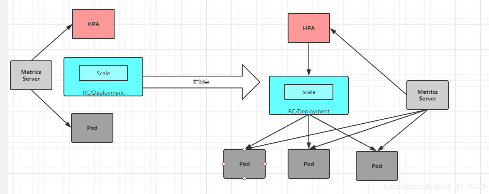

# Horizontal Pod Autoscaler（HPA）

1. HPA的工作原理

k8s中的某个Metrics Server（Heapster或自定义Metrics Server）持续采集所有Pod副本的指标数据。HPA控制器通过Metrics Server的API（Heapster的API或聚合API）获取这些数据，基于用户定义的扩缩容规则进行计算，得到目标Pod副本数量。当目标Pod副本数量与当前副本数量不同时，HPA控制器就访问Pod的副本控制器（Deployment 、RC或者ReplicaSet）发起scale操作，调整Pod的副本数量，完成扩缩容操作。
   

   接下来首先对HPA能够管理的指标类型、扩缩容算法、HPA对象的配置进行详细说明，然后通过一个完整的示例对如何搭建和使用基于自定义指标的HPA体系进行说明。

2. 指标的类型
   

Master的kube-controller-manager服务持续监测目标Pod的某种性能指标，以计算是否需要调整副本数量。目前k8s支持的指标类型如下。

- Pod资源使用率：Pod级别的性能指标，通常是一个比率值，例如CPU使用率。
- Pod自定义指标：Pod级别的性能指标，通常是一个数值，例如接收的请求数量。
- Object自定义指标或外部自定义指标：通常是一个数值，需要容器应用以某种方式提供，例如通过HTTP URL“/metrics”提供，或者使用外部服务提供的指标采集URL。

3. 扩缩容的算法详解

   `desiredReplicas = ceil[currentReplicas * (currentMetricValue / desiredMetricValue)]`

4. HorizontalPodAutoscaler配置详解

基于autoscaling/v2beta2的HorizontalPodAutoscaler配置：
```yaml
   apiVersion: autoscaling/v2beta2
   kind: HorizontalPodAutoscaler
   metadata:
     name: nginx-hpa-v2beta
   spec:
     scaleTargetRef:
       apiVersion: apps/v1
       kind: Deployment
       name: nginx-deployment
     minReplicas: 3
     maxReplicas: 10
     metrics:
     - type: Resource
       resource:
         name: MONERY
         target:
          type: Utilization
          averageUtilization: 50
```


   主要参数如下。
   - scaleTargetRef：目标作用对象，可以是Deployment、ReplicationController或ReplicaSet。
   - minReplicas和maxReplicas：Pod副本数量的最小值和最大值，系统将在这个范围内进行自动扩缩容操作，并维持每个Pod的内存使用率为50%。
   - metrics：目标指标值。在metrics中通过参数type定义指标的类型；通过参数target定义相应的指标目标值，系统将在指标数据达到目标值时（考虑容忍度的区间，见前面算法部分的说明）触发扩缩容操作。

可以将metrics中的type（指标类型）设置为以下三种，可以设置一个或多个组合，如下所述。
（1）Resource：基于资源的指标值，可以设置的资源为CPU和内存。
（2）Pods：基于Pod的指标，系统将对全部Pod副本的指标值进行平均值计算。
（3）Object：基于某种资源对象（如Ingress）的指标或应用系统的任意自定义指标。

 ### Resource类型的指标可以设置CPU和内存。

对于CPU使用率，在target参数中设置averageUtilization定义目标平均CPU使用率。对于内存资源，在target参数中设置AverageValue定义目标平均内存使用值。指标数据可以通过API“metrics.k8s.io”进行查询，要求预先启动Metrics Server服务。

 ### Pods类型和Object类型都属于自定义指标类型，

指标的数据通常需要搭建自定义Metrics Server和监控工具进行采集和处理。指标数据可以通过API“custom.metrics.k8s.io”进行查询，要求预先启动自定义Metrics Server服务。

- 类型为Pods的指标数据来源于Pod对象本身，其中target指标类型只能使用AverageValue，示例如下

```yaml
metrics:
- type: Pods
  pods:
    metric:
      name: packets-per-second
    target:
      type: AverageValue
      averageValue: 1k
```
其中，设置Pod的指标名为packets-per-second，在目标指标平均值为1000时触发扩缩容操作。

- 类型为Object的指标数据来源于其他资源对象或任意自定义指标，其中target指标类型可以使用Value或AverageValue(根据Pod副本数计算平均值)进行设置。下面对几种常见的自定义指标给出示例和说明。

```yaml
metrics:
- type: Object
  object:
    metric:
      name: requests-per-second
    describedObject:
      apiVersion: extensions/v1beta1
      kind: Ingress
      name: main-route
    target:
      type: Value
      value: 2k
      
```
  例1，设置指标的名称为requests-per-second，其值来源于Ingress “main-route”，将目标值（value）设置为2000，即在Ingress的每秒请求数量达到2000个时触发扩缩容操作。

```yaml
metrics:
- type: Object
  object:
    metric:
      name: 'http_requests'
      selector: 'verb=GET'
    target:
      type: AverageValue
      averageValue: 500
```
例2，设置指标的名称为http_requests,并且该资源对象具有标签  “verb=GET”, 在指标平均值达到500时触发扩缩容工作。
还可以在同一个HorizontalPodAutoscaler资源对象中定义多个类型的指标，系统将针对每种类型的指标都计算Pod副本的目标数量，以最大值为准进行扩缩容操作。例如：

```yaml
apiVersion: autoscaling/v2beta2
kind: HorizontalPodAutoscaler
metadata:
  name: tomcat-hpa
  namespace: default
spec:
  scaleTargetRef:
    apiVersion: apps/v1
    kind: Deployment
    name: tomcat-hpa
  minReplicas: 1
  maxReplicas: 10
  metrics:
  - type: Resource
    resource: 
      name: cpu
      target:
        type: AverageUtilization
        averageUtilization: 50
  - type: Pods
    pods:
      metric:
        name: packets-per-seceond
      targetAverageValue: 1k
  - type: Object
    object:
      metric:
        name: requests-per-second
      describedObject:
        apiVersion: extensions/v1beta1
        kind: Ingress
        name: main-route
      target:
        kind: Value
        value: 10k
```