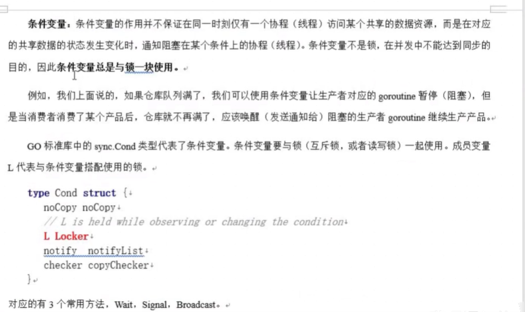
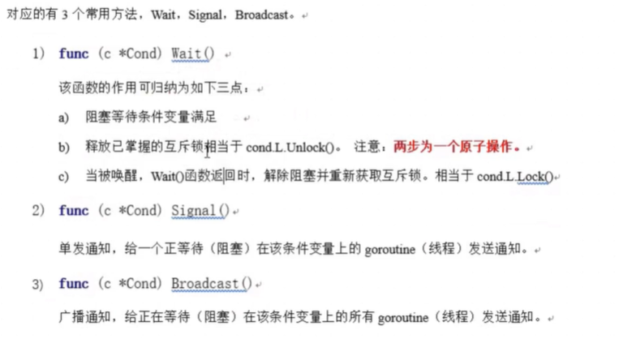

## Waitgroup

```go
var wg  sync.WaitGroup
wg.Add() // 计数器
wg.Done()// 计数器减一
wg.Wait()// 等待计数器结束
```

## 异步锁

```go
var lock sync.Mutex
lock.Lock()
lock.Unlock()
```

## 读写分离锁

```go
var lock sync.RWMutex
lock.RLock()
lock.RUnlock() // read

lock.Lock()
lock.Unlock() // write
```

## sync.Once

 提供了一个针对只执行一次场景的解决方案 `func (o *Once) Do(f func()) `加载配置文件示例

延迟一个开销很大的初始化操作到真正用到它的时候再执行是一个很好的实践。因为预先初始化一个变量（比如在init函数中完成初始化）会增加程序的启动耗时，而且有可能实际执行过程中这个变量没有用上，那么这个初始化操作就不是必须要做的。

```go
var icons map[string]image.Image

var loadIconsOnce sync.Once

func loadIcons() {
	icons = map[string]image.Image{
		"left":  loadIcon("left.png"),
		"up":    loadIcon("up.png"),
		"right": loadIcon("right.png"),
		"down":  loadIcon("down.png"),
	}
}

// Icon 是并发安全的
func Icon(name string) image.Image {
	loadIconsOnce.Do(loadIcons)
	return icons[name]
}
```

`sync.Once`其实内部包含一个互斥锁和一个布尔值，互斥锁保证布尔值和数据的安全，而布尔值用来记录初始化是否完成。这样设计就能保证初始化操作的时候是并发安全的并且初始化操作也不会被执行多次。

## sync.Map

Go语言中内置的map不是并发安全的。

 Go语言的`sync`包中提供了一个开箱即用的并发安全版map–`sync.Map`。开箱即用表示不用像内置的map一样使用make函数初始化就能直接使用。同时`sync.Map`内置了诸如`Store`、`Load`、`LoadOrStore`、`Delete`、`Range`等操作方法。 

```go
var m = sync.Map{}

func main() {
	wg := sync.WaitGroup{}
	for i := 0; i < 20; i++ {
		wg.Add(1)
		go func(n int) {
			key := strconv.Itoa(n)
			m.Store(key, n)
			value, _ := m.Load(key)
			fmt.Printf("k=:%v,v:=%v\n", key, value)
			wg.Done()
		}(i)
	}
	wg.Wait()
}
```

## atomic 

Go语言中原子操作由内置的标准库`sync/atomic`提供。 

 代码中的加锁操作因为涉及内核态的上下文切换会比较耗时、代价比较高。针对基本数据类型我们还可以使用原子操作来保证并发安全，因为原子操作是Go语言提供的方法它在用户态就可以完成，因此性能比加锁操作更好。

## Cond



