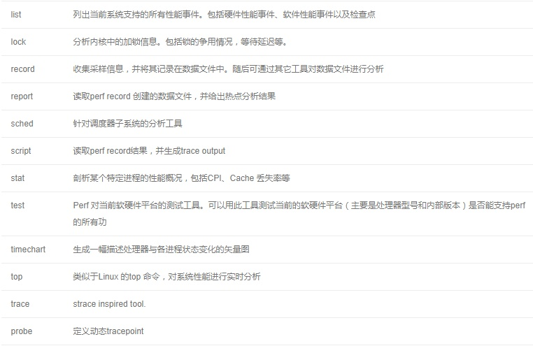
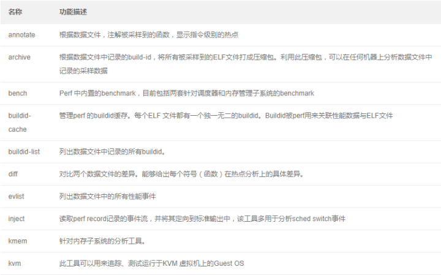

```
rpm -qa | grep <package name>
rpm -ql <package name>

```


## 排查工具

#### sysstat 

包含了常用的 Linux 性能工具，用来监控和分析系统的性能。我们的案例会用到这个包的两个命令 mpstat 和 pidstat。


#### mpstat 
是一个常用的多核 CPU 性能分析工具，用来实时查看每个 CPU 的性能指标，以及所有 CPU 的平均指标。

`$ mapstat -P ALL 1`

#### vmstat BUILT-IN  top之后第二选择

全局报告

```shell
-S, --unit <char>      define display unit
  requires k, K, m or M (default is KiB)
# Display active and  inactive memory
-w, wide wide output
-t, show timestamp
-a active/inactive memory
$ vmstat -a
procs -----------memory---------- ---swap-- -----io---- -system-- ------cpu-----
 r  b   swpd   free  inact active   si   so    bi    bo   in   cs us sy id wa st
 1  0    264 9974360 816312 113368    0    0     0     1    0    0  0  0 100  0  0

# 每隔5秒输出1组数据
$ vmstat 5
procs -----------memory---------- ---swap-- -----io---- -system-- ------cpu-----
 r  b   swpd   free   buff  cache   si   so    bi    bo   in   cs us sy id wa st
 0  0      0 7005360  91564 818900    0    0     0     0   25   33  0  0 100  0  0
```
  * cs(context switch) 每秒上下文切换的次数

  * in(interrupt) 每秒终端的次数

  * r (Running or Runnable)就绪队列的长度, 也就是正在运行和等待CPU的进程数

  * b(Blocked) 处于不可中断睡眠状态的进程数

  * bi  块设备的读取

  * bo 块设备的写入

    > 单位为块 / 秒。因为 Linux 中块的大小是 1KB，所以这个单位也就等价于 KB/s。

### sar  

是一个系统活动报告工具，既可以实时查看系统的当前活动，又可以配置保存和报告历史统计数据。

```
 -n 网络接口（DEV）、网络接口错误（EDEV）、TCP、UDP、ICMP 等 // 网卡收发
 -r // 显示内存使用情况
 -S // 显示Swap使用情况
 -w // 每秒生成线程或者进程的数量
 -B // 查看页统计信息  内存饱和度，即内存换页量？
 -n TCP,ETCP // TCP状态
 sar 2 5       --> will report CPU utilization every two seconds, five times.
```

```
$ sar -r -S 1
$ sar --human -r -S 1 5 # 以G 适合人眼阅读的方式输出
# 内存的使用情况
04:44:06 kbmemfree kbavail kbmemused  %memused kbbuffers kbcached  kbcommit %commit kbactive kbinact kbdirty
04:44:07 152780   6525716   8016528     98.13   6530440     51316   1691736  10.22   867124  6869332   0
# Swap 的使用情况
04:44:06    kbswpfree kbswpused  %swpused  kbswpcad   %swpcad
04:44:07      8384508      4096      0.05        52      1.27
各个指标名称前面的 kb 前缀，表示这些指标的单位是 KB。
kbcommit，表示当前系统负载/(工作量)需要的内存。它实际上是为了保证系统内存不溢出，对需要内存的估计值。
%commit，当前的系统负载/(工作量)需要的内存占所有内存（RAM+Swap）的百分比。 Percentage of memory needed for current workload in relation  to the total amount of memory (RAM+swap).This number may be greater than  100%  because  the kernel usually overcommits memory.
kbactive，表示活跃内存，也就是最近使用过的内存，一般不会被系统回收。
kbinact，表示非活跃内存，也就是不常访问的内存，有可能会被系统回收。
kbswpcad the count of cached swap memory. swap中无需换入换出的cache, 为了提升IO
%swpcad  Percentage of cached swap memory in relation to the amount of used swap space
# tcp的连接数
$  sar -n TCP,ETCP 1 
11:40:05 AM  active/s passive/s    iseg/s    oseg/s
11:40:06 AM      0.00      0.00      1.00      0.00

11:40:05 AM  atmptf/s  estres/s retrans/s isegerr/s   orsts/s
11:40:06 AM      0.00      0.00      0.00      0.00      0.00
active/s：每秒本地发起的 TCP 连接数（例如通过 connect() 发起的连接）。
passive/s：每秒远程发起的连接数（例如通过 accept() 接受的连接）。
retrans/s：每秒 TCP 重传数。
# 网卡设备
$ sar -n DEV 1
13:21:40 IFACE rxpck/s txpck/s rxkB/s txkB/s rxcmp/s txcmp/s rxmcst/s %ifutil
13:21:41 eth0  18.00   20.00   5.79   4.25   0.00    0.00    0.00     0.00
13:21:41 docker0 0.00  0.00    0.00   0.00   0.00    0.00    0.00     0.00
13:21:41 lo    0.00    0.00    0.00   0.00   0.00    0.00    0.00     0.00
rxpck/s 和 txpck/s 分别是接收和发送的 PPS，单位为包 / 秒。
rxkB/s 和 txkB/s 分别是接收和发送的吞吐量，单位是 KB/ 秒。
rxcmp/s 和 txcmp/s 分别是接收和发送的压缩数据包数，单位是包 / 秒。
%ifutil 是网络接口的使用率，即半双工模式下为 (rxkB/s+txkB/s)/Bandwidth，而全双工模式下为 max(rxkB/s, txkB/s)/Bandwidth。
```

#### pidstat 

是一个常用的进程性能分析工具，用来实时查看进程的 CPU、内存、I/O 以及上下文切换等性能指标

`pidstat -wut -p XX 1`

```shell
pidstat -u 5 1 # 5秒内的cpu变化 输出一次
pidstat -d 5 1 #              io
13:39:51 UID PID kB_rd/s kB_wr/s kB_ccwr/s iodelay Command 
13:39:52 102 916 0.00     4.00        0.00     0  rsyslogd
# 还有很多options man一下吧 
```
- kB_rd/s 每秒读取的数据大小
- kB_wr/s 每秒发出的写请求数据大小
- kB_ccwr/s 每秒取消的写请求数据大小
- iodelay   块I/O延迟,包括等待同步块I/O和换入块I/O结束的时间, 单位是时钟周期
```
pidstat -w 5 # 每隔5秒输出一组进程task上下文切换 Report task switching activity
Average:      UID       PID   cswch/s nvcswch/s  Command
Average:        0         1      0.50      0.00  systemd
Average:        0         3      0.30      0.00  ksoftirqd/0
Average:        0         7      0.15      0.00  migration/0
Average:        0         9     37.16      0.00  rcu_sched
Average:        0        11      0.25      0.00  watchdog/0
Average:        0        12      0.25      0.00  watchdog/1

pidstat -wt 1 # -t输出线程的指标 
```

- cswch(voluntary context switches) 每秒自愿上下文切换的次数
- nvcswch(non voluntary context switches)每秒非自愿上下文切换的次数

>  pidstat -u 中， %wait 表示进程等待 CPU 的时间百分比。
>
> top 中 ，iowait% 则表示等待 I/O 的 CPU 时间百分比。
>
> 等待 CPU 的进程已经在 CPU 的就绪队列中，处于运行状态；而等待 I/O 的进程则处于不可中断状态。

```shell
-r Report page faults and memory utilization.
$ pidstat -r 2
Average:      UID       PID  minflt/s  majflt/s     VSZ    RSS   %MEM  Command
Average:        0       889      7.07      0.00   19452    608   0.00  irqbalance
Average:        0      2618      0.07      0.00   82336    756   0.00  zabbix_agentd
Average:     3306      8834   2417.24      0.00 100633928 84807260  85.83  mysqld
Average:      995     14632      0.07      0.00  122896  25828   0.03  node_exporter
Average:      995     14742      2.14      0.00  118296  22471   0.02  mysqld_exporter

```

- minflt/s:   进程平均每秒的minor fault，这些错误不需要从磁盘获取数据  加载到 内存页。 Total number of minor faults the task has made per second, those which have **not required **loading a memory page from disk
- majflt/s:  进程平均每s的major fault，这些错误**需要**从磁盘获取数据 加载到  内存页 Total number of major faults the task has made per second, those which have **required** loading a memory page from disk.

### top

top 默认使用 3 秒时间间隔的CPU 节拍数所算出的使用率

Ctrl-S 是暂停, Ctrl-Q 是继续

`top -H -p XX 1`

```txt
c 显示参数
H 显示线程
P 按cpu排序
M 按内存排序
N PID排序
T 则按照消耗的计算时间进行排序。
V  进程树显示
R 优先级显示
s 改变监控间隔
z，能让显示带颜色
按大写字母X，再输入数字3，则能增大每列的宽度，可以让USER栏显示全用户名。
按数字键2，可以显示每颗物理CPU的使用率；按数字键1，则显示每个CPU线程的使用率；按数字键3，再输入数字选择物理CPU，以显示对应CPU的各线程使用率。
```
you can interactively choose which column to sort on
press `f` /`F `/`Shift+f` to enter the interactive menu
press the up or down arrow until the `%MEM` choice is highlighted
press `s` to select `%MEM` choice
press `q` to exit the interactive menu

### ps

进程的整个生命周期的 cpu节拍数所算出的使用率

```shell
# 所有进程
ps -eF
-e: Select all processes.
-F: Extra full format.相比-f 会输出内存信息RSS
-f Do full-format listing.
-l: 长格式输出,显示更详细的信息
# 所有线程
ps -eLF
THREAD DISPLAY
       H      Show threads as if they were processes.
       -L     Show threads, possibly with LWP and NLWP columns.
       m      Show threads after processes. 看起来更规整
       -m     Show threads after processes.
       -T     Show threads, possibly with SPID column.
# pstree
$ ps mp 进程ID -o THREAD,tid
$ pstree -p 16656
python(16656)─┬─{python}(16657)
              └─{python}(17709)
$ ps mp 16656  -o THREAD,tid,
USER     %CPU PRI SCNT WCHAN  USER SYSTEM   TID
root     91.1   -    - -         -      -     -
root      1.3  19    - poll_s    -      - 16656
root      0.0  19    - poll_s    -      - 16657
root      100  19    - -         -      - 17709
# 僵尸进程
$ ps -e -o stat,ppid,pid,cmd | egrep '^[Zz]'
# 打印线程 -T
$ ps -efT
```

### lsof

```shell
$ -p 列出指定进程号所打开的文件
$ -i 列出符合条件的进程。(4 6 协议 :端口 @ip) // lsof -i :80
docker-pr 28212 root    4u  IPv6 325852      0t0  TCP *:webmin (LISTEN)
```

### journalctl

```
-k  kernel 内核 
-f  
-u <service name>
-xe 
```

### strace  

正是最常用的跟踪进程系统调用的工具。

`-p PID`

`$ strace -p 12280 2>&1 | grep write `

```
-f  开启追踪子进程和子线程Trace child processes as they are created by  currently  traced  processes`
-T表示显示系统调用的时长，
-tt 显示跟踪时间	
-e [string] grep出对应字段
```
#### dstat

io分析利器(磁盘io/网络io),其余类似`vmstat`

#### pstree

找父进程分析D/Z状态

` pstree -aps PID` // 找出其父进程

```shell
# -t表示显示线程，-a表示显示命令行参数
$ pstree -t -a -p 27458
mysqld,27458 --log_bin=on --sync_binlog=1...  
├─{mysqld},27922  
├─{mysqld},27923  
└─{mysqld},28014
```

#### nsenter

run program with namespaces of other processes

```shell
$ PID=$(docker inspect --format {{.State.Pid}} app)
 # -i表示显示网络套接字信息
$ nsenter --target $PID --net -- lsof -i
COMMAND    PID            USER   FD   TYPE   DEVICE SIZE/OFF NODE NAME
redis-ser 9085 systemd-network    6u  IPv4 15447972      0t0  TCP localhost:6379 (LISTEN)
redis-ser 9085 systemd-network    8u  IPv4 15448709      0t0  TCP localhost:6379->localhost:32996 (ESTABLISHED)
python    9181            root    3u  IPv4 15448677      0t0  TCP *:http (LISTEN)
python    9181            root    5u  IPv4 15449632      0t0  TCP localhost:32996->localhost:6379 (ESTABLISHED)

```


| 名称空间 | page                 | 隔离                                                |
| -------- | -------------------- | --------------------------------------------------- |
| cgroup   | cgroup_namespaces(7) | Cgroup root directory                               |
| IPC      |                      | System V IPC, POSIX message queues 消息队列和信号量 |
| network  |                      | Network devices,stacks, ports, etc                  |
| mount    |                      | mount points                                        |
| PID      |                      | process IDS                                         |
| time     |                      | boot and monotonic clocks                           |
| User     | user_namespaces(7)   | User and group IDS                                  |
| UTS      | uts_namespaces(7)    | hostname and NIS domain name                        |

---

### CPU

#### execsnoop 

一个专为短时进程设计的工具。它通过 ftrace 实时监控进程的 exec() 行为，并输出短时进程的基本信息，包括进程 PID、父进程 PID、命令行参数以及执行的结果。

### 内存

#### free 

输出的是一个表格，其中的数值都默认以字节为单位。表格总共有两行六列，这两行分别是物理内存 Mem 和交换分区 Swap 的使用情况，而六列中，每列数据的含义分别为：

- 第一列，total 是总内存大小；

- 第二列，used 是已使用内存的大小，包含了共享内存；

- 第三列，free 是未使用内存的大小；

- 第四列，shared 是共享内存的大小；

- 第五列，buff/cache 是缓存和缓冲区的大小；

  - cache 是page cache 和可回收Slab缓存的和

  - ```shell
    cat /proc/meminfo  | grep -E 'SReclaimable|Cached' 
    Cached:          1287280 kB
    SwapCached:            0 kB
    SReclaimable:     196584 kB
    ```


- 最后一列，available 是新进程可用内存的大小。

  > available 不仅包含未使用内存，还包括了可回收的缓存

#### pmap 
`pmap [pid]`
查看某个进程的详细内存情况 report memory map of a process

#### dmesg 
print or control the kernel ring buffer

```
-H 输出人类更好观察的
```

`dmesg |grep -E 'kill|oom|out of memory'`

**为什么kworker占用您的CPU？**

要找出kworker浪费您CPU的原因，您可以创建CPU回溯：观察您的处理器负载（有`top`或没有），并在高负载时通过`kworker`执行`echo l > /proc/sysrq-trigger`创建回溯。（在Ubuntu上，这需要您使用登录`sudo -s`）。多次执行此操作，然后在`dmesg`输出末尾查看回溯。查看CPU回溯中经常发生的情况，希望它可以指出问题的根源。

**Why does kworker hog your CPU?** To find out why a kworker is wasting your CPU, you can create CPU backtraces: watch your processor load (with `top` or something) and in moments of high load through `kworker`, execute `echo l > /proc/sysrq-trigger` to create a backtrace. (On Ubuntu, this needs you to login with `sudo -s`). Do this several times, then watch the backtraces at the end of `dmesg` output. See what happens frequently in the CPU backtraces, it hopefully points you to the source of your problem.

dmesg is a command that shows a list of boot messages and some kernel messages related to drivers. In some cases dmesg displays the contents of `/var/log/dmesg` in addition to some kernel log messages.

/var/log/message is a logfile that contains kernel, application, and other logs that have no where else to go. It is a catch all that will contain some boot time messages but much more.

VMware Logs its messages to /var/log/vmkernel and not /var/log/message.

#### smem 

```shell
smem --sort swap
```
#### pcstat

查看文件在内存中的缓存大小以及缓存比例。

```shell
#!/bin/bash
if [ $(uname -m) == "x86_64" ] ; then
    curl -L -o pcstat https://github.com/tobert/pcstat/raw/2014-05-02-01/pcstat.x86_64
else
    curl -L -o pcstat https://github.com/tobert/pcstat/raw/2014-05-02-01/pcstat.x86_32
fi
chmod 755 pcstat
./pcstat 
```

https://github.com/tobert/pcstat/

#### bbc套件 

4.1以上的内核

https://github.com/iovisor/bcc

```shell
sudo apt-key adv --keyserver keyserver.ubuntu.com --recv-keys 4052245BD4284CDD
echo "deb https://repo.iovisor.org/apt/xenial xenial main" | sudo tee /etc/apt/sources.list.d/iovisor.list
sudo apt-get update
sudo apt-get install -y bcc-tools libbcc-examples linux-headers-$(uname -r)
export PATH=$PATH:/usr/share/bcc/tools
```

centos 7 安装https://github.com/iovisor/bcc/issues/462

> [升级内核](https://www.cnblogs.com/fan-gx/p/11006762.html)
>
> ```
> yum install -y kernel-lt-4.4.103-1.el7.elrepo.x86_64.rpm #yum安装内核包
> awk '$1=="menuentry" {print $2,$3,$4}' /etc/grub2.cfg  #查看默认启动顺序
> 
> #如果没有外网先安装key，下载地址：https://www.elrepo.org/RPM-GPG-KEY-elrepo.org
> rpm --import RPM-GPG-KEY-elrepo.org
> rpm -ivh kernel-lt-4.4.103-1.el7.elrepo.x86_64.rpm -y
> 
> #设置默认启动项，0是按menuentry顺序。比如要默认从第四个菜单项启动，数字改为3，若改为 saved，则默认为上次启动项。
> sed -i "s/GRUB_DEFAULT=saved/GRUB_DEFAULT=0/g" /etc/default/grub	
> grub2-mkconfig -o /boot/grub2/grub.cfg
> reboot		#重启机器
> 
> uname -r	#重启后查看内核版本
> 
> #注：装新内核是占用/boot空间的，可以使用yum remove kernel-ml-4.10.11-1.el6.elrepo.x86_64方式清理不用的kernel
> ```
>
> 

##### cachestat  cache命中情况

提供了整个操作系统缓存的读写命中情况。

- TOTAL ，表示总的 I/O 次数

- MISSES ，表示缓存未命中的次数

- HITS ，表示缓存命中的次数

- DIRTIES， 表示新增到缓存中的脏页数

- BUFFERS_MB 表示 Buffers 的大小，以 MB 为单位

- CACHED_MB 表示 Cache 的大小，以 MB 为单位

##### cachetop cache命中情况

提供了每个进程的缓存命中情况。

而 READ_HIT 和 WRITE_HIT ，分别表示读和写的缓存命中率。

##### memleak

查看内存是否泄露

3.10的可以用valgrind

### io

#### df

```
-h // 友好输出
-i // 查看inode的使用情况
```

#### iostat
```shell
/proc/diskstats
# -d Display the device utilization report, 显示硬件报告, 默认项
#  -x 显示所有磁盘I/O的指标
# -z Tell iostat to omit output for any devices for which there was no activity during the sample period.
# 告诉iostat省略在示例期间没有活动的任何设备的输出。
# -c 显示CPU报告
$ iostat -d -xz 1 
%util  ，就是磁盘 I/O 使用率；
r/s +  w/s  ，就是 IOPS；
rkB/s+wkB/s ，就是吞吐量；
r_await+w_await ，就是响应时间。
```

| 性能指标 | 含义                       | 提示                                               |
| -------- | -------------------------- | -------------------------------------------------- |
| r/s      | 每秒发送给磁盘的读请求数   | 合并后的请求数                                     |
| w/s      | 每秒发送给磁盘的写请求数   | 合并后的请求数                                     |
| rkB/s    | 每秒从磁盘**读取**的数据量 | 单位位kB                                           |
| wKB/s    | 写入                       |                                                    |
| rrqm/s   | 每秒合并的读请求数         |                                                              |
| wrqm/s   | 每秒合并的写请求数         |                                                              |
|%rrqm|表示合并读请求的百分比||
|%wrqm|表示合并写请求的百分比||
| r_await  | 读请求处理完成等待时间     | 包括队列中的等待时间和设备实际处理时间, 单位为毫秒 |
| w_await  | 写 |                                                    |
| aqu-sz   | 平均请求队列长度 | 旧版中为avgqu-sz |
|rareq-sz|平均读请求大小|单位为kB|
|wareq-sz|平均写请求大小||
|svctm|处理I/O请求所需的平均时间,(不包括等待时间)|单位为毫秒,注意这里是推断的数据,并不保证完全准确<br />Warning! Do not trust this field any more.  This field will be removed in a future sysstat version.|
|%util|磁盘处理I/O的时间百分比|即使用率, 由于可能存在并行I/O,100%并不一定表明磁盘I/O饱和|

#### pidstat

`-d`

#### iotop

```

$ iotop
Total DISK READ :       0.00 B/s | Total DISK WRITE :       7.85 K/s 
Actual DISK READ:       0.00 B/s | Actual DISK WRITE:       0.00 B/s 
  TID  PRIO  USER     DISK READ  DISK WRITE  SWAPIN     IO>    COMMAND 
15055 be/3 root        0.00 B/s    7.85 K/s  0.00 %  0.00 % systemd-journald 
```

- PRIO 优先级

the  percentage  of time  the  thread/process  spent while swapping in and while waiting on I/O

```python
    def delay2percent(delay):  # delay in ns, duration in s
        return '%.2f %%' % min(99.99, delay / (duration * 10000000.0))
```

- SWAPIN swap换出延迟占每个单位时钟的百分比
- IO>  I/O响应时间占每个单位时钟的百分比


#### pcstat

查看文件在缓存中的大小

#### hcache

pcstat的是升级版

https://github.com/silenceshell/hcache

```shell
$ hcache --top 3
+--------------------------+----------------+------------+-----------+---------+
| Name | Size (bytes) | Pages | Cached | Percent |
|--------------------------+----------------+------------+-----------+---------|
| /usr/bin/containerd | 44250880 | 10804 | 10804 | 100.000 |
| /usr/bin/dockerd-ce | 81622264 | 19928 | 8319 | 041.745 |
| /usr/bin/containerd-shim | 4972896 | 1215 | 1215 | 100.000 |
+--------------------------+----------------+------------+-----------+---------+
```


#### bbc套件

##### filetop

`-C 选项表示输出新内容时不清空屏幕`

filetop 输出了 8 列内容，分别是线程 ID、线程命令行、读写次数、读写的大小（单位 KB）、文件类型以及读写的文件名称。

##### opensnoop

可以动态跟踪内核中的 open 系统调用

### network

>  ifconfig 和 ip 分别属于软件包 net-tools 和 iproute2

#### ip

`ip [ OPTIONS ] OBJECT { COMMAND | help }`

```shell
$ ip -s addr show dev eth0 // -s[tatistics] 统计
2: eth0: <BROADCAST,MULTICAST,UP,LOWER_UP> mtu 1500 qdisc mq state UP group default qlen 1000
    link/ether 56:00:02:10:ea:68 brd ff:ff:ff:ff:ff:ff
    inet 108.61.159.62/25 brd 108.61.159.127 scope global dynamic eth0
       valid_lft 53370sec preferred_lft 53370sec
    inet6 2001:19f0:5:112c:5400:2ff:fe10:ea68/64 scope global mngtmpaddr dynamic 
       valid_lft 2591966sec preferred_lft 604766sec
    inet6 fe80::5400:2ff:fe10:ea68/64 scope link 
       valid_lft forever preferred_lft forever
    RX: bytes  packets  errors  dropped overrun mcast   
    25816728024 26553699 0       0       0       0       
    TX: bytes  packets  errors  dropped carrier collsns 
    24988117794 23132132 0       0       0       0  
```

网络收发的字节数、包数、错误数以及丢包情况，特别是 TX 和 RX 部分的 errors、dropped、overruns、carrier 以及 collisions 等指标不为 0 时，通常表示出现了网络 I/O 问题。其中：

- errors 表示发生错误的数据包数，比如校验错误、帧同步错误等；
- dropped 表示丢弃的数据包数，即数据包已经收到了 Ring Buffer，但因为内存不足等原因丢包；
- overruns 表示超限数据包数，即网络 I/O 速度过快，导致 Ring Buffer 中的数据包来不及处理（队列满）而导致的丢包；
- carrier 表示发生 carrirer 错误的数据包数，比如双工模式不匹配、物理电缆出现问题等；collisions 表示碰撞数据包数。

#### ifconfig

```shell
$ ifconfig eth0
```

#### ss

```shell
# -s 协议堆栈信息
$ ss -tmpie

```

#### netstat

```shell
# -l 表示只显示监听套接字
# -n 表示显示数字地址和端口(而不是名字)
# -p 表示显示进程信息
$ netstat -nlp | head -n 3
# -s 协议栈统计信息 
netstat -s | egrep "listen"
```

#### sar

`sar -n DEV 1` 数字1表示每隔1秒输出一组数据

#### ethtool

`ethtool eth0 | grep Speed`

#### pktgen

测试PPS的方法
[详见](./test_tools.md)

#### iperf3

测试TCP/UDP的性能的方法
[详见](./test_tools.md)


#### ab

测试HTTP
[详见](./test_tools.md)

```
# -c表示并发请求数为1000，-n表示总的请求数为10000
$ ab -c 1000 -n 10000 http://192.168.0.30/```
```
#### wrk

应用负载测试
[详见](./test_tools.md)

#### DNS

##### nslookup

```
$ nslookup <域名>
$ nslookup --debug <域名>
# 反向查询 PTR
$ nslookup -type=PTR 35.190.27.188 8.8.8.8
```


##### dig

```
# +trace 表示开启追踪查询  +nodnssec 表示禁止DNS安全扩展
$ dig +trace +nodnssec <domain>
# +short
```


#### tcpdump 

是一个常用的网络抓包工具，常用来分析各种网络问题。它基于 [libpcap](https://www.tcpdump.org/) ，利用内核中的 AF_PACKET 套接字，抓取网络接口中传输的网络包；
查看 tcpdump 的 [手册](https://www.tcpdump.org/manpages/tcpdump.1.html) ，以及 pcap-filter 的[手册](https://www.tcpdump.org/manpages/pcap-filter.7.html)，

```
-i 指定网络接口/网卡  默认是0号接口 any 表示所有接口
-n 不解析主机名和协议名
-nn 表示不解析抓包中的域名（即不反向解析）、协议以及端口号。
tcp port 80 表示只抓取tcp协议并且端口号为80的网络帧
host 35.190.27.188 ，表示只显示 IP 地址（包括源地址和目的地址）为 35.190.27.188 的包。
or 表示或的关系
-w <filename> 写入到文件名
-c  限制要抓取网络包的个数
-A 以ASCII格式显示网络包内容(不指定时只显示头部信息)
-e 输出链路层的头部信息(MAC地址)
```
过滤表达式类

| 表达式                              | 示例                                       | 说明            |
| ----------------------------------- | ------------------------------------------ | --------------- |
| host, src host, dst host            | tcpdump -nn host 35.190.27.188             | 主机过滤        |
| net, src net, dst net               | tcpdump -nn 192.168.0.0                    | 网络过滤        |
| port, portrange, src port, dst port | tcpdump -nn dst port 80                    | 端口过滤        |
| ip, ip6, arp, tcp, udp, icmp        | tcpdump -nn tcp                            | 协议过滤        |
| and, or, not                        | tcpdump -nn icmp or udp                    | 逻辑表达式      |
| tcp[tcpflags]                       | tcpdump -nn "tcp[tcpflags] & tcp-syn != 0" | 特定状态的TCP包 |
|                                     |                                            |                 |

基本格式: `时间戳 协议 源地址.源端口 > 目的地址.目的端口 网络包详细信息`

#### systemtap

[SystemTap](https://sourceware.org/systemtap/) 是 Linux 的一种动态追踪框架，它把用户提供的脚本，转换为内核模块来执行，用来监测和跟踪内核的行为。

## 套件

### perf-tools

`git clone --depth 1 https://github.com/brendangregg/perf-tools`

[perf-tools](https://github.com/brendangregg/perf-tools)

### perf

性能事件采样为基础, 可以划分为3类

- Hardware Event 是由 PMU 硬件产生的事件，比如 cache 命中，当您需要了解程序对硬件特性的使用情况时，便需要对这些事件进行采样；
- Software Event 是内核软件产生的事件，比如进程切换，tick 数等 ;
- Tracepoint event 是内核中的静态 tracepoint 所触发的事件，这些 tracepoint 用来判断程序运行期间内核的行为细节，比如 slab 分配器的分配次数等。
```shell
git clone --depth 1 https://github.com/brendangregg/perf-tools
```

##### perf top

- Overhead ，是该符号的性能事件在所有采样中的比例，用百分比来表示。
- Shared ，是该函数或指令所在的动态共享对象（Dynamic Shared Object），如内核、进程名、动态链接库名、内核模块名等。
- Object ，是动态共享对象的类型。比如 [.] 表示用户空间的可执行程序、或者动态链接库，而 [k] 则表示内核空间。
- Symbol 是符号名，也就是函数名。当函数名未知时，用十六进制的地址来表示。

##### perf record

`perf record -ag -- sleep 2;perf report`

perf top 和 perf record 加上 -g 参数，开启调用关系的采样，方便我们根据调用链来分析性能问题。

##### perf report

This command reads the performance data from a file and analyzes the recorded data. For further details, read the man page:

```
$ man perf-report
E 展开
C 收起
–tui   交互式的文本显示窗口
–stdio 文本显示窗口。
```

>  **指定符号路径为容器文件系统的路径**。比如对于第 05 讲的应用，你可以执行下面这个命令：
>  ```shell
>  mkdir /tmp/foo
>  PID=$(docker inspect --format {{.State.Pid}} phpfpm)
>  bindfs /proc/$PID/root /tmp/foo
>  perf report --symfs /tmp/foo
> # 使用完成后不要忘记解除绑定
> umount /tmp/foo/
> ```

##### perf stat

This command provides overall statistics for common performance events, including instructions executed and clock cycles consumed. You can use the option flags to gather statistics on events other than the default measurement events. As of Red Hat Enterprise Linux 6.4, it is possible to use `perf stat` to filter monitoring based on one or more specified control groups (cgroups).

For further information, read the man page:

```
$ man perf-stat
```

##### perf list

This command lists the events available on a particular machine. These events vary based on the performance monitoring hardware and the software configuration of the system. For further information, read the man page:

```
$ man perf-list
```

##### perf trace

This command performs a similar function to the **strace** tool. It monitors the system calls used by a specified thread or process and all signals received by that application. Additional trace targets are available; refer to the man page for a full list:

```
$ man perf-trace
```





[linux_pref_火焰图介绍](https://zhuanlan.zhihu.com/p/54276509)

### 日志文件

#### message

`less /var/log/message`

dmesg is a command that shows a list of boot messages and some kernel messages related to drivers. In some cases dmesg displays the contents of /var/log/boot in addition to some kernel log messages.

/var/log/message is a logfile that contains kernel, application, and other logs that have no where else to go. It is a catch all that will contain some boot time messages but much more.

VMware Logs its messages to /var/log/vmkernel and not /var/log/message.

##### journalctl

```
-u 用户
-x 增加说明行
Note: when attaching journalctl output to bug reports, please do not use -x.
-e 立即跳到最后
```


### proc文件

[redhat 介绍](https://access.redhat.com/documentation/en-us/red_hat_enterprise_linux/7/html/system_administrators_guide/index)

[kernel.org](https://www.kernel.org/doc/Documentation/filesystems/proc.txt)

#### CPU

```shell
# 查看物理 cpu 数：
cat /proc/cpuinfo| grep "physical id"| sort| uniq| wc -l
# 查看每个物理 cpu 中 核心数(core 数)：
cat /proc/cpuinfo | grep "cpu cores" | uniq
# 查看总的逻辑 cpu 数（processor 数）：
cat /proc/cpuinfo| grep "processor"| wc -l
# 查看 cpu 型号：
cat /proc/cpuinfo | grep name | cut -f2 -d: | uniq -c
lscpu
```

##### 中断

```shell
# 获取各种类型的中断次数。
/proc/interrupts
# 软中断的运行情况
/proc/softirqs 
TIMER（定时中断）、NET_RX（网络接收）NET_TX（网络发送）、SCHED（内核调度）、RCU（RCU 锁）
# 硬中断的运行情况
/proc/interrupts
```


#### memory

```shell
# This file reports statistics about memory usage on the system. 
/proc/meminfo

# This  file  display information about memory zones.  This is useful for analyzing virtual memory behavior.
/proc/zoneinfo 

# An extension based on maps, showing the memory consumption of each mapping and flags associated with it
/proc/$PID/smaps 
#  process-global PSS. RSS same
awk '/Pss:/{ sum += $2 } END { print sum }' /proc/$$/smaps

# https://blog.csdn.net/petib_wangwei/article/details/75135686
# The minimum number of kilobytes to keep free across the system. This value is used to compute a watermark value for each low memory zone, which are then assigned a number of reserved free pages proportional to their size.
 /proc/sys/vm/min_free_kbytes
# Cache
$ cat /proc/meminfo | grep -E "SReclaimable|Cached" 
Cached:           748316 kB 
SwapCached:            0 kB 
SReclaimable:     179508 kB 
 # 剩余内存、内存阈值以及匿名页和文件页的活跃情况 等
 /proc/zoneinfo
 watch -d grep -A 15 'Normal' /proc/zoneinfo
 
 # 所有目录项和各种文件系统索引节点的缓存情况
 cat /proc/slabinfo | grep -E '^#|dentry|inode'
 
 #内存分配策略
 cat /proc/sys/vm/overcommit_memory
0:表示内核将检查是否有足够的可用内存供应用进程使用；如果有足够的可用内存，内存申请允许 否则内存申请失败，并把错误返回给应用进程。
1:表示内核允许分配所有的物理内存，而不管当前的内存状态如何。
2:表示内核允许分配超过所有物理内存和交换空间总和的内存
 
 # 调整 NUMA 本地内存的回收策略
 /proc/sys/vm/zone_reclaim_mode
 - 默认的 0 表示既可以从其他 Node 寻找空闲内存，也可以从本地回收内存。系统会倾向于从其他节点分配内存
 - 1、2、4 都表示只回收本地内存，2 表示可以回写脏数据回收内存，4 表示可以用 Swap 方式回收内存。
```
##### swap

```shell
# 调整系统定期回收内存的阈值
/proc/sys/vm/min_free_kbytes
# 调整文件页和匿名页的回收倾向。
/proc/sys/vm/swappiness
A low swappiness value is recommended for database workloads. For example, for Oracle databases, Red Hat recommends a swappiness value of 10.
```
###### 查看进程 Swap 换出的虚拟内存大小，

查看 Swap 到底影响了哪些应用程序呢？换句话说，Swap 换出的是哪些进程的内存？

/proc/pid/status 中的 VmSwap 中

```
# 按VmSwap使用量对进程排序，输出进程名称、进程ID以及SWAP用量
for file in /proc/*/status ; do awk '/VmSwap|Name|^Pid/{printf $2 " " $3}END{ print ""}' $file; done | sort -k 3 -n -r | head
```
##### NUMA                 
NUMA和SMP是两种CPU相关的硬件架构。在SMP架构里面，所有的CPU争用一个总线来访问所有内存，优点是资源共享，而缺点是总线争用激烈。随着PC服务器上的CPU数量变多（不仅仅是CPU核数），总线争用的弊端慢慢越来越明显，于是Intel在Nehalem CPU上推出了NUMA架构，而AMD也推出了基于相同架构的Opteron CPU。

NUMA最大的特点是引入了node和distance的概念。对于CPU和内存这两种最宝贵的硬件资源，NUMA用近乎严格的方式划分了所属的资源组（node），而每个资源组内的CPU和内存是几乎相等。资源组的数量取决于物理CPU的个数（现有的PC server大多数有两个物理CPU，每个CPU有4个核）；distance这个概念是用来定义各个node之间调用资源的开销，为资源调度优化算法提供数据支持。
```shell
grep -i numa /var/log/dmesg
numactl --harware
numactl -H
```

#### io

```shell
# 磁盘状态
/proc/diskstats
/proc/slabinfo
```

#### net

```shell
/proc/sys/net/ipv4/tcp_abort_on_overflow
- 为0表示如果三次握手第三步的时候全连接队列满了那么server扔掉client 发过来的ack（在server端认为连接还没建立起来）
- 1表示第三步的时候如果全连接队列满了，server发送一个reset包给client，表示废掉这个握手过程和这个连接（本来在server端这个连接就还没建立起来）。

```


# 老师的总结


