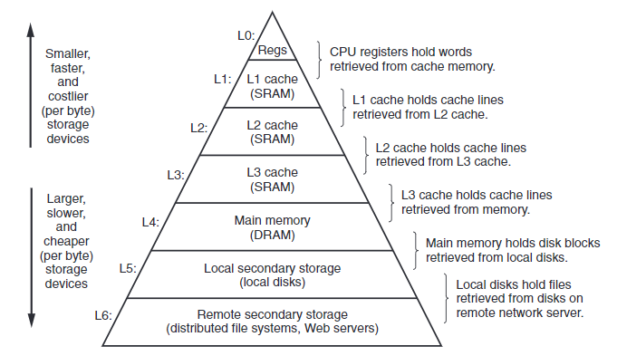

###  L1\L2\L3 Cache 与TLB



#### MMU与TLB

TLB缓存 地址翻译 被缓存在芯片上的TLB 由硬件MMU管理

cpu寄存器 缓存4字节或8字节 被缓存在CPU寄存器中 由编译器管理

根据wiki的解释：

A **translation lookaside buffer** (**TLB**) is a memory [cache](https://en.wikipedia.org/wiki/CPU_cache) that is used to reduce the time taken to access a user memory location.[[1\]](https://en.wikipedia.org/wiki/Translation_lookaside_buffer#cite_note-tlbsurvey-1)[[2\]](https://en.wikipedia.org/wiki/Translation_lookaside_buffer#cite_note-ostep-1-2) It is a part of the chip's [memory-management unit](https://en.wikipedia.org/wiki/Memory_management_unit) (MMU). The TLB stores the recent translations of [virtual memory](https://en.wikipedia.org/wiki/Virtual_memory) to [physical memory](https://en.wikipedia.org/wiki/Physical_memory) and can be called an address-translation cache. A TLB may reside between the [CPU](https://en.wikipedia.org/wiki/Central_processing_unit) and the [CPU cache](https://en.wikipedia.org/wiki/CPU_cache), between CPU cache and the main memory or between the different levels of the multi-level cache. The majority of desktop, laptop, and server processors include one or more TLBs in the memory-management hardware, and it is nearly always present in any processor that utilizes [paged](https://en.wikipedia.org/wiki/Paging) or [segmented](https://en.wikipedia.org/wiki/Memory_segmentation) [virtual memory](https://en.wikipedia.org/wiki/Virtual_memory).

[


**MMU是CPU芯片的一部分，而TLB快表是MMU的一部分**。TLB(Translation Lookaside Buffer)，专门用于改进虚拟地址到物理地址转换速度的缓存。**其访问速度非常快，和寄存器相当，比L1访问还快。**

**TLB hit time: 0.5 – 1 clock cycle**

**L1 cache: 3 cycles**

**L2 cache: 11 cyclesimage/**

**L3 cache: 25 cycles**

**Main Memory: 100 cycles**

有了TLB之后，CPU访问某个虚拟内存地址的过程如下

**1、CPU产生一个虚拟地址**

**2、MMU从TLB中获取页表，翻译成物理地址**

**3、MMU把物理地址发送给L1/L2/L3/内存**

**4、L1/L2/L3/内存将地址对应数据返回给CPU**

#### L1、L2、L3缓存

#### CPU Cache与TLB的区别

First thing first. **CPU Cache** is a fast memory which is used to improve latency of fetching information from Main memory (RAM) to CPU registers. So CPU Cache sits between Main memory and CPU. And this cache stores information temporarily so that the next access to the same information is faster. A CPU cache which used to store executable instructions, it’s called Instruction Cache (I-Cache). A CPU cache which is used to store data, it’s called Data Cache (D-Cache). So I-Cache and D-Cache speeds up fetching time for instructions and data respectively. A modern processor contains both I-Cache and D-Cache. For completeness, let us discuss about D-cache hierarchy as well. D-Cache is typically organized in a hierarchy i.e. Level 1 data cache, Level 2 data cache etc.. It should be noted that L1 D-Cache is faster/smaller/costlier as compared to L2 D-Cache. But the basic idea of ‘*CPU cache*‘ is to speed up instruction/data fetch time from Main memory to CPU.

**Translation Lookaside Buffer (i.e. TLB)** is required only if Virtual Memory is used by a processor. In short, TLB speeds up translation of virtual address to physical address by storing page-table in a faster memory. In fact, TLB also sits between CPU and Main memory. Precisely speaking, TLB is used by MMU when virtual address needs to be translated to physical address. By keeping this mapping of virtual-physical addresses in a fast memory, access to page-table improves. It should be noted that page-table (which itself is stored in RAM) keeps track of where virtual pages are stored in the physical memory. In that sense, TLB also can be considered as a cache of the page-table.

**TLB is about ‘speeding up address translation for Virtual memory’ so that page-table needn’t to be accessed for every address. CPU Cache is about ‘speeding up main memory access latency’ so that RAM isn’t accessed always by CPU.**


如何查看L1、L2、L3缓存大小

```
[claa@localhost ~]$ getconf -a | grep -i cache
LEVEL1_ICACHE_SIZE                 32768
LEVEL1_ICACHE_ASSOC                8
LEVEL1_ICACHE_LINESIZE             64
LEVEL1_DCACHE_SIZE                 32768
LEVEL1_DCACHE_ASSOC                8
LEVEL1_DCACHE_LINESIZE             64
LEVEL2_CACHE_SIZE                  262144
LEVEL2_CACHE_ASSOC                 8
LEVEL2_CACHE_LINESIZE              64
LEVEL3_CACHE_SIZE                  20971520
LEVEL3_CACHE_ASSOC                 20
LEVEL3_CACHE_LINESIZE              64
LEVEL4_CACHE_SIZE                  0
LEVEL4_CACHE_ASSOC                 0
LEVEL4_CACHE_LINESIZE              0
[claa@localhost ~]$ lscpu | grep -i cache
L1d cache:             32K
L1i cache:             32K
L2 cache:              256K
L3 cache:              20480K
```

#### TLB的命中查看

```
[root@localhost ~]# perf stat -e dTLB-loads,dTLB-load-misses,iTLB-loads,iTLB-load-misses -p 25178

^C
 Performance counter stats for process id '25178':

       153,182,445      dTLB-loads
         4,266,611      dTLB-load-misses          #    2.79% of all dTLB cache hits   (99.90%)
            69,109      iTLB-loads                                                    (99.90%)
           962,590      iTLB-load-misses          # 1392.86% of all iTLB cache hits   (99.90%)

      40.817393340 seconds time elapsed


[root@localhost ~]#
```

#### 参考材料

https://cseweb.ucsd.edu/classes/su09/cse120/lectures/Lecture7.pdf

https://zhuanlan.zhihu.com/p/79607142

https://www.geeksforgeeks.org/whats-difference-between-cpu-cache-and-tlb/