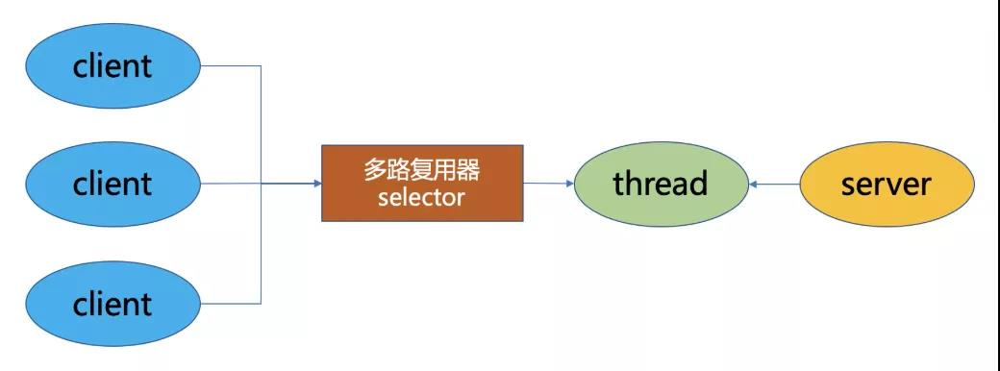
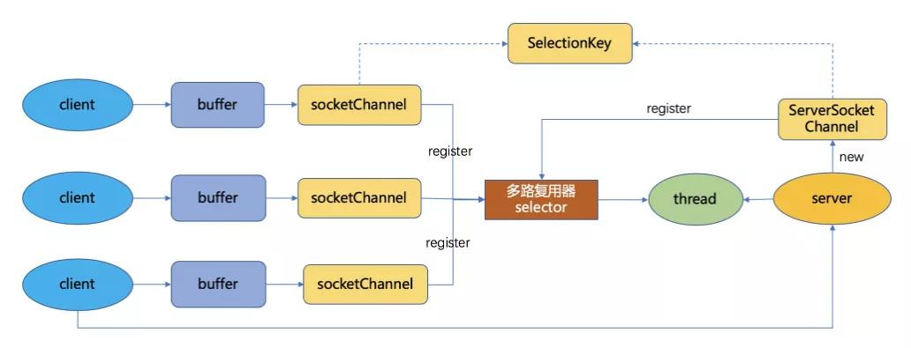

# BIO(Blocking  IO)

同步阻塞模型, 一个客户端连接对应一个处理线程。在BIO中，accept和read方法都是阻塞操作，如果没有连接请求，accept方法阻塞；如果无数据可读取，read方法阻塞。

# NIO(Non Blocking IO)

同步非阻塞模型，服务端的**一个线程**可以处理多个请求, 客户端发送的连接请求注册在**多路复用器Selector**上, 服务端线程通过轮询多路复用器查看是否有IO请求

## NIO的三大核心组件

### buffer

用于存储数据，底层基于数组实现，针对8种基本类型提供了对应的缓冲区类

### channal

用于进行数据传输，面向缓冲器进行操作，支持双向操作，数据可以从channel读取到buffer中，也可以从buffer写到channel中

### selector

选择器，当向一个selector中注册channel后，selector内部的机制就可以自动不段的select(查询)这些channle是否有已就绪的I/O事件，(例如可读，可写，网络连接完成等)，这些程序就可以很简单地使用一个线程高效的管理多个channel，也就是说管理多个网络连接。因此Selector也被称为多路复用器。

当某个Channel上面发生了读或者写事件，这个Channel就处于就绪状态，会被Selector监听到，然后通过SelectionKeys可以获取就绪Channel的集合，进行后续的I/O操作。

Epoll是Linux下多路复用IO接口select/poll的增强版本，它能显著提高程序在大量并发连接中只有少量活跃的情况下的系统CPU利用率，获取事件的时候，它无须遍历整个被侦听的描述符集(fd)，只要遍历那些被内核IO事件异步唤醒而加入Ready队列的描述符集合就行了。

### I/O 多路复用（I/O Multiplexing）

在网络编程中经常用到的 I/O 多路复用（I/O Multiplexing）。I/O 多路复用是什么意思呢？

别急，详细了解前，先来讲两种 I/O 事件通知的方式：水平触发和边缘触发，它们常用在套接字接口的文件描述符中。

- **水平触发**(LT)：只要文件描述符可以非阻塞地执行 I/O ，就会触发通知。也就是说，应用程序可以随时检查文件描述符的状态，然后再根据状态，进行 I/O 操作。

- **边缘触发**(ET)：只有在文件描述符的状态发生改变（也就是 I/O 请求达到）时，才发送一次通知。这时候，应用程序需要尽可能多地执行 I/O，直到无法继续读写，才可以停止。如果 I/O 没执行完，或者因为某种原因没来得及处理，那么这次通知也就丢失了。

  > select/poll是LT模式，epoll缺省使用的也是水平触发模式（LT）。
  > 目前业界对于ET的最佳实践大概就是Nginx了，单线程redis也是使用的LT
  >
  > LT:文件描述符准备就绪时（FD关联的读缓冲区不为空，可读。写缓冲区还没满，可写），触发通知。
  > 也就是你文中表述的"只要文件描述符可以非阻塞地执行 I/O ，就会触发通知..."
  > ET:当FD关联的缓冲区发生变化时（例如：读缓冲区由空变为非空，有新数据达到，可读。写缓冲区满变有空间了，有数据被发送走，可写），触发通知，仅此一次
  > 也就是你文中表述的"只有在文件描述符的状态发生改变（也就是 I/O 请求达到）时"

### I/O 多路复用之select、poll、epoll详解

select，poll，epoll都是IO多路复用的机制。I/O多路复用就是通过一种机制，一个进程可以监视多个描述符(fd)，一旦某个描述符就绪（一般是读就绪或者写就绪），能够通知程序进行相应的读写操作。但select，poll，epoll本质上都是同步I/O，因为他们都需要在读写事件就绪后自己负责进行读写，也就是说这个读写过程是阻塞的，而异步I/O则无需自己负责进行读写，异步I/O的实现会负责把数据从内核拷贝到用户空间。

在 select/poll中，进程只有在调用一定的方法后，内核才对所有监视的文件描述符进行扫描，而**epoll事先通过epoll_ctl()来注册一 个文件描述符，一旦基于某个文件描述符就绪时，内核会采用类似callback的回调机制，迅速激活这个文件描述符，当进程调用epoll_wait() 时便得到通知**。(`此处去掉了遍历文件描述符，而是通过监听回调的的机制`。这正是epoll的魅力所在。)

https://segmentfault.com/a/1190000003063859

**第一种，使用非阻塞 I/O 和水平触发通知，比如使用 select 或者 poll。**

根据刚才水平触发的原理，select 和 poll 需要从文件描述符列表中，找出哪些可以执行 I/O ，然后进行真正的网络 I/O 读写。由于 I/O 是非阻塞的，一个线程中就可以同时监控一批套接字的文件描述符，这样就达到了单线程处理多请求的目的。

所以，这种方式的最大优点，是对应用程序比较友好，它的 API 非常简单。

但是，应用软件使用 select 和 poll 时，需要对这些文件描述符列表进行轮询，这样，请求数多的时候就会比较耗时。并且，select 和 poll 还有一些其他的限制. **每次收到数据都需要遍历每一个连接查看那个数据有数据请求**

select 使用固定长度的位相量，表示文件描述符的集合，因此会有最大描述符数量的限制。比如，在 32 位系统中，默认限制是 1024。并且，在 select 内部，检查套接字状态是用轮询的方法，再加上应用软件使用时的轮询，就变成了一个 **O(n^2)** 的关系。

而 poll 改进了 select 的表示方法，换成了一个没有固定长度的数组，这样就没有了最大描述符数量的限制（当然还会受到系统文件描述符限制）。但应用程序在使用 poll 时，同样需要对文件描述符列表进行轮询，这样，处理耗时跟描述符数量就是 **O(N)** 的关系。

除此之外，应用程序每次调用 select 和 poll 时，还需要把文件描述符的集合，从用户空间传入内核空间，由内核修改后，再传出到用户空间中。这一来一回的内核空间与用户空间切换，也增加了处理成本。

**第二种，使用非阻塞 I/O 和边缘触发通知，比如 epoll。**

- epoll 使用红黑树，在内核中管理文件描述符的集合，这样，就不需要应用程序在每次操作时都传入、传出这个集合。
- epoll 使用事件驱动的机制，只关注有 I/O 事件发生的文件描述符，不需要轮询扫描整个集合。

# AIO

**第三种，使用异步 I/O（Asynchronous I/O，简称为 AIO）**。在前面文件系统原理的内容中，我曾介绍过异步 I/O 与同步 I/O 的区别。异步 I/O 允许应用程序同时发起很多 I/O 操作，而不用等待这些操作完成。而在 I/O 完成后，系统会用事件通知（比如信号或者回调函数）的方式，告诉应用程序。这时，应用程序才会去查询 I/O 操作的结果。

AIO是异步非阻塞模型，一般用于连接数较多且连接时间较长的应用，在读写事件完成后由回调服务去通知程序启动线程进行处理。与NIO不同，当进行读写操作时，只需直接调用read或write方法即可。这两种方法均为异步的，对于读操作而言，当有流可读取时，操作系统会将可读的流传入read方法的缓冲区，并通知应用程序；对于写操作而言，当操作系统将write方法传递的流写入完毕时，操作系统主动通知应用程序。可以理解为，read/write方法都是异步的，完成后会主动调用回调函数。

# 二 I/O模型演化

1 传统I/O模型

对于传统的I/O通信方式来说，客户端连接到服务端，服务端接收客户端请求并响应的流程为：读取 -> 解码 -> 应用处理 -> 编码 -> 发送结果。服务端为每一个客户端连接新建一个线程，建立通道，从而处理后续的请求，也就是BIO的方式。

这种方式在客户端数量不断增加的情况下，对于连接和请求的响应会急剧下降，并且占用太多线程浪费资源，线程数量也不是没有上限的，会遇到各种瓶颈。虽然可以使用线程池进行优化，但是依然有诸多问题，比如在线程池中所有线程都在处理请求时，无法响应其他的客户端连接，每个客户端依旧需要专门的服务端线程来服务，即使此时客户端无请求，也处于阻塞状态无法释放。基于此，提出了基于事件驱动的Reactor模型。

2 Reactor模型

Reactor模式是基于事件驱动开发的，服务端程序处理传入多路请求，并将它们同步分派给请求对应的处理线程，Reactor模式也叫Dispatcher模式，即I/O多路复用统一监听事件，收到事件后分发（Dispatch给某进程），这是编写高性能网络服务器的必备技术之一。

Reactor模式以NIO为底层支持，核心组成部分包括Reactor和Handler：

- Reactor：Reactor在一个单独的线程中运行，负责监听和分发事件，分发给适当的处理程序来对I/O事件做出反应。它就像公司的电话接线员，它接听来自客户的电话并将线路转移到适当的联系人。

- Handlers：处理程序执行I/O事件要完成的实际事件，Reactor通过调度适当的处理程序来响应 I/O 事件，处理程序执行非阻塞操作。类似于客户想要与之交谈的公司中的实际员工。

根据Reactor的数量和Handler线程数量，可以将Reactor分为三种模型:

- 单线程模型 (单Reactor单线程)
- 多线程模型 (单Reactor多线程)
- 主从多线程模型 (多Reactor多线程) 

**单线程模型**

Reactor内部通过Selector监控连接事件，收到事件后通过dispatch进行分发，如果是连接建立的事件，则由Acceptor处理，Acceptor通过accept接受连接，并创建一个Handler来处理连接后续的各种事件，如果是读写事件，直接调用连接对应的Handler来处理。

Handler完成read -> (decode -> compute -> encode) ->send的业务流程。

这种模型好处是简单，坏处却很明显，当某个Handler阻塞时，会导致其他客户端的handler和accpetor都得不到执行，无法做到高性能，只适用于业务处理非常快速的场景，如redis读写操作。

**多线程模型**

主线程中，Reactor对象通过Selector监控连接事件,收到事件后通过dispatch进行分发，如果是连接建立事件，则由Acceptor处理，Acceptor通过accept接收连接，并创建一个Handler来处理后续事件，而Handler只负责响应事件，不进行业务操作，也就是只进行read读取数据和write写出数据，业务处理交给一个线程池进行处理。

线程池分配一个线程完成真正的业务处理，然后将响应结果交给主进程的Handler处理，Handler将结果send给client。

单Reactor承担所有事件的监听和响应，而当我们的服务端遇到大量的客户端同时进行连接，或者在请求连接时执行一些耗时操作，比如身份认证，权限检查等，这种瞬时的高并发就容易成为性能瓶颈。

**主从多线程模型**

 

存在多个Reactor，每个Reactor都有自己的Selector选择器，线程和dispatch。

主线程中的mainReactor通过自己的Selector监控连接建立事件，收到事件后通过Accpetor接收，将新的连接分配给某个子线程。

子线程中的subReactor将mainReactor分配的连接加入连接队列中通过自己的Selector进行监听，并创建一个Handler用于处理后续事件。

Handler完成read -> 业务处理 -> send的完整业务流程。 

关于Reactor，最权威的资料应该是Doug Lea大神的Scalable IO in Java，有兴趣的同学可以看看。