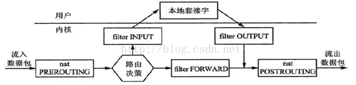
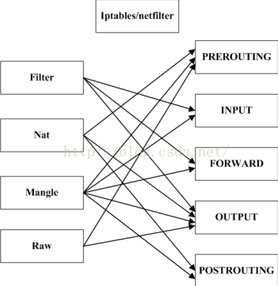

# Linux 入门必看：如何60秒内分析Linux性能

https://netflixtechblog.com/linux-performance-analysis-in-60-000-milliseconds-accc10403c55

https://mp.weixin.qq.com/s/HvADkICPYflS2VTuSB16rg

http://www.brendangregg.com/tsamethod.html

# 排查步骤

vmstat     -->     top   -->  pidstat

​     通过vmstat查看整体CPU, 内存, io,使用情况，top查看CPU占用高的几个进程，pidstat查看这几个进程对应的线程。

监控CPU性能包括以下几个部分：

a. 检查CPU的run queue，每个CPU的run queue最好不要超过3个进程。

b. 确定CPU利用率在usr/sys = 65% / 35% ~ 70% / 30%之间。

c. 当CPU的处理时间更多的是在system空间，说明已经超负荷。

d. 当I/O增多时，CPU密集型的应用将受到影响。

e. 当CPU的IOWait占用比较大的比例时，说明IO出现异常。

# 碰到上下文切换次数过多

可以借助 vmstat  、  pidstat 和 /proc/interrupts 等工具，来辅助排查性能问题的根源。

## Kworker占用了CPU, 同时大量的自愿切换

排查过程:

- top 发现僵尸进程和kworker

- `kill -9` 发现杀不死

- ps 发现是docker中的java,  再杀父进程,不OK, 

  

  根据进程号`ps -ef | grep PID`找到docker ID

  `docker stop Conatiner ID`关不掉

  思考是不是因为kwoker

- `pidstat -w` 发现上下文切换很高

- `perf record -ag -- sleep 15; perf report` 没有发现什么有价值且能看懂的信息

- google

  - [Kworker, what is it and why is it hogging so much CPU?](https://askubuntu.com/questions/33640/kworker-what-is-it-and-why-is-it-hogging-so-much-cpu)
  - 第一个答案介绍kworker, 看到了重启大法, 稍后再试
  - 第二个答案, 给出了他的解决方案,实验无果
  - 第三个答案, 说因为NFS挂载的原因, -->想到自己的挂载卷
  - `df -Th` 验证处于 夯住的状态
  - `cat /etc/mtab` 结合前面的容器名字 找到挂载的卷
  
- 使用 umount -f PATH 卸载

  ```
  ~ umount -f /webserver/page
  ```
强制卸载, 如果执行此命令后, 还是提示磁盘"busily" 就使用以下命令卸载

  使用 umount -l PATH 卸载

  ```
 ~ umount -l /webserver/page
  ```
  
- 僵尸进程没有了

- kworker 依旧很高

- 重启

- 事后继续查看perf 发现

  

  
  
  以目前的经验分析, 的确和nfs有关,因为nfs依赖于rpc, 强制卸载盘后依旧无法释放连接

# CPU使用率过高怎么办

pref

# 进程的 PID 在变，这说明什么呢？

- 要么是这些进程在不停地重启，要么就是全新的进程，这无非也就两个原因：
  - 进程在不停地崩溃重启，比如因为段错误、配置错误等等，这时，进程在退出后可能又被监控系统自动重启了。
  - 这些进程都是短时进程，也就是在其他应用内部通过 exec 调用的外面命令。这些命令一般都只运行很短的时间就会结束，你很难用 top 这种间隔时间比较长的工具发现

# 碰见iowait升高怎么办

- 碰到 iowait 升高时，需要先用 dstat、pidstat 等工具，确认是不是磁盘 I/O 的问题，然后再找是哪些进程导致了 I/O。
- 确定是不是内存满了， swap问题
- 等待 I/O 的进程一般是不可中断状态，所以用 ps 命令找到的 D 状态（即不可中断状态）的进程，多为可疑进程。但这个案例中，在 I/O 操作后，进程又变成了僵尸进程，所以不能用 strace 直接分析这个进程的系统调用。这种情况下，我们用了 perf 工具，来分析系统的 CPU 时钟事件，最终发现是直接 I/O 导致的问题。这时，再检查源码中对应位置的问题，就很轻松了。而僵尸进程的问题相对容易排查，使用 pstree 找出父进程后，去查看父进程的代码，检查 wait() / waitpid() 的调用，或是 SIGCHLD 信号处理函数的注册就行了。

# 网络丢包怎么办

网络丢包可能发生在网络传输的**任何一个过程**


## 链路层

### 查看网卡统计信息

```
# 查看网卡 包 统计信息, 
$ netstat -i 
$ ethtool DEVNAME
$ ethtool -S DEVNAME
```

> 注意，由于 Docker 容器的虚拟网卡，实际上是一对 veth pair，一端接入容器中用作 eth0，另一端在主机中接入 docker0 网桥中。veth 驱动并没有实现网络统计的功能，所以使用 ethtool -S 命令，无法得到网卡收发数据的汇总信息。

### 查看不被网卡统计的信息

如果**用 tc 等工具配置了 QoS**，那么 tc 规则导致的丢包，就不会包含在网卡的统计信息中。

```
root@nginx:/# tc -s qdisc show dev eth0
qdisc netem 800d: root refcnt 2 limit 1000 loss 30%
 Sent 432 bytes 8 pkt (dropped 4, overlimits 0 requeues 0)
 backlog 0b 0p requeues 0
```

从 tc 的输出中可以看到， eth0 上面配置了一个网络模拟排队规则（qdisc netem），并且配置了丢包率为 30%（loss 30%）。再看后面的统计信息，发送了 8 个包，但是丢了 4 个。看来，应该就是这里，导致 Nginx 回复的响应包，被 netem 模块给丢了。

解决办法，删除相关规则

`root@nginx:/# tc qdisc del dev eth0 root netem loss 30%`

### 传输层

重新测试，问题依旧没有消失

```
# 查看 协议 的收发汇总
$ netstat -s
```

只有 TCP 协议发生了丢包和重传，分别是：
11 次连接失败重试（11 failed connection attempts）
4 次重传（4 segments retransmitted）
11 次半连接重置（11 resets received for embryonic SYN_RECV sockets）
4 次 SYN 重传（TCPSynRetrans）
7 次超时（TCPTimeouts）

### iptables和内核的连接追踪机制

查看是不是内核的限制: 即对比下当前的连接追踪数和最大连接追踪数

```
# 主机终端中查询内核配置
$ sysctl net.netfilter.nf_conntrack_max
net.netfilter.nf_conntrack_max = 262144
$ sysctl net.netfilter.nf_conntrack_count
net.netfilter.nf_conntrack_count = 182
```

那接下来看下iptables

基于Netfilter框架，通过一系列的规则(四表5链)，对网络数据包进行过滤(如防火墙)和修改(如NAT)

统一管理在一系列的表中，包括 filter（用于过滤）、nat（用于 NAT）、mangle（用于修改分组数据） 和 raw（用于原始数据包）等。而每张表又可以包括pre-routing,  input,FORWARD, output, post-routing的链，用于对 iptables 规则进行分组管理。
- PREROUTING:数据包进入路由表之前 
- INPUT:通过路由表后目的地为本机
- FORWARD:通过路由表后，目的地不为本机
- OUTPUT:由本机产生，向外转发
- POSTROUTIONG:发送到网卡接口之前





```
root@nginx:/# iptables -t filter -nvL
Chain INPUT (policy ACCEPT 25 packets, 1000 bytes)
 pkts bytes target     prot opt in     out     source               destination
    6   240 DROP       all  --  *      *       0.0.0.0/0            0.0.0.0/0            statistic mode random probability 0.29999999981

Chain FORWARD (policy ACCEPT 0 packets, 0 bytes)
 pkts bytes target     prot opt in     out     source               destination

Chain OUTPUT (policy ACCEPT 15 packets, 660 bytes)
 pkts bytes target     prot opt in     out     source               destination
    6   264 DROP       all  --  *      *       0.0.0.0/0            0.0.0.0/0            statistic mode random probability 0.29999999981
```

# 服务器的吞吐下降很厉害，怎么分析

1. 查看统计数据

   ```
   $ ss -s 
   Total: 213 (kernel 2890)
   TCP:   814 (estab 4, closed 798, orphaned 1, synrecv 0, timewait 798/0), ports 0
   
   Transport Total     IP        IPv6
   *	  2890      -         -
   RAW	  1         0         1
   UDP	  6         4         2
   TCP	  16        13        3
   INET	  23        17        6
   FRAG	  0         0         0
   ```

   建立的链接4个，closed和timewait居高

2. 因为是docker运行的环境，所有考虑NAT 和 iptables

   ```
   # 查看系统日志， 检查连接追踪nf_conntrack是否出现问题
   
   $ dmesg | tail
   [88356.354329] nf_conntrack: nf_conntrack: table full, dropping packet
   [88356.354374] nf_conntrack: nf_conntrack: table full, dropping packet
   
   
   $ sysctl net.netfilter.nf_conntrack_max
   net.netfilter.nf_conntrack_max = 200
   $ sysctl net.netfilter.nf_conntrack_count
   net.netfilter.nf_conntrack_count = 200
   
   
   # 将连接跟踪限制增大到1048576
   $ sysctl -w net.netfilter.nf_conntrack_max=1048576
   
   ```

   

3. 应用进程优化

4. 套接字socket优化

   ```
   # 只关注套接字统计
   $ netstat -s | grep socket
       73 resets received for embryonic SYN_RECV sockets
       308582 TCP sockets finished time wait in fast timer
       8 delayed acks further delayed because of locked socket
       290566 times the listen queue of a socket overflowed
       290566 SYNs to LISTEN sockets dropped
   
   # 稍等一会，再次运行
   $ netstat -s | grep socket
       73 resets received for embryonic SYN_RECV sockets
       314722 TCP sockets finished time wait in fast timer
       8 delayed acks further delayed because of locked socket
       344440 times the listen queue of a socket overflowed
       344440 SYNs to LISTEN sockets dropped
   ```

   根据两次统计结果中 socket overflowed 和 sockets dropped 的变化，你可以看到，有大量的套接字丢包，并且丢包都是套接字队列溢出导致的。所以，接下来，我们应该分析连接队列的大小是不是有异常。
   你可以执行下面的命令，查看套接字的队列大小：
   ```
   $ ss -ltnp
   State     Recv-Q     Send-Q            Local Address:Port            Peer Address:Port
   LISTEN    10         10                      0.0.0.0:80                   0.0.0.0:*         users:(("nginx",pid=10491,fd=6),("nginx",pid=10490,fd=6),("nginx",pid=10487,fd=6))
   LISTEN    7          10                            *:9000                       *:*         users:(("php-fpm",pid=11084,fd=9),...,("php-fpm",pid=10529,fd=7))
   ```
   这次可以看到，Nginx 和 php-fpm 的监听队列 （Send-Q）只有 10，而 nginx 的当前监听队列长度 （Recv-Q）已经达到了最大值，php-fpm 也已经接近了最大值。很明显，套接字监听队列的长度太小了，需要增大。
   关于套接字监听队列长度的设置，既可以在应用程序中，通过套接字接口调整，也支持通过内核选项来配置。我们继续在终端一中，执行下面的命令，分别查询 Nginx 和内核选项对监听队列长度的配置：
   ```
   # 查询nginx监听队列长度配置
   $ docker exec nginx cat /etc/nginx/nginx.conf | grep backlog
           listen       80  backlog=10;
   # 查询php-fpm监听队列长度
   $ docker exec phpfpm cat /opt/bitnami/php/etc/php-fpm.d/www.conf | grep backlog
   ; Set listen(2) backlog.
   ;listen.backlog = 511
   # somaxconn是系统级套接字监听队列上限
   $ sysctl net.core.somaxconn
   net.core.somaxconn = 10
   ```
   从输出中可以看到，Nginx 和 somaxconn 的配置都是 10，而 php-fpm 的配置也只有 511，显然都太小了。那么，优化方法就是增大这三个配置，比如，可以把 Nginx 和 php-fpm 的队列长度增大到 8192，而把 somaxconn 增大到 65536。
   
5. 端口号优化
```
$ docker logs nginx --tail 10
2019/03/15 16:52:39 [crit] 15#15: *999779 connect() to 127.0.0.1:9000 failed (99: Cannot assign requested address) while connecting to upstream, client: 192.168.0.2, server: localhost, request: "GET / HTTP/1.1", upstream: "fastcgi://127.0.0.1:9000", host: "192.168.0.30"
```
根据网络套接字的原理，当客户端连接服务器端时，需要分配一个临时端口号，而  Nginx 正是 PHP-FPM 的客户端。端口号的范围并不是无限的，最多也只有 6 万多。
我们执行下面的命令，就可以查询系统配置的临时端口号范围：
```
$ sysctl net.ipv4.ip_local_port_range
net.ipv4.ip_local_port_range=20000 20050
```
你可以看到，临时端口的范围只有 50 个，显然太小了 。优化方法很容易想到，增大这个范围就可以了。比如，你可以执行下面的命令，把端口号范围扩展为 “10000 65535”：
```
$ sysctl -w net.ipv4.ip_local_port_range="10000 65535"
net.ipv4.ip_local_port_range = 10000 65535
```

6. 因优化带来的瓶颈

  前面我们已经优化了很多配置。这些配置在优化网络的同时，却也会带来其他资源使用的上升。这样来看，是不是说明其他资源遇到瓶颈了呢？
   我们

```
# 执行perf记录事件
$ perf record -g

# 切换到FlameGraph安装路径执行下面的命令生成火焰图
$ perf script -i ~/perf.data | ./stackcollapse-perf.pl --all | ./flamegraph.pl > nginx.svg
```


中间的 do_syscall_64、tcp_v4_connect、inet_hash_connect 这个堆栈，很明显就是最需要关注的地方。inet_hash_connect() 是 Linux 内核中负责分配临时端口号的函数。所以，这个瓶颈应该还在临时端口的分配上。
在上一步的“端口号”优化中，临时端口号的范围，已经优化成了 “10000 65535”。这显然是一个非常大的范围，那么，端口号的分配为什么又成了瓶颈呢？
一时想不到也没关系，我们可以暂且放下，先看看其他因素的影响。再顺着 inet_hash_connect 往堆栈上面查看，下一个热点是 __init_check_established 函数。而这个函数的目的，是检查端口号是否可用。结合这一点，你应该可以想到，如果有大量连接占用着端口，那么检查端口号可用的函数，不就会消耗更多的 CPU 吗？
实际是否如此呢？我们可以继续在终端一中运行 ss 命令， 查看连接状态统计：

```
$ ss -s
TCP:   32775 (estab 1, closed 32768, orphaned 0, synrecv 0, timewait 32768/0), ports 0
...
```

开启端口复用

```
$ sysctl net.ipv4.tcp_tw_reuse
net.ipv4.tcp_tw_reuse = 0
$ sysctl -w net.ipv4.tcp_tw_reuse
```

实际上，分析性能瓶颈，最核心的也正是掌握运用这些原理。
首先，利用各种性能工具，收集想要的性能指标，从而清楚系统和应用程序的运行状态；
其次，拿目前状态跟系统原理进行比较，不一致的地方，就是我们要重点分析的对象。
从这个角度出发，再进一步借助 perf、火焰图、bcc 等动态追踪工具，找出热点函数，就可以定位瓶颈的来源，确定相应的优化方法。
思考

# CPU 的性能分析

1. top 看一眼load average 

2. top + 1看**cpu使用率**

3. us 高 说明 用户程序比较繁忙

   sy 高  说明 内核比较繁忙   --> pidstat -wut 抓进程

   io 高 **通常**说明系统与硬件设备的 I/O 交互时间比较长。  pidstat -d 抓进程

   si/hi 软中断 硬中断, --> watch -d cat /proc/softirqs 

4.  去看 **上下文**

5. cpu **缓存的命中率**

   

# 内存的性能分析

1. 先用 free 和 top，查看系统整体的内存使用情况。
2. vmstat 和 pidstat，查看一段时间的趋势，从而判断出内存问题的类型。
3. 最后进行详细分析，比如内存分配分析、缓存 / 缓冲区分析、具体进程的内存使用分析等。


# io性能分析


# 网络性能分析

网络性能,其实包含两类资源:即**网络接口和内核资源**


# 应用性能瓶颈

应用程序性能问题虽然各种各样，但就其本质来源，实际上只有三种，也就是资源瓶颈、依赖服务瓶颈以及应用自身的瓶颈。

- 资源瓶颈

- 依赖服务的瓶颈

  诸如数据库，分布式缓存，中间件等应用程序，直接或间接调用的服务出现了性能问题从而导致应用程序的响应变慢，或者错误率升高。这说白了就是跨应用的性能问题，使用全链路跟踪系统，就可以帮你快速定位这类问题的根源。

- 应用程序自身的性能问题

  可以通过系统调用、热点函数，或者应用自身的指标监控以及日志监控等，进行分析定位