初始化的时候可以看启动日志
` /usr/bin/mysql_secure_installation`
修改root远程访问权限
`grant all privileges on *.* to testuser@”%” identified by “123456” ;　`
`flush privileges ;`

### SQL语句: struct Query Language

- DML: 数据操作语言
  - insert
  - delete
  - select
  - update
- DDL ： 数据定义语言 definition
  - CREATE
  - DROP
  - ALTER
- DCL ： 数据控制语言
  - GRANT
  - REVOKE

事务的特点:
ACID:

- 原子性: 事务只有成功和失败，没有中间态

- 一致性: 数据库的完整性没有破坏

- 隔离性

  1、隔离的四个级别

- 持久性

  # 数据库事务隔离级别


数据库事务的隔离级别有4个，由低到高依次为Read uncommitted 、Read committed 、Repeatable read 、Serializable ，这四个级别可以逐个解决脏读 、不可重复读 、幻读 这几类问题。


√: 可能出现    ×: 不会出现

| 级别             | 脏读 | 不可重复读 | 幻读 |
| ---------------- | ---- | ---------- | ---- |
| Read uncommitted | √    | √          | √    |
| Read committed   | ×    | √          | √    |
| Repeatable read  | ×    | ×          | √    |
| Serializable     | ×    | ×          | ×    |

注意：我们讨论隔离级别的场景，主要是在多个事务并发 的情况下，因此，接下来的讲解都围绕事务并发。

Mysql的默认隔离级别就是Repeatable read

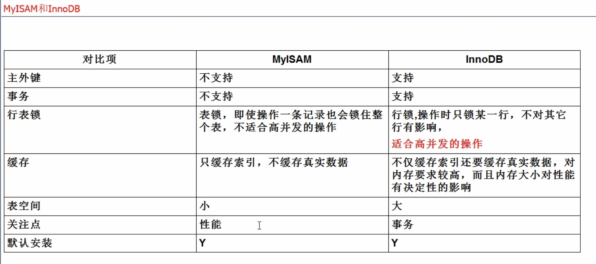

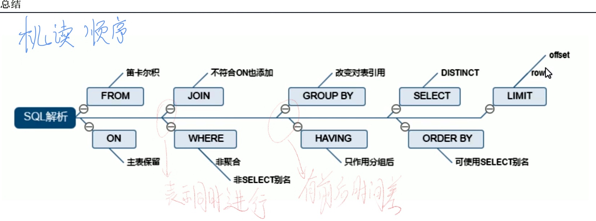

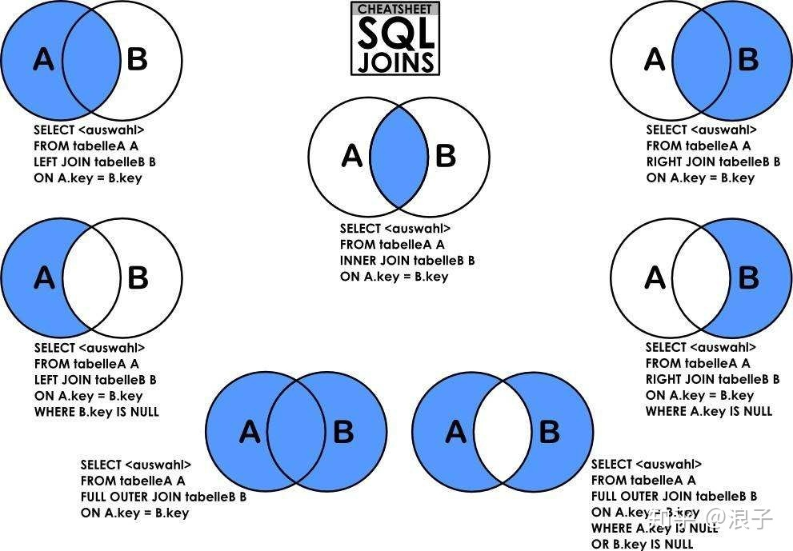

# join

不匹配的会补NULL

- INNER JOIN
  `SELECT <select_list> FROM Table A INNER JOIN Table B On A.key=B.key;`

- LEFT JOIN
  `SELECT <select_list> FROM Table A LEFT JOIN Table B On A.key=B.key;`

- RIGHT JOIN
  `SELECT <select_list> FROM Table A RIGHT JOIN Table B On A.key=B.key;`

- d
  `SELECT <select_list> FROM Table A LEFT JOIN Table B On A.key=B.key WHERE B.key is NULL;`

- d
 `SELECT <select_list> FROM Table A INNER JOIN Table B On A.key=B.key WHERE A.key is NULL;`

- FULL OUTER JOIN

 `SELECT <select_list> FROM Table A FULL OUTER JOIN Table B On A.key=B.key;`

mysql 的实现方式

```mysql
SELECT * FROM tbl_emp a LEFT JOIN tbl_dept b ON a.deptId = b.id 
    -> UNION
    -> SELECT * FROM tbl_emp a RIGHT JOIN tbl_dept b ON a.deptId = b.id 
```

- 两张表中都没有出现的数据集

`SELECT <select_list> FROM Table A FULL OUTER JOIN Table B On A.key=B.key  WHERE A.key is NULL OR B.key is NULL;`
mysql 的实现方式

```mysql
SELECT * FROM tbl_emp a LEFT JOIN tbl_dept b ON a.deptId = b.id WHERE b.id is NULL
    -> UNION
    -> SELECT * FROM tbl_emp a RIGHT JOIN tbl_dept b ON a.deptId = b.id WHERE a.deptId is NULL
```


# 索引 排好序的快速查找数据结构

Index 是帮助Mysql 高效获取数据的数据结构。可以得到索引的本质：**索引是数据结构**

目的：提高效率，可以类比字典

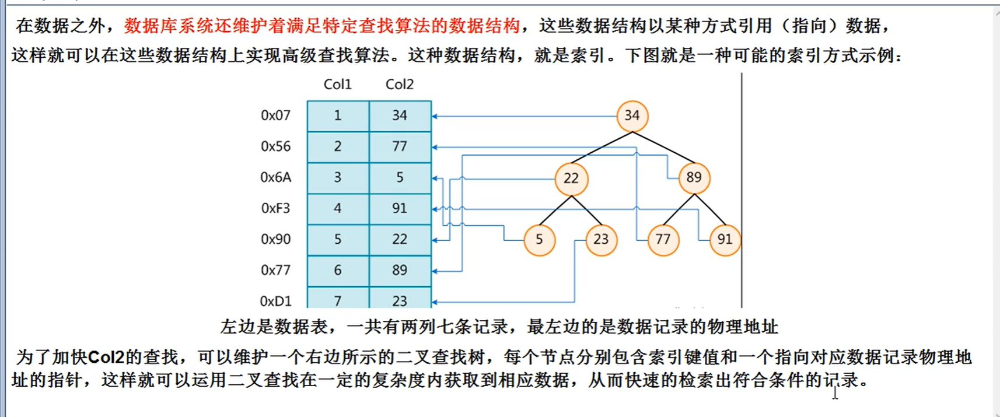

### 类型

- 单值索引

- 唯一索引
索引的值必须唯一,但允许有空值

- 复合索引
一个索引包含了多个列

####  基本语法
- 创建
```sql
CREATE [UNIQUE] INDEX indexName On mytable(columnname(length));
# 或 UNIQUE代表是否是唯一索引
ALTER mytable ADD [UNIQUE] INDEX [indexName] On (columnname(length));
```


- 删除

`DROP INDEX [indexName] On mytable;`


- 查看 	

  `SHOW INDEX FROM table_name\G`

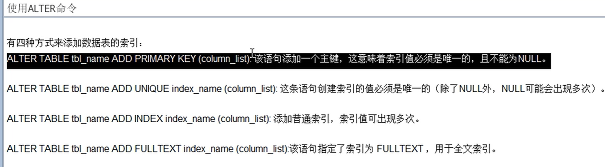

## Btree

- 在B树中，内部（非叶子）节点可以拥有可变数量的子节点（数量范围预先定义好）
- 叶子节点才会存储真实的数据
- 非叶子系欸DNA只存储 指引搜索方向的数据项(即子结点)

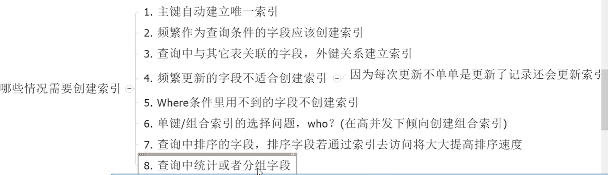

## MySql Query Optimizer 查询优化器

| id   | select_type | table | type | possible_keys | key  | key_len | ref  | rows | Extra |
| ---- | ----------- | ----- | ---- | ------------- | ---- | ------- | ---- | ---- | ----- |
|      |             |       |      |               |      |         |      |      |       |

### 各字段解释

#### id-- select查询的序列号,包含一组数字,表示查询中执行select子句或操作表的顺序

- id相同，执行顺序从上到下
- id不同,如果是子查询.id的序号会递增,id值越大优先级越高，越先执行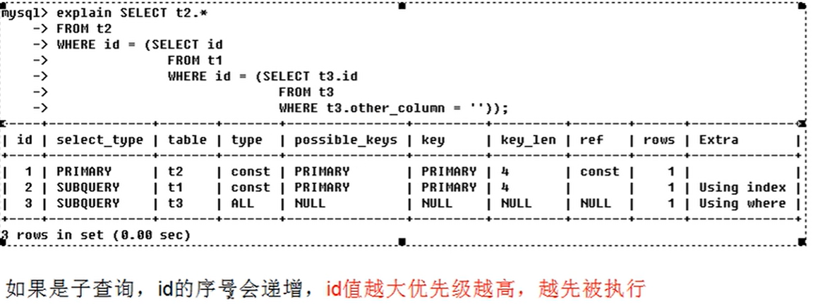
- id相同不同，同时存在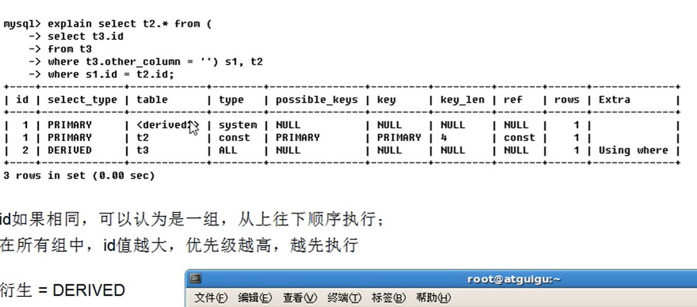


​		s1是一张虚表

#### select_type 数据读取操作的操作类型

- 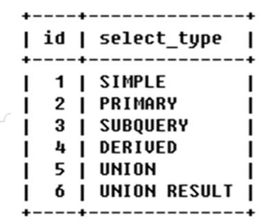

- SIMPLE 简单的select查询,查询中不包含子查询或者UNION

- PRIMARY 

  - 查询中若包含任何复杂的子部分,最外层查询则被标记为primary

- SUBQUERY  在select或where列表中包含了子查询

- DERIVED 在FROM列表中包含的子查询被标记为derived衍生MySQL会递归执行这些子查询，把结果放在临时表中

- UNION

  若第二个SELECT出现在UNION之后，则被标记为UNION;若UNION包含在FROM子句的子查询中，外层SELECT将被标记为:DERIVED

- UNION RESULT  从UNION表中获取结果的SELECT

  

#### type

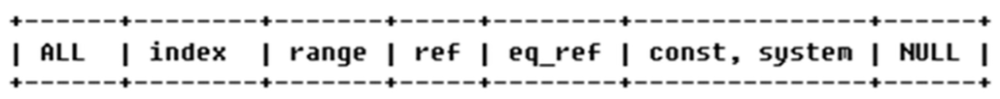

> 从最好到最差依次是:
>
> system>const>eq_ref>ref>range>index>ALL

- system 系统表,只有一行记录
- const  

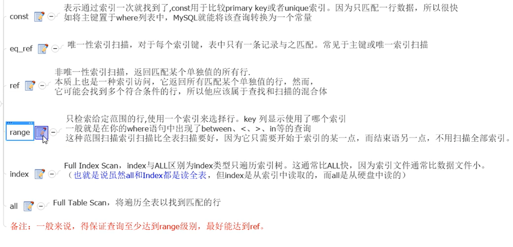

#### possible_keys And key

- possible_keys 
  显示可能应用在这张表中的索引,一个或多个
  查询涉及到的字段上若存在索引,则该索引将被列出,**但不一定会被查询实际使用**

- key

  - 实际使用的
  - 查询中若使用了覆盖索引,则该索引仅出现在key列表中
 #### ken_len

表示索引中使用的字节数

