# 抽线数据类型abstract Data Type

## 数据类型

 - 数据对象集
 - 数据集合相关联的操作集

## 抽象: 描述数据类型的方法不依赖于具体实现

-	与存放数据的机器无关
-	与数据存储的物理结构无关
-	与实现操作的算法和编程语言均无关

> 只描述数据对象及和相关操作集**是什么**,并不设计**如何做到**的问题.

## 描述抽象数据类型的标准格式

ADT 抽象数据类型名
Data 
	数据元素之间的逻辑关系的定义
Operation 
	操作
endADT

# 线性表

顺序存储结构 (优势:查找)

线性表(Linear List):由同类型**数据元素**构成**有序数列**的线性结构
- 起始位置:表头,结束位置:表尾
- 可以为0,称为空表
- 表中元素个数成为线性表的长度(从1开始计算的)

ADT : 线性表

Data(数据对象集): n>=0个元素构成的有序序列,出第一个元素外都有一个**先驱元素**,除最后一个元素外都有一个**后继元素**.数据元素之间的关系是一对一的关系

Operation: 

- InitList(*L): 初始化,建立一个空的线性表
- ListEmpty(L): 判断线性表是否为空
- GetElem(L,i,*e):返回第i个元素的值
- LocateElem(L,e),返回在线性表L中查找X的第一次出现的位置
- ListInsert
- ListDelete


## 链表(优势:插入和删除)

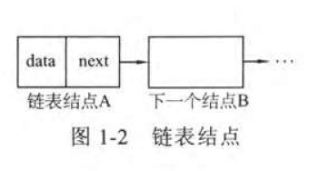

```go
type struct Node {
	data int,
    Node struct *next, 
}
```

```c
typedef struct Node {
    int data;          // 这里默认的是int
    struct Node *next; // 指向Node型变量的指针
}Node;
```

上面这个struct的名字为Node,因此组成此结构体的成员中有一个是指向**和自己类型相同的变量的指针**,内部要用自己来定义这个指针，所以写成`struct Node *next;`

### 头插法建立单链表


生成的链表与**输入的顺序**相反

### 尾插法


需要一个index索引


## 逆转单链表

```c
List Reverse( List L )
{
    Position Old_head, New_head, Temp;
    New_head = NULL;
    Old_head = L->Next;

    while ( Old_head )  {
        Temp = Old_head->Next;
        Old_head->Next=New_head;  
        New_head = Old_head;  
        Old_head = Temp; 
    }
    L->Next=New_head;
    return L;
}
// 还可以利用头插法,将头节点后面的结点,取出来插到头节点前面
```


### 循环链表


另外一种办法:rear 指针 不再有head

### 双向链表
- 结点结构
  ```C
  typedef struct DualNode
  {
    ElemType data;
    struct DualNode *prior; // 前驱结点
    struct DualNode *next; // 后继结点
  } DualNode, *DuLinkList;
  ```


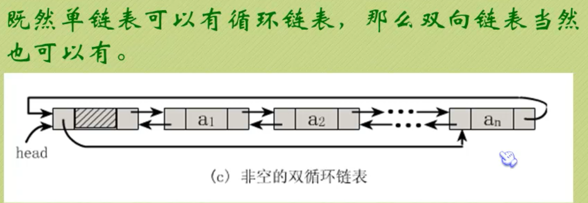

```c
// 插入s结点 在p结点之前
s->next = p;
s->prior = p ->prior;
p->prior->next = s;
p->prior = s;
//删除
p->prior->next = p.next; 
p->next->prior = p.prior;
free(p);
```
[leetcode实践](https://leetcode-cn.com/problems/middle-of-the-linked-list/solution/kuai-man-zhi-zhen-zhu-yao-zai-yu-diao-shi-by-liwei/)

## 栈和队列 stack and queue

### 栈 Last in First out

LIFO的线性表，它要求**只在表尾**进行删除和插入操作

- ADT: stack堆栈

- 数据对象集: 一个有0个或者多个元素的有穷线性表

- 操作集:

  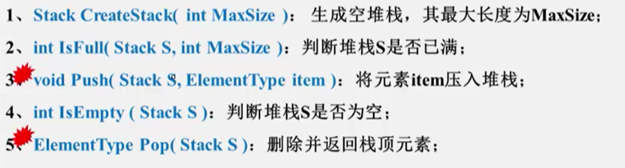

**因为栈的本质是一个线性表，线性表有两种存储形式。**

#### 栈的顺序存储结构

栈的顺序存储结构通常由一个**一维数组**和一个记录**栈顶元素位置**的变量组成。

```c
#define MaxSize <存储数据元素的最大个数>
typedef struct SNode *stack;
struct SNode{
    ElementType Data[MaxSize];
    int Top;
}
typedef int Position;
struct SNode {
    ElementType *Data; /* 存储元素的数组 */
    Position Top;      /* 栈顶指针 */
    int MaxSize;       /* 堆栈最大容量 */
};
typedef struct SNode *Stack;
```

```c
void Push(stack Ptrs, ElementType item)
{
    if ( Ptrs->Top == MaxSize-1 ) {
        printf("堆栈满"): return;
    }else {
        Ptrs->Data[++(Ptrs->Top)] = item;
        return;
    }
}

ElemrntType Pop(Stack PtrS)
{
    if (PtrS->Top == -1){
        printf("堆栈空");
        return ERROR;
    }else
        return (PtrS->Data[(PtrS->Top)--]);
}
```

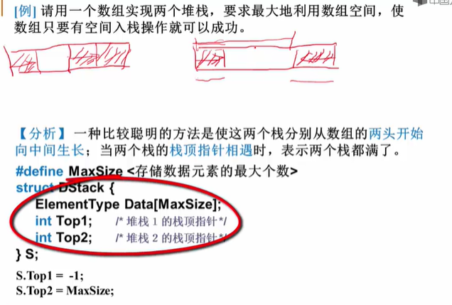

```c
void Push( struct DStack *PtrS, ElementType item,int Tag)
{ /* Tag作为区分两个堆栈的标志，取值为1和2 */
    if ( PtrS->Top2 - PtrS->Top1 == 1) { 
        printf("堆栈满"); return ;
    }
    if ( Tag == 1 ) /* 对第一个堆栈操作 */
        PtrS->Data[++(PtrS->Top1)] = item;
    else /* 对第二个堆栈操作 注意++和--*/
        PtrS->Data[--(PtrS->Top2)] = item;
}
ElementType Pop( struct DStack *PtrS, int Tag)
{  /* Tag 作为区分两个堆栈的标志,取值为1和2 */
    if ( Tag == 1 ) { /* 对第一个堆栈操作 */
        if ( PtrS->Top1 == -1 ) { /* 堆栈1空 */
             printf("堆栈1空"); return NULL;
        } else return PtrS->Data[(PtrS->Top1)--];
    } else {  /* 对第二个堆栈操作 */
        if ( PtrS->Top2 == MaxSize ) {
            printf("堆栈2空"); return NULL;
        }else return PtrS->Data[(PtrS->Top2)++];
    }
}
```

##### 小甲鱼的方法/c的特殊写法

```c
typedef struct
{
    ElemType *base;
    Elemtype *top;
    int stackSize;
}sqStack;
```

这里定义一个顺序存储的栈，它包含了三个元素:base,top,stackSize,其中base是指向栈底的指针变量，top是指向栈顶的指针变量，stackSize指示栈的当前可使用的最大容量。

##### 清空一个栈

就是将栈中的元素全部作废，但栈本身物理空间并不发生改变

`s->top = s->base` 即可

##### 销毁一个栈

要释放该栈所占据的物理内存空间，因此不要混淆 销毁与清空操作

```c
DestoryStack(sqStack *s){
    int i, len;
    len = s->stackSize;
    for ( i=0; i < len; i++ ) {
        free( s->base );
        s->base++;
    }
    s->base = s->top = NULL;
    s->stackSize = 0;
}
```

##### 计算栈的当前容量

计算栈的当前容量也就是计算栈中元素的个数，因此只要返回`s.top - s.base`即可。

注意, 栈的最大容量是指该栈占据内存空间的大小，其值是s.stackSize，它与栈的当前容量不是一个概念

```c
int StackLen(sqStack s)
{
    return (s.top - s.base); // 指针可以相减，不可以相加，本质是：指针相减后，除以指针底层数据类型的大小
}
```

#### 栈的链式存储结构

因为是单链表，所以 指针Top在head插入、删除会更方便

### 队列 First in First out

只允许在一端进行插入操作,而在另一端进行删除操作的线性表,一般建议用链式存储，顺序结构建议构建循环数组

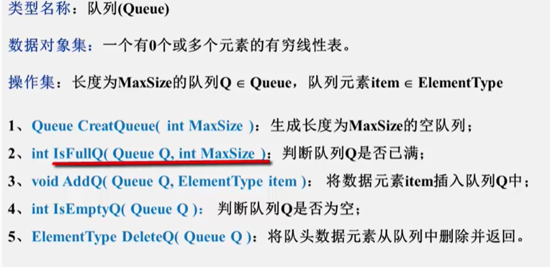

#### 队列的顺序存储实现

队列的顺序存储结构通常由一个**一维数组**和一个记录队列头元素位置的变量**front**以及一个记录队列尾元素位置的变量**rear**组成

```c
#define MaxSize <存储数据元素的最大个数>
struct QNode {
    ElementTyoe Data[MaxSize] ;
    int rear;
    int front;
};
typedef struct QNode *Queue;
struct QNode {
    ElementType *Data;     /* 存储元素的数组 */
    Position Front, Rear;  /* 队列的头、尾指针 */
    int MaxSize;           /* 队列最大容量 */
};
/* 构建循环数组 最大化利用空间 
front rear 都为 0  
front 删除
rear 增加
*/
bool IsFull( Queue Q )
{
    return ((Q->Rear+1)%Q->MaxSize == Q->Front);
    /* 取余操作 */
}
```

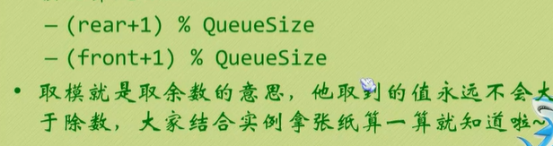

#### 队列的链式存储实现

```c
typedef struct Node *PtrToNode;
struct Node { /* 队列中的结点 */
    ElementType Data;
    PtrToNode Next;
};
typedef PtrToNode Position;
 
struct QNode {
    Position Front, Rear;  /* 队列的头、尾指针 */
    int MaxSize;           /* 队列最大容量 */
};
typedef struct QNode *Queue;

bool IsEmpty( Queue Q )
{
    return ( Q->Front == NULL);
}
 
```

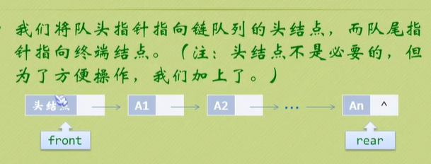

# 广义表(了解)

- 广义表是线性表的推广

- 对于线性表而言,n个元素都是基本的**单元素**

- 广义表中, 这些元素不仅可以是单元素,也可以是**另外一个广义表**

  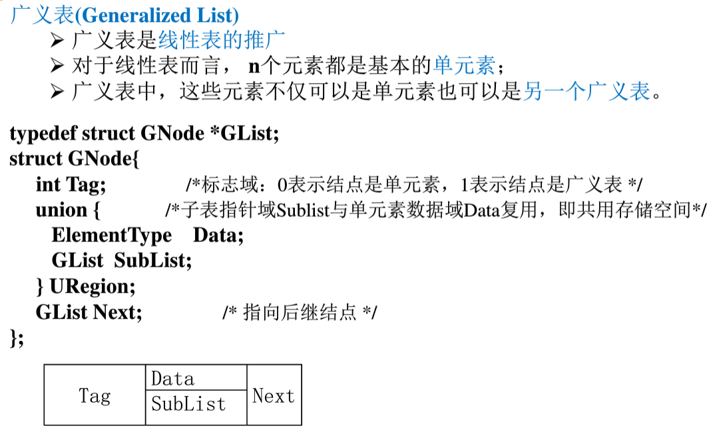

# 多重链表

## 十字链表(在图表示的时候常用)

十字链表常用来存储**稀疏矩阵**

- 只存储矩阵非0元素项

  结点的**数据域**: 行坐标Row, 列坐标Col, 数值Value

- 每个结点通过**两个指针域**, 把同行, 同列串起来

  - 行指针(或称为向右指针)Right
  - 列指针(或称为向下指针)Down

# 树

## 二分查找启示
- 判定树上每个**结点**需要的查找次数刚好为该节点所在的**层数**；
- 查找成功时**查找次数**不会超过判定树的**深度**
- n个结点的判定树的深度为[log<sub>2</sub>n]+1. 
- 下图为3+1 = 4层

- 平均成功查找次数ASL = (4\*4+4\*3+2\*2+1)/11 =3


## 树的定义

树: n (n>=0)个结点构成的有限集合

n=0时称为**空树**

对于任一棵非空树（n>0)，它具备以下性质:

- 树中有一个称为"根(Root)"的特殊结点,用r表示
  - 其余结点可分为m(m>0)个**互不相交**的有限集T<sub>1</sub>,T<sub>2</sub>,...,T<sub>m</sub>,其中**每个集合本身又是一棵树**,称为原来树的“子树(subtree)”


A 有以B,C,D,E为结点的树

	- 除了根节点外,每个结点有且只有一个父节点

### 树的一些基本术语

1. **结点的度(Degree)**: 结点的**子树个数**

2. **树的度**： 树的所有节点中最大的度数 下图A和D的 度都为3 ,所以树的度为3

3. 叶节点(Leaf):度为0的结点

4. 父节点(Parent):有子树的结点是其子树的根结点的父结点

5. 子结点(Child): 若A结点是B结点的父结点，则称B结点是A结点的子结点；子结点也称**孩子结点**

6. 兄弟结点(sibling): 具有同一父结点的各结点彼此是兄弟结点
   
   
7. 路径和路径长度：从结点n<sub>1</sub>到n<sub>k</sub>的路径为一个结点序列n<sub>1</sub>,n<sub>2</sub>,...,n<sub>k</sub>,n<sub>i</sub>是n<sub>i+1</sub>的父结点。路径所包含边的个数为**路径的长度**

8. 祖先结点(Ancestor)：沿**树根到某一结点路径**上的所有结点都是这个结点的祖先结点

9. 子孙结点(Descendant): 某一结点的**子树中的所有结点**是这个结点的子孙

10. 结点的层次(Level): 规定**根结点在1层**，其他任一结点的层数是其父结点的层数加1.

11. 树的深度(Depth): 树中所有结点中的**最大层次**是这棵树的深度

    其他概念

    1. 如果将树中结点的各子树看成从左至右是有次序的，不能互换的，则称该树为有序树，否在成为无序树
    2. 森林(Forest)是m(m>=0)棵互不相交的集合，对树中每个结点而言，其子树的集合即为森林

### 树的表示-->儿子-兄弟表示法
- 双亲表示法

   - 数组存储, 孩子指向双亲

- 儿子表示法

- 双亲儿子表示法

- 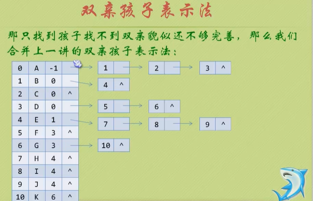

   ```c
   #define MAX_TREE_SIZE  100
   
   typedef char ElemType
   // child
   typedef struct CTNode
   {
       int child;             // 孩子结点的下标
       struct CTNode *next;   // 指向下一个孩子结点的指针
   }*ChildPtr;
   // 表头结构
   typedef struct 
   {
       ElemType data;
       int    parent;
       ChildPtr firstchild;
   }CTBox;
   // 树结构
   typedef struct 
   {
       CTBox nodes[MAX_TREE_SIZE];  // 结点数组
   }
   ```
   
- **儿子-兄弟表示法**
 

  


# 二叉树


ADT: 二叉树

Data：一个有穷的结点集合。若不为空,则由**根结点和其左、右二叉子树**组成

Operation: 


### 完美二叉树perfect Binary Tree

一个深度为k(>=-**1**)且有2^(k+1) - 1个结点的二叉树称为**完美二叉树**。 (注： 国内的数据结构教材大多翻译为"满二叉树")

所有的非叶子结点都有两个孩子，所有的叶子结点都在同一层。即每层结点都完全填满。（显然这是一种特殊的完全二叉树）

所有分支结点都存在左子树和右子树，并且所有叶子结点都在同一层上。

叶子只能出现在最下一层

### 满二叉树/完满(Full)二叉树

```txt
A Full Binary Tree (FBT) is a tree in which every node other than the leaves has two children.
```

要么是叶子结点（结点的度为 0），要么结点同时具有左右子树（结点的度为 2）。

(只要你有孩子,你就必然有两个孩子)

### 完全二叉树(CBT)/Complete Binary Tree


**满二叉树一定是完全二叉树，完全二叉树不一定是满二叉树**

除最后一层外的每层结点都完全填满，在最后一层上如果不是满的，则只缺少右边的若干结点。


| **完美二叉树** | Perfect Binary Tree       | Every node except the leaf nodes have two children and every level (last level too) is completely filled. **除了叶子结点之外的每一个结点都有两个孩子，每一层(当然包含最后一层)都被完全填充。** |
| -------------- | ------------------------- | ------------------------------------------------------------ |
| **完全二叉树** | Complete Binary Tree      | Every level except the last level is completely filled and all the nodes are left justified. **除了最后一层之外的其他每一层都被完全填充，并且所有结点都保持向左对齐。** |
| **完满二叉树** | Full/Strictly Binary Tree | Every node except the leaf nodes have two children. **除了叶子结点之外的每一个结点都有两个孩子结点。** |

[更多详情](https://www.cnblogs.com/idorax/p/6441043.html)

### 常用的存储方式
##### 顺序存储

完全二叉树: 从上至下,从左至右的顺序存储

n个结点的完全二叉树的**结点父子关系**

A B O C S M Q W K

1  2  3 4 5 6  7  8  9

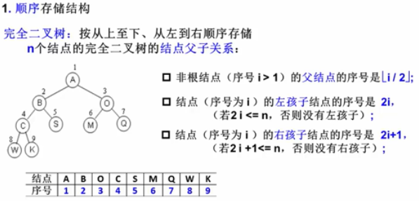

##### 链表存储

```c
typedef struct TreeNode *BinTree;
typedef BinTree Position;
struct TreeNode {
    ElemenType Data;
    BinTree Left;
    BinTree Right;
}
// -------
typedef struct BTNode {
    int data;				// 这里默认的是int
    struct BTNode *lchild;  // 指向左孩子节点的指针
    struct BTNode *rchild;  // 指向右孩子节点的指针
}BTNode;
```

### 常用的遍历方法

二叉树的遍历(traversing binary tree) 是指从根结点出发，按照某种**次序**依次**访问**二叉树中所有结点，使得每个结点被访问一次且仅被访问一次。


>  叉搜索树的中序遍历的序列是递增排序的序列。**中序遍历的遍历次序：`Left -> Node -> Right`。**
>
>  先序遍历: 第一次碰见时就print
>
>  中序遍历: 第二次碰见时 print
>
>  后序遍历:  第三次碰见时print

##### 递归实现
```c
void PreOrderTraversal( BinTree BT)
{
    // 先序 前序遍历
	if ( BT ) {
		prtintf("%d", BT->Data) ;
		PreOrderTraversal( BT->Left);
		PreOrderTraversal( BT->Right);
	}
        // 中序遍历
	if ( BT ) {
		PreOrderTraversal( BT->Left);
		prtintf("%d", BT->Data) ;
		PreOrderTraversal( BT->Right);
	}
    
       // 后序遍历
	if ( BT ) {
		PreOrderTraversal( BT->Left);
		PreOrderTraversal( BT->Right);
        prtintf("%d", BT->Data) ;
	}
}
```

##### 堆栈实现


- 遇到一个结点, 就把它压栈, 并去遍历它的左子树

- 当左子树遍历结束后, 从栈顶弹出这个结点并访问它

- 然后按其右指针再去中序遍历该结点的右子树

  ```c
  void InOrderTraversal( BinTree BT)
  {
      BinTree T = BT;
      Stack S = CreateStack( MaxSize);  // 船舰并初始化堆栈S*
      whiel ( T || !IsEmpty(S) ){
          while ( T ){   // 一直向左并将沿途结点压入堆栈
              Push(S, T);
              T = T->Left; 
          }
          if (!IsEmpty(S)) {
              T = Pop(S); // 结点弹出堆栈
              printf("%5d", T->Data); // 访问 打印结点
              T = T->Right; // 转向右子树
          }
      }
  }
  ```

  

#### 层序遍历

二叉树遍历的核心问题: **二维结构的线性化**(即二维变成线性的解决办法)

 - 从结点访问其左、右儿子结点
 - 访问左儿子后，右儿子结点怎么办
   	- 需要一个存储结构保存暂时不能访问的结点
      	- 存储结构: stack、queue

##### 队列实现

遍历从根结点开始，首先将**根结点入队**，然后开始执行循环，结点出队、访问该结点、其左右儿子入队


```c
void LevelorderTraversal ( BinTree BT )
{ 
    Queue Q; 
    BinTree T;
 
    if ( !BT ) return; /* 若是空树则直接返回 */
     
    Q = CreatQueue(); /* 创建空队列Q */
    AddQ( Q, BT );
    while ( !IsEmpty(Q) ) {
        T = DeleteQ( Q );
        printf("%d ", T->Data); /* 访问取出队列的结点 */
        if ( T->Left )   AddQ( Q, T->Left );
        if ( T->Right )  AddQ( Q, T->Right );
    }
}
```


[leetcode例题](https://leetcode-cn.com/problems/maximum-depth-of-binary-tree/solution/er-cha-shu-de-zui-da-shen-du-by-leetcode/)

### 由两种遍历序列确定二叉树

- 必须要有**中序遍历**才行

#### 先序和中序遍历序列来确定一棵二叉树

- 根据**先序**遍历序列第一个结点确定**根结点**
- 根据根结点再**中序遍历**序列中分割出左右两个子序列
- 对 **左子树和右子树分别递归**使用相同的方法继续分解

### 求二叉树的高度

```c
     // 后序遍历
	if ( BT ) {
		HL = PreOrderTraversal( BT->Left); // 左子树深度
		HR = PreOrderTraversal( BT->Right);// 右子树深度
        MaxH = (HL > HR)? HL:HR; // 取左右子树较大的深度
        return (MaxH + 1);  // 返回树的深度
	}
	else return 0;
```


## 线索二叉树 小甲鱼

```go
type BiTNode struct {
    lchild
    ltag
    data
    rtag
    rchild
}
```


## 二叉搜索树/二叉查找树(BST,Binary Search Tree)

基本概念: 一棵二叉树，可以为空,如果不为空，满足以下性质:

1. 非空**左子树**的所有**键值小于其根结点**的键值
2. 非空**右子树**的所有**键值大于其根结点**的键值
3. **左、右子树都是二叉搜索树**
4. 没有键值相等的节点 // 不确定

Operation：


> 查找效率取决于树的高度

### Find

```c
Position Find(ElementType X, BinTree BST)
{
    if (!BST) return NULL; // 查找失败
    if (X > BST->Data )
		return Find(X, BST->right); // 在右子树中继续查找
    else if (X < BST->Data)
        return Find(X, BST->left); // 在左子树中继续查找
    else // X == BST->Data
        return BST // 查找成功,返回
}
// 尾递归
```

> 由于非递归函数的执行效率高, 可将"尾递归"函数改为迭代函数

```c
Position Find(ElementType X, BinTree BST)
{	
    while (BST){
     	if (X > BST->Data )
			BST = BST->right ; // 在右子树中继续查找
    	else if (X < BST->Data)
        	BST =  BST->left ; // 在左子树中继续查找
    	else // X == BST->Data
        	return BST // 查找成功,返回
    }
    return NULL; // 查找失败
}
```

指定值:[例题](https://leetcode-cn.com/problems/search-in-a-binary-search-tree/)

最大值: 

​	最大元素一定是在树的**最右分支的端结点**上

```c
Position FindMax(ElementType X, BinTree BST)
{	
    if (BST) {
        while ( BST -> Right)
            BST = BST->right // 沿右分支继续查找, 直到最右叶结点
    }
        return BST;
}
```

最小值: 

​	最小元素一定是在树的**最左分支的端结点**上

```c
Position FindMin(ElementType X, BinTree BST)
{	
    if (!BST) return NULL;
    else if (!BST->left)
        return BST; // 在左子树中继续查找
    else // X == BST->Data
        return FindMin( BST->left);  // 沿左分支继续查找
}
// 尾递归同样可以转化为迭代
 /* 从右子树中找最小的元素填充删除结点 */
func findMin(root *TreeNode) *TreeNode { 
    for root.Left !=nil {
        root = root.Left
    }
    return root
}
```


### Insert

```c
BinTree Insert( BinTree BST, ElementType X )
{
    if( !BST ){ /* 若原树为空，生成并返回一个结点的二叉搜索树 */
        BST = (BinTree)malloc(sizeof(struct TNode));
        BST->Data = X;
        BST->Left = BST->Right = NULL;
    }
    else { /* 开始找要插入元素的位置 */
        if( X < BST->Data )
            BST->Left = Insert( BST->Left, X );   /*递归插入左子树*/
        else  if( X > BST->Data )
            BST->Right = Insert( BST->Right, X ); /*递归插入右子树*/
        /* else X已经存在，什么都不做 */
    }
    return BST;
}
```

[例题:](https://leetcode-cn.com/problems/insert-into-a-binary-search-tree/)

### Delect
- 叶节点:直接删除,父指针置为NUll

- 删除只有一个孩子的结点

  

- 删除有左、右两颗子树的结点

  

---
```c
BinTree Delete( BinTree BST, ElementType X ) 
{ 
    Position Tmp; 
 
    if( !BST ) 
        printf("要删除的元素未找到"); 
    else {
        if( X < BST->Data ) 
            BST->Left = Delete( BST->Left, X );   /* 从左子树递归删除 */
        else if( X > BST->Data ) 
            BST->Right = Delete( BST->Right, X ); /* 从右子树递归删除 */
        else { /* BST就是要删除的结点 */
            /* 如果被删除结点有左右两个子结点 */ 
            if( BST->Left && BST->Right ) {
                /* 从右子树中找最小的元素填充删除结点 */
                Tmp = FindMin( BST->Right );
                BST->Data = Tmp->Data;
                /* 从右子树中删除最小元素 */
                BST->Right = Delete( BST->Right, BST->Data );
            }
            else { /* 被删除结点有一个或无子结点 */
                Tmp = BST; 
                if( !BST->Left )       /* 只有右孩子或无子结点 */
                    BST = BST->Right; 
                else                   /* 只有左孩子 */
                    BST = BST->Left;
                free( Tmp );
            }
        }
    }
    return BST;
}
```
[例题](https://leetcode-cn.com/problems/delete-node-in-a-bst/)

### 验证是否二叉搜索树BST

// 中序遍历, 树输出的值 应该是递增的

[例题](https://leetcode-cn.com/problems/validate-binary-search-tree/)

# 平衡二叉树(Balanced Binary Tree)(AVL树)

平衡因子(Balance Factor): **BF(T) = h<sub>L</sub> - h<sub>R</sub>** 其中h<sub>L</sub>h<sub>R</sub>分别为T的左、右子树的高度

平衡因子:左右两棵子树的高度差

**平衡二叉树**:

- 首先是满足 **二叉搜索树/二叉查找树**

- **空树，或者任一结点左、右子树的高度差的绝对值不超过1**,即`|BR(T)| <=1`

> 给定结点数为n的AVL树的最大高度为$O(log_2n)$

### 插入

- RR 右右

  破坏者在被破坏者的右子树的右子树

  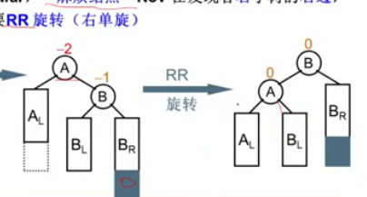

- LL 左左

- RL 右左

- LR 左右

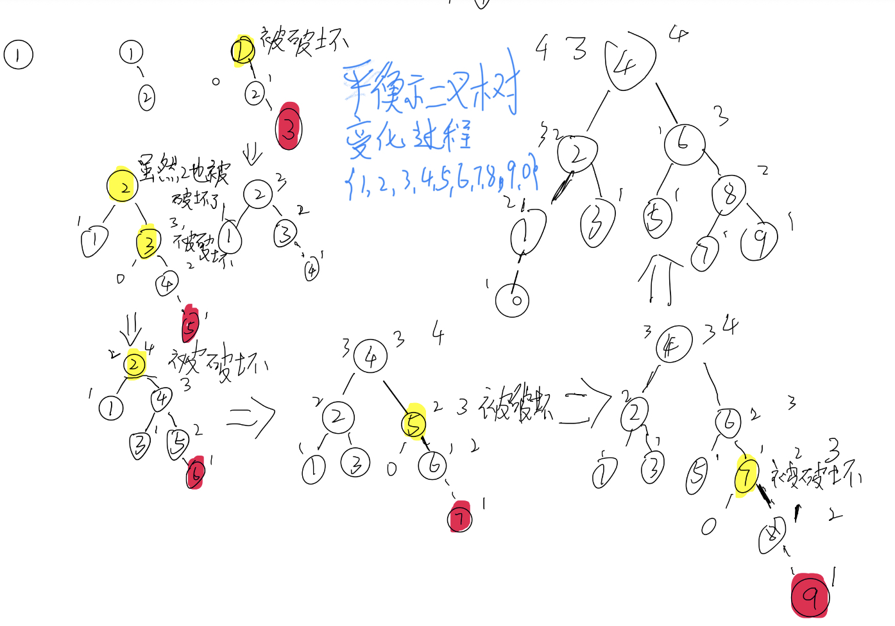

```c
typedef struct AVLNode *Position;
typedef Position AVLTree; /* AVL树类型 */
struct AVLNode{
    ElementType Data; /* 结点数据 */
    AVLTree Left;     /* 指向左子树 */
    AVLTree Right;    /* 指向右子树 */
    int Height;       /* 树高 */
};
 
int Max ( int a, int b )
{
    return a > b ? a : b;
}
 
AVLTree SingleLeftRotation ( AVLTree A )
{ /* 注意：A必须有一个左子结点B */
  /* 将A与B做左单旋，更新A与B的高度，返回新的根结点B */     
 	// B要成为新的root
	// 为了满足BST的性质, B的左子树要挂到A的右子树
    AVLTree B = A->Left;
    A->Left = B->Right;
    B->Right = A;
    A->Height = Max( GetHeight(A->Left), GetHeight(A->Right) ) + 1;
    B->Height = Max( GetHeight(B->Left), A->Height ) + 1;
  
    return B;
}
 
AVLTree DoubleLeftRightRotation ( AVLTree A )
{ /* 注意：A必须有一个左子结点B，且B必须有一个右子结点C */
  /* 将A、B与C做两次单旋，返回新的根结点C */
     
    /* 将B与C做右单旋，C被返回 */
    A->Left = SingleRightRotation(A->Left);
    /* 将A与C做左单旋，C被返回 */
    return SingleLeftRotation(A);
}
 
/*************************************/
/* 对称的右单旋与右-左双旋请自己实现 */
/*************************************/
 
AVLTree Insert( AVLTree T, ElementType X )
{ /* 将X插入AVL树T中，并且返回调整后的AVL树 */
    if ( !T ) { /* 若插入空树，则新建包含一个结点的树 */
        T = (AVLTree)malloc(sizeof(struct AVLNode));
        T->Data = X;
        T->Height = 0;
        T->Left = T->Right = NULL;
    } /* if (插入空树) 结束 */
 
    else if ( X < T->Data ) {
        /* 插入T的左子树 */
        T->Left = Insert( T->Left, X);
        /* 如果需要左旋 */
        if ( GetHeight(T->Left)-GetHeight(T->Right) == 2 )
            if ( X < T->Left->Data ) 
               T = SingleLeftRotation(T);      /* 左单旋 */
            else 
               T = DoubleLeftRightRotation(T); /* 左-右双旋 */
    } /* else if (插入左子树) 结束 */
     
    else if ( X > T->Data ) {
        /* 插入T的右子树 */
        T->Right = Insert( T->Right, X );
        /* 如果需要右旋 */
        if ( GetHeight(T->Left)-GetHeight(T->Right) == -2 )
            if ( X > T->Right->Data ) 
               T = SingleRightRotation(T);     /* 右单旋 */
            else 
               T = DoubleRightLeftRotation(T); /* 右-左双旋 */
    } /* else if (插入右子树) 结束 */
 
    /* else X == T->Data，无须插入 */
 
    /* 别忘了更新树高 */
    T->Height = Max( GetHeight(T->Left), GetHeight(T->Right) ) + 1;
     
    return T;
}
```

# 堆

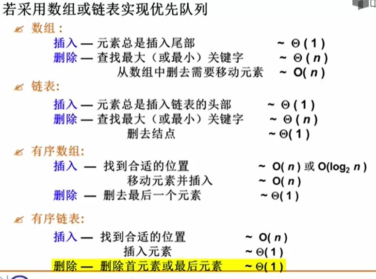

## 完全二叉树来存储

- 有序性: 任一结点的关键字是其子树所有结点的最大值(最小值)

  最大堆(MaxHeap) , 也称 大顶堆 最大值

  最小堆(MinHeap) , 也称 小顶堆 最小值

- 结构性: 用数组表示的完全二叉树

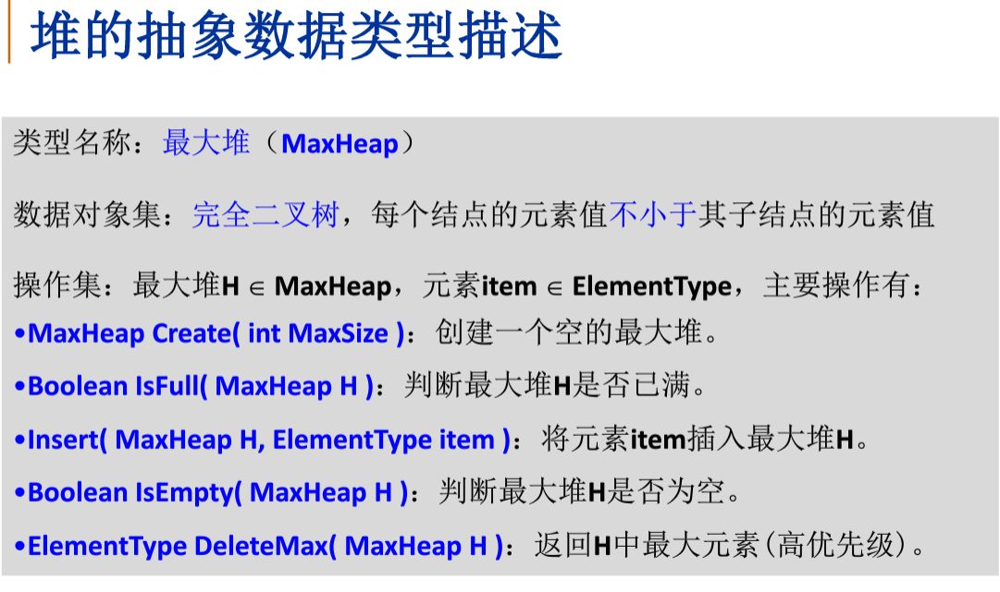

**建堆时，最坏情况下需要挪动元素次数是等于树中各结点的高度和 // 叶子结点的高度为0所以约等于非叶子结点的高度和**

时间复杂度$O(n)$

```c
typedef struct HNode *Heap; /* 堆的类型定义 */
struct HNode {
    ElementType *Data; /* 存储元素的数组 */
    int Size;          /* 堆中当前元素个数 */
    int Capacity;      /* 堆的最大容量 */
};
typedef Heap MaxHeap; /* 最大堆 */
typedef Heap MinHeap; /* 最小堆 */
 
#define MAXDATA 1000  /* 该值应根据具体情况定义为大于堆中所有可能元素的值 */
 
MaxHeap CreateHeap( int MaxSize )
{ /* 创建容量为MaxSize的空的最大堆 */
 
    MaxHeap H = (MaxHeap)malloc(sizeof(struct HNode));
    H->Data = (ElementType *)malloc((MaxSize+1)*sizeof(ElementType));
    H->Size = 0;
    H->Capacity = MaxSize;
    H->Data[0] = MAXDATA; /* 定义"哨兵"为大于堆中所有可能元素的值*/
 
    return H;
}
 
bool IsFull( MaxHeap H )
{
    return (H->Size == H->Capacity);
}
 
bool Insert( MaxHeap H, ElementType X )
{ /* 将元素X插入最大堆H，其中H->Data[0]已经定义为哨兵 */
    int i;
  
    if ( IsFull(H) ) { 
        printf("最大堆已满");
        return false;
    }
    i = ++H->Size; /* i指向插入后堆中的最后一个元素的位置 */
    for ( ; H->Data[i/2] < X; i/=2 )
        H->Data[i] = H->Data[i/2]; /* 上滤X */
    H->Data[i] = X; /* 将X插入 */
    return true;
}
 
#define ERROR -1 /* 错误标识应根据具体情况定义为堆中不可能出现的元素值 */
 
bool IsEmpty( MaxHeap H )
{
    return (H->Size == 0);
}
 
ElementType DeleteMax( MaxHeap H )
{ /* 从最大堆H中取出键值为最大的元素，并删除一个结点 */
    int Parent, Child;
    ElementType MaxItem, X;
 
    if ( IsEmpty(H) ) {
        printf("最大堆已为空");
        return ERROR;
    }
 
    MaxItem = H->Data[1]; /* 取出根结点存放的最大值 */
    /* 用最大堆中最后一个元素从根结点开始向上过滤下层结点 */
    X = H->Data[H->Size--]; /* 注意当前堆的规模要减小 */
    for( Parent=1; Parent*2<=H->Size; Parent=Child ) {
        Child = Parent * 2;
        if( (Child!=H->Size) && (H->Data[Child]<H->Data[Child+1]) )
            Child++;  /* Child指向左右子结点的较大者 */
        if( X >= H->Data[Child] ) break; /* 找到了合适位置 */
        else  /* 下滤X */
            H->Data[Parent] = H->Data[Child];
    }
    H->Data[Parent] = X;
 
    return MaxItem;
} 
 
/*----------- 建造最大堆 -----------*/
void PercDown( MaxHeap H, int p )
{ /* 下滤：将H中以H->Data[p]为根的子堆调整为最大堆 */
    int Parent, Child;
    ElementType X;
 
    X = H->Data[p]; /* 取出根结点存放的值 */
    for( Parent=p; Parent*2<=H->Size; Parent=Child ) {
        Child = Parent * 2;
        if( (Child!=H->Size) && (H->Data[Child]<H->Data[Child+1]) )
            Child++;  /* Child指向左右子结点的较大者 */
        if( X >= H->Data[Child] ) break; /* 找到了合适位置 */
        else  /* 下滤X */
            H->Data[Parent] = H->Data[Child];
    }
    H->Data[Parent] = X;
}
 
void BuildHeap( MaxHeap H )
{ /* 调整H->Data[]中的元素，使满足最大堆的有序性  */
  /* 这里假设所有H->Size个元素已经存在H->Data[]中 */
 
    int i;
 
    /* 从最后一个结点的父节点开始，到根结点1 */
    for( i = H->Size/2; i>0; i-- )
        PercDown( H, i );
}
```

# 集合的表示

- 集合运算: **交, 并, 补, 差, 判定**一个元素是否属于某一集合

- 并查集: 集合并, 查 某元素属于什么集合

- 并查集问题中集合存储如何实现
  
  - 可以用树结构表示集合, 树的每个结点代表一个集合元素,树根来代表某一个集合
  
  ```c
  #define MAXN 1000                  /* 集合最大元素个数 */
  typedef int ElementType;           /* 默认元素可以用非负整数表示 */
  typedef int SetName;               /* 默认用根结点的下标作为集合名称 */
  typedef ElementType SetType[MAXN]; /* 假设集合元素下标从0开始 */
   
  void Union( SetType S, SetName Root1, SetName Root2 ) // 这里是按树的规模
  { /* 这里默认Root1和Root2是不同集合的根结点 */
      /* 保证小集合并入大集合 */
      if ( S[Root2] < S[Root1] ) { /* 如果集合2比较大 */
          S[Root2] += S[Root1];     /* 集合1并入集合2  */
          S[Root1] = Root2;
      }
      else {                         /* 如果集合1比较大 */
          S[Root1] += S[Root2];     /* 集合2并入集合1  */
          S[Root2] = Root1;
      }
  }
  /*
  void Union(int s[],int root1,int root2)//按高度归并
  {
  	if(s[root2]<s[root1])
  	{
  		s[root1]=root2;
  	}
  	else 
  	{
  	if(s[root1]=s[root2])  s[root1]--;
  		s[root2]=root1;
  	}
  }
  */
  SetName Find( SetType S, ElementType X )
  { /* 默认集合元素全部初始化为-1 */
      if ( S[X] < 0 ) /* 找到集合的根 */
          return X;
      else
          return S[X] = Find( S, S[X] ); /* 路径压缩 */
  }
  ```
  
  

# 图

一组顶点: 通常用V(Vertex) 表示顶点集合

一组边: 通常用E(Edge) 表示边的集合

G(V,E)由一个非空的有限顶点集合v 和 一个有限边集合E组成

`MST`计算图的最小生成树

`shortestPath`图G中顶点v到任意其他顶点的最短距离

~~图是由顶点的**有穷非空集合**和顶点之间边的集合组成，通常表示为: G(V,E),~~ 其中G表示一个图，V是图G中顶点的集合，E是图G中边的集合。

对于图的定义，我们需要明确几个注意的地方：

- 线性表中-->数据元素叫**元素**，树中叫**结点**，图中叫**顶点**(Vertex)

- 线性表可以没有数据元素，称为空表。树中可以没有结点，叫做空树，而图结构在咱国内大部分的教材中强调顶点集合V要**有穷非空**

- 线性表中，相邻的数据元素之间具有线性关系。树结构中，相邻两层的结点具有层次关系。图结构中，任意两个顶点之间都有可能有关系，顶点之间的逻辑关系用**边**来表示，边集可以是**空的**

- 无向边: 若顶点Vi到Vj之间的边没有方向，则称这条边为无向边(Edge),用无序偶(Vi,Vj)来表示
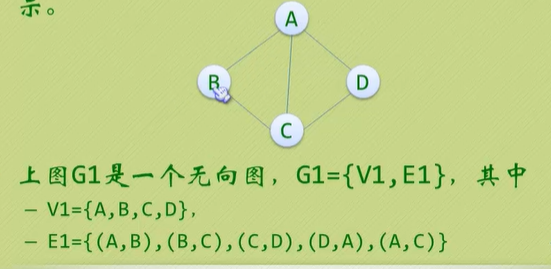

- 有向边: 若从顶点Vi到Vj的边有方向，则称这条边为有向边，也称为弧(Arc),用有序偶<Vi,Vj>来表示，Vi称为弧尾，Vj称为弧头

  
  
- 简单图: 在图结构中，**若不存在顶点到其自身的边，且同一条边不重复出现**，则称这样的图为简单图。

  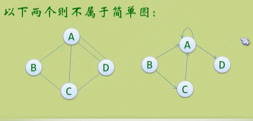
  
- 无向完全图

  在无向图中，如果任意两个顶点之间都存在边，则称该图为无向完全图。含有n个顶点的无向完全图有**n*(n-1)/2**条边。

- 有向完全图

  在有向图中，如果任意两个顶点之间都存在方向互为相反的两条弧，则称该图为有向完全图，含有n个顶点的有向完全图有**n*(n-1)**条边

- 稀疏图和稠密图

  这里的稀疏和稠密是模糊的概念，都是相对而言的，通常认为**边或弧数小于n*logn**(n是顶点的个数)的图称为稀疏图，反之
  
- 有些图的边或弧 带有与它相关的数字，这种与图的边或弧相关的数叫做权(weight),带权的图通常称为图(Network).

- G2为G1的子图(Subgragh).

  ## 图的顶点与边之间的关系

  连通: 如果从V到W存在一条(无向)**路径**, 则称V和W 是连通的
  
  路径: V到W的路径是一系列顶点{V,v1,v2,....vn,W}的集合, 其中任一对相邻的顶点间都有图中的边.
  
  路径的长度: 路径中的边数(如果带权,则是所有边的权重和). 如果V到W之间的所有顶点都不同, 则称**简单路径**
  
  回路: 起点等于终点的路径
  
  连通图: 图中任意两顶点均连通
  
  连通分量: 无向图的**极大**连通子图  // 首先要是子图
  
  - 极大定点数: 再加一个顶点就不连通了
  - 极大边数: 包含子图中所有顶点相连的所有边
  
  强连通: 有向图中顶点V和W之间存在双向路径,则称V和W是强连通的
  
  强连通图: 有向图中任意两顶点均强连通
  
  强连通分量: 有向图的极大强连通子图
  
  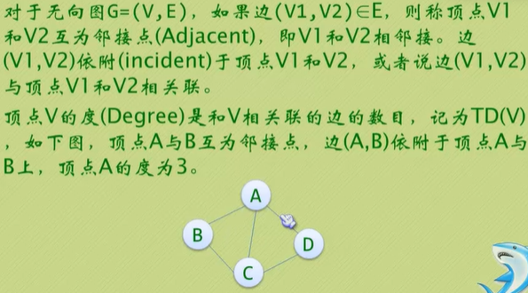

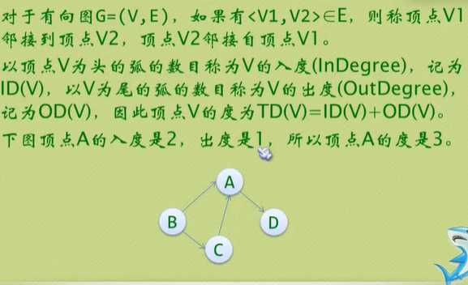

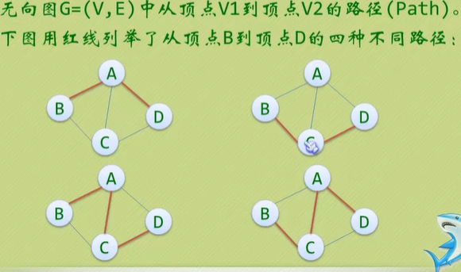

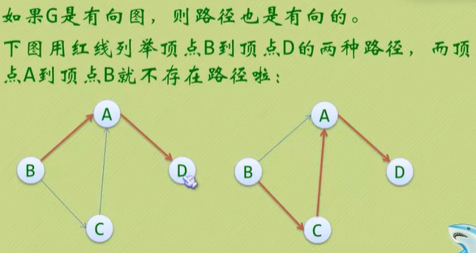

- 路径的长度是路径上的边或弧的数目

- 第一个顶点到最后一个顶点相同的路径称为**回路或环(cycle)**

- 序列中顶点不重复出现的路径称为简单路径，除了**第一个顶点和最后一个顶点之外，其余顶点不重复出现**的回路，称为简单回路或简单环。

## 连通图

- 在无向图G中，如果从顶点V1到顶点V2有路径，则称V1和v2是连通的，如果对于图中任意两个顶点Vi和Vj都是连通的，则称G是连通图(ConnectedGraph)
- 无向图中的**极大连通子图**称为连通分量。注意一下概念
  - 子图，子图要是连通的
  - 连通子图含有极大顶点数
  - 具有极大顶点数的连通子图包含依附于这些顶点的所有边
- 在有向图G中，如果对于每一对Vi到Vj都存在路径，则称G是强连通图
- 有向图中的极大强连通子图称为有向图的强连通分量

### 连通图的生成树

- 一个连通图的生成树是一个**极小**的连通子图，它含有图中全部的n个顶点，但只有足以构成一棵树的n-1条边。
- 如果一个有向图正好有一个顶点入度为0，其余顶点的入度均为1，则是一棵有向树.


------

有`N`个顶点的无向完全图有多少条边？

`N(N-1)/2`


### 图的存储结构

#### 邻接矩阵(无向图)G\[N][N]

图的邻接矩阵(Adjacency Matrix)存储方式是用两个数组来表示图，一个一维数组:存储图中顶点信息，一个二维数组(称为邻接矩阵)

$$G[i][j]= \begin{cases} 1& \text{<Vi,Vj>是G中的边} \\ 0& \text{否则} \end{cases}$$


$$ \begin{bmatrix} 
0 & 1 & 0 & 1 & 0\\ 
1 & 0 & 1 & 1 & 0 \\
0 & 1 & 0 & 0 & 1 \\
1 & 1 & 0 & 0 & 0 \\
0 & 0 & 1 & 0 & 0 \\
\end{bmatrix}$$


- 用一个长度为$N(N+1)/2$的一维数组A存储{G~00~G~10~G~11~,G~n-1\ 0~,G~n-1\ n-1~}则G~ij~ 在A中的位置为

​											$i * (i+1)/2 + j$


- 对于**网络**, 只要把G[i]\[j]的 值 定义为边<Vi,Vj>的 权重weight 即可

BFS用 队列，DFS用递归或栈$ \sum_{i=1}^n a_i$

```c
/* 图的邻接矩阵表示法 */
 
#define MaxVertexNum 100    /* 最大顶点数设为100 */
#define INFINITY 65535        /* ∞设为双字节无符号整数的最大值65535*/
typedef int Vertex;         /* 用顶点下标表示顶点,为整型 */
typedef int WeightType;        /* 边的权值设为整型 */
typedef char DataType;        /* 顶点存储的数据类型设为字符型 */
 
/* 边的定义 */
typedef struct ENode *PtrToENode;
struct ENode{
    Vertex V1, V2;      /* 有向边<V1, V2> */
    WeightType Weight;  /* 权重 */
};
typedef PtrToENode Edge;
        
/* 图结点的定义 */
typedef struct GNode *PtrToGNode;
struct GNode{
    int Nv;  /* 顶点数 */
    int Ne;  /* 边数   */
    WeightType G[MaxVertexNum][MaxVertexNum]; /* 邻接矩阵 */
    DataType Data[MaxVertexNum];      /* 存顶点的数据 */
    /* 注意：很多情况下，顶点无数据，此时Data[]可以不用出现 */
};
typedef PtrToGNode MGraph; /* 以邻接矩阵存储的图类型 */
 
 
 
MGraph CreateGraph( int VertexNum )
{ /* 初始化一个有VertexNum个顶点但没有边的图 */
    Vertex V, W;
    MGraph Graph;
     
    Graph = (MGraph)malloc(sizeof(struct GNode)); /* 建立图 */
    Graph->Nv = VertexNum;
    Graph->Ne = 0;
    /* 初始化邻接矩阵 */
    /* 注意：这里默认顶点编号从0开始，到(Graph->Nv - 1) */
    for (V=0; V<Graph->Nv; V++)
        for (W=0; W<Graph->Nv; W++)  
            Graph->G[V][W] = INFINITY;
             
    return Graph; 
}
        
void InsertEdge( MGraph Graph, Edge E )
{
     /* 插入边 <V1, V2> */
     Graph->G[E->V1][E->V2] = E->Weight;    
     /* 若是无向图，还要插入边<V2, V1> */
     Graph->G[E->V2][E->V1] = E->Weight;
}
 
MGraph BuildGraph()
{
    MGraph Graph;
    Edge E;
    Vertex V;
    int Nv, i;
     
    scanf("%d", &Nv);   /* 读入顶点个数 */
    Graph = CreateGraph(Nv); /* 初始化有Nv个顶点但没有边的图 */ 
     
    scanf("%d", &(Graph->Ne));   /* 读入边数 */
    if ( Graph->Ne != 0 ) { /* 如果有边 */ 
        E = (Edge)malloc(sizeof(struct ENode)); /* 建立边结点 */ 
        /* 读入边，格式为"起点 终点 权重"，插入邻接矩阵 */
        for (i=0; i<Graph->Ne; i++) {
            scanf("%d %d %d", &E->V1, &E->V2, &E->Weight); 
            /* 注意：如果权重不是整型，Weight的读入格式要改 */
            InsertEdge( Graph, E );
        }
    } 
 
    /* 如果顶点有数据的话，读入数据 */
    for (V=0; V<Graph->Nv; V++) 
        scanf(" %c", &(Graph->Data[V]));
 
    return Graph;
}
```


#### 邻接表

G[N] 为指针数组,对应矩阵每行一个链表,只存非0元素

> 够稀疏才合算

```c
/* 图的邻接表表示法 */
 
#define MaxVertexNum 100    /* 最大顶点数设为100 */
typedef int Vertex;         /* 用顶点下标表示顶点,为整型 */
typedef int WeightType;        /* 边的权值设为整型 */
typedef char DataType;        /* 顶点存储的数据类型设为字符型 */
 
/* 边的定义 */
typedef struct ENode *PtrToENode;
struct ENode{
    Vertex V1, V2;      /* 有向边<V1, V2> */
    WeightType Weight;  /* 权重 */
};
typedef PtrToENode Edge;
 
/* 邻接点的定义 */
typedef struct AdjVNode *PtrToAdjVNode; 
struct AdjVNode{
    Vertex AdjV;        /* 邻接点下标 */
    WeightType Weight;  /* 边权重 */
    PtrToAdjVNode Next;    /* 指向下一个邻接点的指针 */
};
 
/* 顶点表头结点的定义 */
typedef struct Vnode{
    PtrToAdjVNode FirstEdge;/* 边表头指针 */
    DataType Data;            /* 存顶点的数据 */
    /* 注意：很多情况下，顶点无数据，此时Data可以不用出现 */
} AdjList[MaxVertexNum];    /* AdjList是邻接表类型 */
 
/* 图结点的定义 */
typedef struct GNode *PtrToGNode;
struct GNode{  
    int Nv;     /* 顶点数 */
    int Ne;     /* 边数   */
    AdjList G;  /* 邻接表 */
};
typedef PtrToGNode LGraph; /* 以邻接表方式存储的图类型 */
 
 
 
LGraph CreateGraph( int VertexNum )
{ /* 初始化一个有VertexNum个顶点但没有边的图 */
    Vertex V;
    LGraph Graph;
     
    Graph = (LGraph)malloc( sizeof(struct GNode) ); /* 建立图 */
    Graph->Nv = VertexNum;
    Graph->Ne = 0;
    /* 初始化邻接表头指针 */
    /* 注意：这里默认顶点编号从0开始，到(Graph->Nv - 1) */
       for (V=0; V<Graph->Nv; V++)
        Graph->G[V].FirstEdge = NULL;
             
    return Graph; 
}
        
void InsertEdge( LGraph Graph, Edge E )
{
    PtrToAdjVNode NewNode;
     
    /* 插入边 <V1, V2> */
    /* 为V2建立新的邻接点 */
    NewNode = (PtrToAdjVNode)malloc(sizeof(struct AdjVNode));
    NewNode->AdjV = E->V2;
    NewNode->Weight = E->Weight;
    /* 将V2插入V1的表头 */
    NewNode->Next = Graph->G[E->V1].FirstEdge;
    Graph->G[E->V1].FirstEdge = NewNode;
         
    /* 若是无向图，还要插入边 <V2, V1> */
    /* 为V1建立新的邻接点 */
    NewNode = (PtrToAdjVNode)malloc(sizeof(struct AdjVNode));
    NewNode->AdjV = E->V1;
    NewNode->Weight = E->Weight;
    /* 将V1插入V2的表头 */
    NewNode->Next = Graph->G[E->V2].FirstEdge;
    Graph->G[E->V2].FirstEdge = NewNode;
}
 
LGraph BuildGraph()
{
    LGraph Graph;
    Edge E;
    Vertex V;
    int Nv, i;
     
    scanf("%d", &Nv);   /* 读入顶点个数 */
    Graph = CreateGraph(Nv); /* 初始化有Nv个顶点但没有边的图 */ 
     
    scanf("%d", &(Graph->Ne));   /* 读入边数 */
    if ( Graph->Ne != 0 ) { /* 如果有边 */ 
        E = (Edge)malloc( sizeof(struct ENode) ); /* 建立边结点 */ 
        /* 读入边，格式为"起点 终点 权重"，插入邻接矩阵 */
        for (i=0; i<Graph->Ne; i++) {
            scanf("%d %d %d", &E->V1, &E->V2, &E->Weight); 
            /* 注意：如果权重不是整型，Weight的读入格式要改 */
            InsertEdge( Graph, E );
        }
    } 
 
    /* 如果顶点有数据的话，读入数据 */
    for (V=0; V<Graph->Nv; V++) 
        scanf(" %c", &(Graph->G[V].Data));
 
    return Graph;
}
```

## 图的遍历

优点
1、能找出所有解决方案
2、优先搜索一棵子树，然后是另一棵，所以和广搜对比，有着内存需要相对较少的优点
缺点
1、要多次遍历，搜索所有可能路径，标识做了之后还要取消。

广搜优缺点
优点
1、对于解决最短或最少问题特别有效，而且寻找深度小
2、每个结点只访问一遍，结点总是以最短路径被访问，所以第二次路径确定不会比第一次短
缺点
1、内存耗费量大（需要开大量的数组单元用来存储状态）


DFS本质上使用的栈结构，而BFS使用的是队列。

当问题解离初始结点越近，这样的问题使用BFS效率较高，反之用DFS可能较好

---

==问:== 输入第1行给出两个正整数，分别表示社交网络图的结点数N（1<N≤10^3^，表示人数）、边数M（≤33×N，表示社交关系数）。随后的M行对应M条边，每行给出一对正整数，分别是该条边直接连通的两个结点的编号（节点从1到N编号）。
==解:==明显这是一种无向图。用邻接表表示，需要N + 66N个空间。用邻接矩阵表示，需要N(N+1)/2个空间。

解不等式N +66N > N(N + 1)/2，得到N<133。

当N<133的时候,  用邻接矩阵所需的空间少一些。

当N=133的时候，用邻接矩阵和邻接表所需的空间一样多。

当N>133的时候，用邻接表所需空间少一些


### DFS

```c
/* 邻接表存储的图 - DFS */
 
void Visit( Vertex V )
{
    printf("正在访问顶点%d\n", V);
}
 
/* Visited[]为全局变量，已经初始化为false */
void DFS( LGraph Graph, Vertex V, void (*Visit)(Vertex) )
{   /* 以V为出发点对邻接表存储的图Graph进行DFS搜索 */
    PtrToAdjVNode W;
     
    Visit( V ); /* 访问第V个顶点 */
    Visited[V] = true; /* 标记V已访问 */
 
    for( W=Graph->G[V].FirstEdge; W; W=W->Next ) /* 对V的每个邻接点W->AdjV */
        if ( !Visited[W->AdjV] )    /* 若W->AdjV未被访问 */
            DFS( Graph, W->AdjV, Visit );    /* 则递归访问之 */
}
```

### BFS

```c
/* 邻接矩阵存储的图 - BFS */
 
/* IsEdge(Graph, V, W)检查<V, W>是否图Graph中的一条边，即W是否V的邻接点。  */
/* 此函数根据图的不同类型要做不同的实现，关键取决于对不存在的边的表示方法。*/
/* 例如对有权图, 如果不存在的边被初始化为INFINITY, 则函数实现如下:         */
bool IsEdge( MGraph Graph, Vertex V, Vertex W )
{
    return Graph->G[V][W]<INFINITY ? true : false;
}
 
/* Visited[]为全局变量，已经初始化为false */
void BFS ( MGraph Graph, Vertex S, void (*Visit)(Vertex) )
{   /* 以S为出发点对邻接矩阵存储的图Graph进行BFS搜索 */
    Queue Q;     
    Vertex V, W;
 
    Q = CreateQueue( MaxSize ); /* 创建空队列, MaxSize为外部定义的常数 */
    /* 访问顶点S：此处可根据具体访问需要改写 */
    Visit( S );
    Visited[S] = true; /* 标记S已访问 */
    AddQ(Q, S); /* S入队列 */
     
    while ( !IsEmpty(Q) ) {
        V = DeleteQ(Q);  /* 弹出V */
        for( W=0; W<Graph->Nv; W++ ) /* 对图中的每个顶点W */
            /* 若W是V的邻接点并且未访问过 */
            if ( !Visited[W] && IsEdge(Graph, V, W) ) {
                /* 访问顶点W */
                Visit( W );
                Visited[W] = true; /* 标记W已访问 */
                AddQ(Q, W); /* W入队列 */
            }
    } /* while结束*/
}
```

## 最短路径问题的抽象

- 在网络中,求两个不同顶点之间的所有路径中, 边的权值之和最小的那一条路径

  - 这条路径就是两点之间的**最短路径**(Shortest Path)

  - 第一个顶点为源点(Source)

  - 最后一个顶点为终点(Destination)

单源最短路径问题: 从某固定源点出发, 求其到所有其他顶点的最短路径

多源最短路径问题: 求任意两顶点间的最短路径

## 最短路算法

切记切记, 最短路算法 一定是 对 **递增(非递减)**的图来谈的, 类似tree的层序遍历, 图的BFS遍历

 ## 无权图的单源最短路算法

按照==**递增(非递减)**==的顺序找出某个顶点到各个顶点的最短路

```c 
void Unweighted ( Vertex S) 
{ Enqueue(S, Q);
  while (!IsEmpty(Q)) {
      V = Dequeue(Q);
      for (V 的每个邻接点W) {
          dist[W] = dist[V] + 1;
          path[W] = V;
          Enqueue(W,Q);
      }
  }
}
// dist[W] S到W的最短距离
// path[W] S到W的最短路径
/* 邻接表存储 - 无权图的单源最短路算法 */
 
/* dist[]和path[]全部初始化为-1 */
void Unweighted ( LGraph Graph, int dist[], int path[], Vertex S )
{
    Queue Q;
    Vertex V;
    PtrToAdjVNode W;
     
    Q = CreateQueue( Graph->Nv ); /* 创建空队列, MaxSize为外部定义的常数 */
    dist[S] = 0; /* 初始化源点 */
    AddQ (Q, S);
 
    while( !IsEmpty(Q) ){
        V = DeleteQ(Q);
        for ( W=Graph->G[V].FirstEdge; W; W=W->Next ) /* 对V的每个邻接点W->AdjV */
            if ( dist[W->AdjV]==-1 ) { /* 若W->AdjV未被访问过 */
                dist[W->AdjV] = dist[V]+1; /* W->AdjV到S的距离更新 */
                path[W->AdjV] = V; /* 将V记录在S到W->AdjV的路径上 */
                AddQ(Q, W->AdjV);
            }
    } /* while结束*/
```

#### 有权图的单源最短路算法 // Dijkstra(

```c
void Dijkstra( Vertex s )
{ while (1) {
    V = 未收录顶点中dist最小者;
    if ( 这样的V不存在 )
      break; 
    collected[V] = true;
    for ( V 的每个邻接点 W )
      if ( collected[W] == false ) 
    if ( dist[V]+E<V,W> < dist[W] ) {
         dist[W] = dist[V] + E<V,W> ;
         path[W] = V;
    }
  }
}
// dist 要被初始化为正无穷
// dist[0,X,X]
// path[-1,X,X]

/* 邻接矩阵存储 - 有权图的单源最短路算法 */
 
Vertex FindMinDist( MGraph Graph, int dist[], int collected[] )
{ /* 返回未被收录顶点中dist最小者 */
    Vertex MinV, V;
    int MinDist = INFINITY;
 
    for (V=0; V<Graph->Nv; V++) {
        if ( collected[V]==false && dist[V]<MinDist) {
            /* 若V未被收录，且dist[V]更小 */
            MinDist = dist[V]; /* 更新最小距离 */
            MinV = V; /* 更新对应顶点 */
        }
    }
    if (MinDist < INFINITY) /* 若找到最小dist */
        return MinV; /* 返回对应的顶点下标 */
    else return ERROR;  /* 若这样的顶点不存在，返回错误标记 */
}
 
bool Dijkstra( MGraph Graph, int dist[], int path[], Vertex S )
{
    int collected[MaxVertexNum];
    Vertex V, W;
 
    /* 初始化：此处默认邻接矩阵中不存在的边用INFINITY表示 */
    for ( V=0; V<Graph->Nv; V++ ) {
        dist[V] = Graph->G[S][V];
        if ( dist[V]<INFINITY )
            path[V] = S;
        else
            path[V] = -1;
        collected[V] = false;
    }
    /* 先将起点收入集合 */
    dist[S] = 0;
    collected[S] = true;
 
    while (1) {
        /* V = 未被收录顶点中dist最小者 */
        V = FindMinDist( Graph, dist, collected );
        if ( V==ERROR ) /* 若这样的V不存在 */
            break;      /* 算法结束 */
        collected[V] = true;  /* 收录V */
        for( W=0; W<Graph->Nv; W++ ) /* 对图中的每个顶点W */
            /* 若W是V的邻接点并且未被收录 */
            if ( collected[W]==false && Graph->G[V][W]<INFINITY ) {
                if ( Graph->G[V][W]<0 ) /* 若有负边 */
                    return false; /* 不能正确解决，返回错误标记 */
                /* 若收录V使得dist[W]变小 */
                if ( dist[V]+Graph->G[V][W] < dist[W] ) {
                    dist[W] = dist[V]+Graph->G[V][W]; /* 更新dist[W] */
                    path[W] = V; /* 更新S到W的路径 */
                }
            }
    } /* while结束*/
    return true; /* 算法执行完毕，返回正确标记 */
}
```

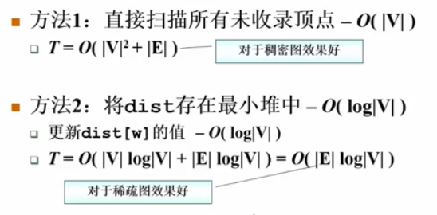

#### 多源最短路算法 Floyd算法 $O(V^3)$

多元一般用邻接矩阵 定义图

- $D^k[i][j]$ =路径{i -> {l <= k} -> j} 的最小长度

- $D^0 D^1, .....D^{|V|-1}[i][j]$这种方式递推的话,$D^{|V|-1}[i][j]$即存的i到j的最短路径

- 当$D^{k-1}$ 已经完成, 递推到$D^k$时

  - k **不属于**最短路径{i -> {l <= k} -> j}, 则$D^k = D^{K-1}$

  - k **属于**最短路径{i -> {l <= k} -> j}, 则==该路径必定由两段最短路径组成== : $D^k[i][j] = D^{K-1}[i][k] + D^{K-1}[k][j] $即 i -> j的距离 == i->k的距离 + k->j的距离,  i->k的距离 + k->j的距离都是不包括k的, 因为在k-1步就要求出来的

    

```c
/* 邻接矩阵存储 - 多源最短路算法 */
 
bool Floyd( MGraph Graph, WeightType D[][MaxVertexNum], Vertex path[][MaxVertexNum] )
{
    Vertex i, j, k;
 
    /* 初始化 */
    for ( i=0; i<Graph->Nv; i++ )
        for( j=0; j<Graph->Nv; j++ ) {
            D[i][j] = Graph->G[i][j];
            path[i][j] = -1;
        }
 
    for( k=0; k<Graph->Nv; k++ )// 上标
        for( i=0; i<Graph->Nv; i++ )
            for( j=0; j<Graph->Nv; j++ )
                if( D[i][k] + D[k][j] < D[i][j] ) {
                    D[i][j] = D[i][k] + D[k][j];
                    if ( i==j && D[i][j]<0 ) /* 若发现负值圈 */
                        return false; /* 不能正确解决，返回错误标记 */
                    path[i][j] = k;
                }
    return true; /* 算法执行完毕，返回正确标记 */
}
```

### 最小生成树(Minimum spanning tree)

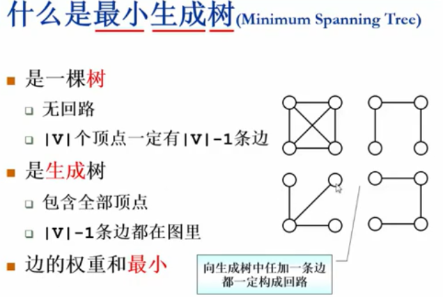

## 拓扑排序

有向图

AOV(Activity On Vertex)网络

- 拓扑序: 如果图中从V到W有一条有向路径, 则V一定排在W之前,满足此条件的顶点序列称为一个拓扑序
- 获得拓扑序的过程就是拓扑排序
- AOV如果有**合理的**拓扑序,则必定是**有向无环图(**Directed Acyclic Graph,DAG)
- 入度为0的顶点

```c
void TopSort()
{
    for ( cnt = 0; cnt < |V|; cnt ++) {
        V = 为输出的入度为0的顶点;
        if (这样的V不存在) {
        	Error ("图中有回路")
            break;
        }
        输出V, 或者纪录V的输出序号;
        for (V 的每个邻接点W)
            Indegree[W]--;
    }
}
```

聪明的算法; 随时将入度变为0的顶点放到一个容器里

```c
void TopSort()
{
    for ( 图中每个顶点V ){
        if ( Indegree[V] == 0)
            Enqueue(V, Q);
    }
    for ( !IsEmpty(Q)) {
        V = DEqueue(Q);
        输出V, 或者纪录V的输出序号; cnt++;
        for (V 的每个邻接点W)
            if ( --INdegree[W] == 0)
                Enqueue( W, Q );
    }
   if ( cnt != |V| )
       Error("图中有回路");
}
```

AOE(Activity On Edge)网络

- 一般用于安排项目的工序

```c
/* 邻接表存储 - 拓扑排序算法 */
 
bool TopSort( LGraph Graph, Vertex TopOrder[] )
{ /* 对Graph进行拓扑排序,  TopOrder[]顺序存储排序后的顶点下标 */
    int Indegree[MaxVertexNum], cnt;
    Vertex V;
    PtrToAdjVNode W;
       Queue Q = CreateQueue( Graph->Nv );
  
    /* 初始化Indegree[] */
    for (V=0; V<Graph->Nv; V++)
        Indegree[V] = 0;
         
    /* 遍历图，得到Indegree[] */
    for (V=0; V<Graph->Nv; V++)
        for (W=Graph->G[V].FirstEdge; W; W=W->Next)
            Indegree[W->AdjV]++; /* 对有向边<V, W->AdjV>累计终点的入度 */
             
    /* 将所有入度为0的顶点入列 */
    for (V=0; V<Graph->Nv; V++)
        if ( Indegree[V]==0 )
            AddQ(Q, V);
             
    /* 下面进入拓扑排序 */ 
    cnt = 0; 
    while( !IsEmpty(Q) ){
        V = DeleteQ(Q); /* 弹出一个入度为0的顶点 */
        TopOrder[cnt++] = V; /* 将之存为结果序列的下一个元素 */
        /* 对V的每个邻接点W->AdjV */
        for ( W=Graph->G[V].FirstEdge; W; W=W->Next )
            if ( --Indegree[W->AdjV] == 0 )/* 若删除V使得W->AdjV入度为0 */
                AddQ(Q, W->AdjV); /* 则该顶点入列 */ 
    } /* while结束*/
     
    if ( cnt != Graph->Nv )
        return false; /* 说明图中有回路, 返回不成功标志 */ 
    else
        return true;
}
```

```go
func TopSort(Graph LGraph, TopOrder []string) bool {
	var Queue []int
	Queue = make([]int, Graph.Nv)

	// 初始化Indegreee[]
	//for V := 0; V < Graph.Nv; V++ {
	//	Indegress[V] = 0
	//}
	Indegree := make(map[int]int, Graph.Nv)
    // 获取所有结点的入度
	for V := 0; V < Graph.Nv; V++ {
		for _, W := Graph.G[V].FirstEdge; W; W = W.Next {
			// 对有向边<V, W->AdjV>累计终点的入度
			Indegree[W.AdjV]++
		}
	}

	// 将所有入度为0的顶点入列
	for V := 0; V < Graph.Nv; V++ {
		Queue = append(Queue, V)
	}

	// 拓扑排序
	cnt := 0
	// for !IsEmpty() {
	for len(Queue) > 0 {
		// 弹出一个入度为0的顶点
		V := Queue[0]
		Queue = Queue[1:]

		// 将之存为结果序列的下一个元素
		cnt++
		TopOrder[cnt] = V;

		// 对V的每个邻接点W->AdjV
		for W := Graph.G[V].FirstEdge; W; W = W.Next {
			Indegree[W.AdjV] --
			// 若删除V使得W.AdjV入度为0
			if Indegree[W.AdjV] == 0 {
				Queue =append(Queue, W.AdjV)
			}
		}

		if cnt != Graph.Nv {
			return false; 说明图中有回路,返回不成功标志
		}
		return true
	}
}
```

```go
func canFinish(numCourses int, prerequisites [][]int) bool {
    Indegree := make([]int , numCourses)
    edges := make([][]int, numCourses)
    TopOrder := []int{}
	// 构建入度数组和 有向图
    for _, info := range prerequisites {
        edges[info[1]] = append(edges[info[1]], info[0])
        Indegree[info[0]]++
    }

	// 将入度为0的结点放入队列
    Queue := []int{}
    for i := 0; i < numCourses; i++ {
      if Indegree[i] == 0 {
          Queue = append(Queue, i)
      }
    }

    for len(Queue) > 0 {
        V := Queue[0]
        Queue = Queue[1:]

        TopOrder = append(TopOrder, V)

        for i := 0; i < len(edges[V]); i ++ {
            Indegree[edges[V][i]] --
            if Indegree[edges[V][i]] == 0 {
                Queue = append(Queue, edges[V][i])
            }
        }
    }
    return len(TopOrder) == numCourses 
}
```

