# 抽线数据类型abstract Data Type

## 数据类型

 - 数据对象集
 - 数据集合相关联的操作集

## 抽象: 描述数据类型的方法不依赖于具体实现

-	与存放数据的机器无关
-	与数据存储的物理结构无关
-	与实现操作的算法和编程语言均无关

> 只描述数据对象及和相关操作集**是什么**,并不设计**如何做到**的问题.

## 描述抽象数据类型的标准格式

ADT 抽象数据类型名
Data 
	数据元素之间的逻辑关系的定义
Operation 
	操作
endADT

# 线性表

顺序存储结构 (优势:查找)

线性表(Linear List):由同类型**数据元素**构成**有序数列**的线性结构
- 起始位置:表头,结束位置:表尾
- 可以为0,称为空表
- 表中元素个数成为线性表的长度(从1开始计算的)

ADT : 线性表

Data(数据对象集): n>=0个元素构成的有序序列,出第一个元素外都有一个**先驱元素**,除最后一个元素外都有一个**后继元素**.数据元素之间的关系是一对一的关系

Operation: 

- InitList(*L): 初始化,建立一个空的线性表
- ListEmpty(L): 判断线性表是否为空
- GetElem(L,i,*e):返回第i个元素的值
- LocateElem(L,e),返回在线性表L中查找X的第一次出现的位置
- ListInsert
- ListDelete


# 链表(优势:插入和删除)


```go
type struct Node {
	data int,
    Node struct *next, 
}
```

```c
typedef struct Node {
    int data;          // 这里默认的是int
    struct Node *next; // 指向Node型变量的指针
}Node;
```

上面这个struct的名字为Node,因此组成此结构体的成员中有一个是指向**和自己类型相同的变量的指针**,内部要用自己来定义这个指针，所以写成`struct Node *next;`

### 头插法建立单链表

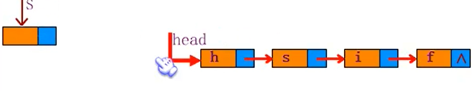

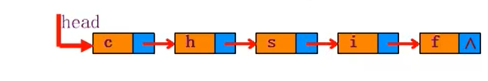

生成的链表与**输入的顺序**相反

### 尾插法

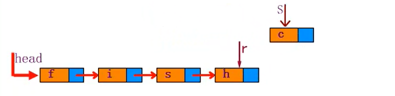

需要一个index索引

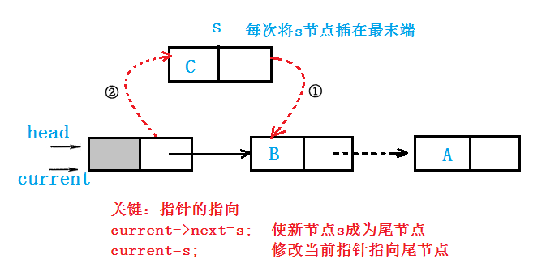

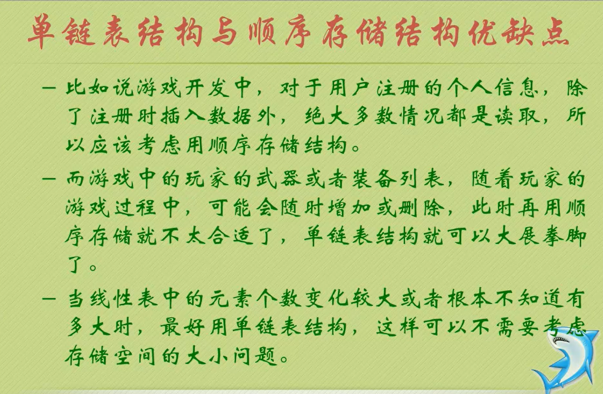


### 循环链表

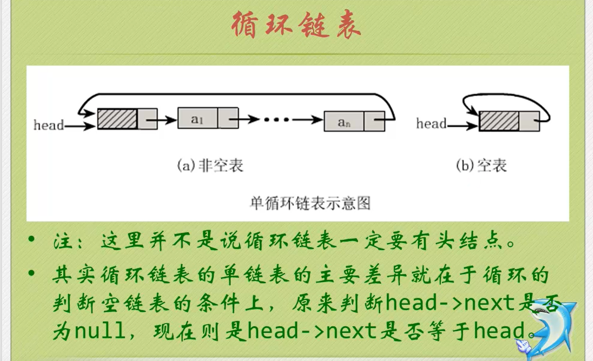

另外一种办法:rear 指针 不再有head


# 树

## 二分查找启示
- 判定树上每个**结点**需要的查找次数刚好为该节点所在的**层数**；
- 查找成功时**查找次数**不会超过判定树的**深度**
- n个结点的判定树的深度为[log<sub>2</sub>n]+1. 
- 下图为3+1 = 4层
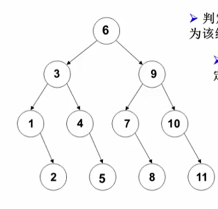
- 平均成功查找次数ASL = (4\*4+4\*3+2\*2+1)/11 =3

## 树的定义

树: n (n>=0)个结点构成的有限集合

n=0时称为**空树**

对于任一棵非空树（n>0)，它具备以下性质:

- 树中有一个称为"根(Root)"的特殊结点,用r表示
  - 其余结点可分为m(m>0)个**互不相交**的有限集T<sub>1</sub>,T<sub>2</sub>,...,T<sub>m</sub>,其中**每个集合本身又是一棵树**,称为原来树的“子树(subtree)”

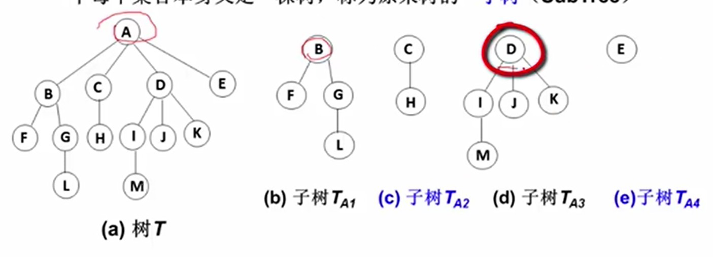

A 有以B,C,D,E为结点的树

	- 除了根节点外,每个结点有且只有一个父节点

### 树的一些基本术语

1. 结点的度(Degree): 结点的子树个数
2. 树的度： 树的所有节点中最大的度数
3. 叶节点(Leaf):度为0的结点
4. 父节点(Parent):有子树的结点是其子树的根结点的父结点
5. 子结点(Child): 若A结点是B结点的父结点，则称B结点是A结点的子结点；子结点也称**孩子结点**
6. 兄弟结点(sibling): 具有同一父结点的各结点彼此是兄弟结点
   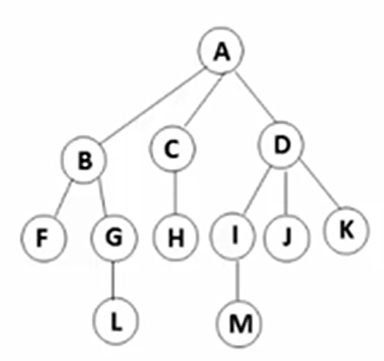
7. 路径和路径长度：从结点n<sub>1</sub>到n<sub>k</sub>的路径为一个结点序列n<sub>1</sub>,n<sub>2</sub>,...,n<sub>k</sub>,n<sub>i</sub>是n<sub>i+1</sub>的父结点。路径所包含边的个数为**路径的长度**
8. 祖先结点(Ancestor)：沿**树根到某一结点路径**上的所有结点都是这个结点的祖先结点
9. 子孙结点(Descendant): 某一结点的**子树中的所有结点**是这个结点的子孙
10. 结点的层次(Level): 规定**根结点在1层**，其他任一结点的层数是其父结点的层数加1.
11. 树的深度(Depth): 树中所有结点中的**最大层次**是这棵树的深度

### 树的表示

- 儿子-兄弟表示法

- 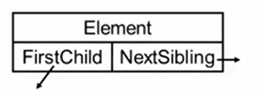

  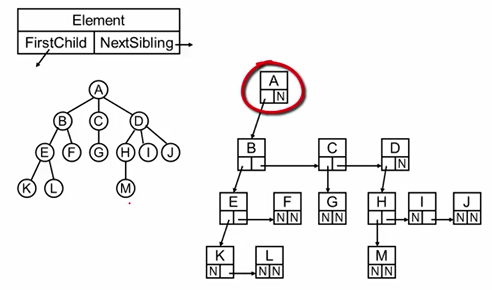


# 二叉树


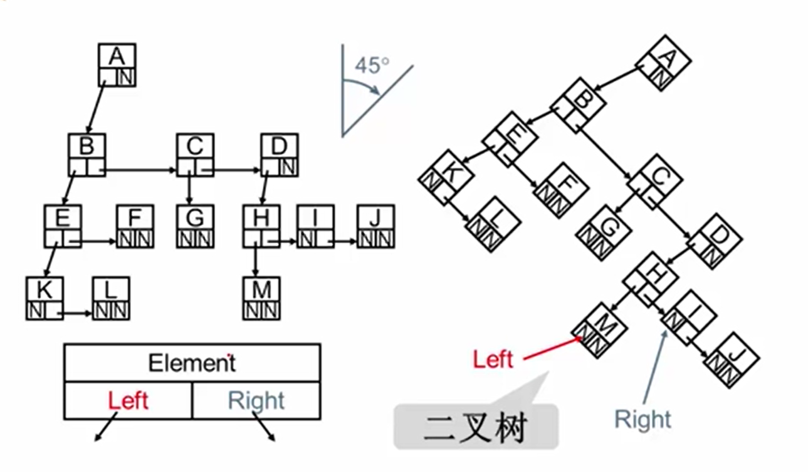

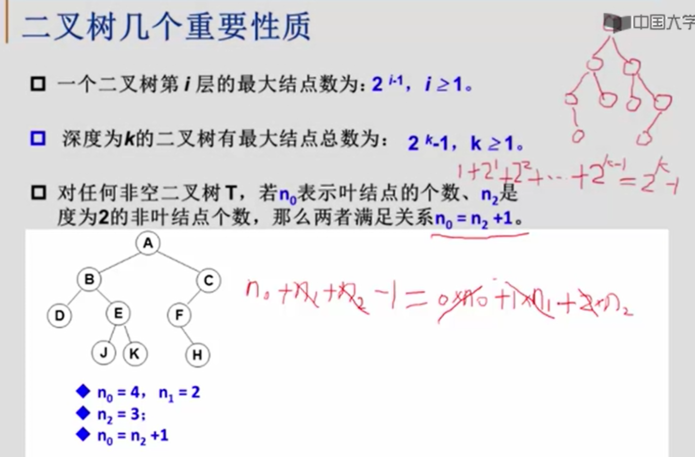

ADT: 二叉树

Data：一个有穷的结点集合。若不为空,则由**根结点和其左、右二叉子树**组成

Operation: 


### 常用的遍历方法
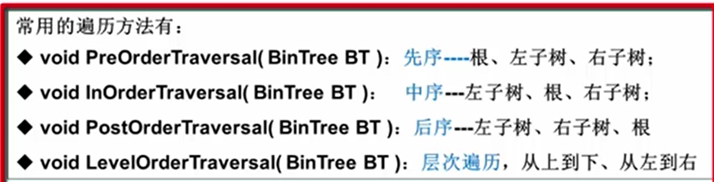

>  叉搜索树的中序遍历的序列是递增排序的序列。中序遍历的遍历次序：`Left -> Node -> Right`。

```c
typedef struct BTNode {
    int data;				// 这里默认的是int
    struct BTNode *lchild;  // 指向左孩子节点的指针
    struct BTNode *rchild;  // 指向右孩子节点的指针
}BTNode;
```

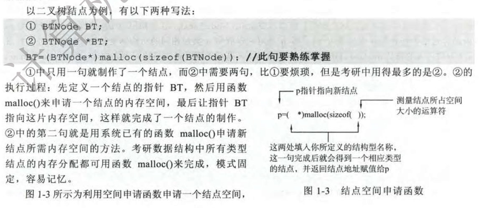
##### 堆栈实现
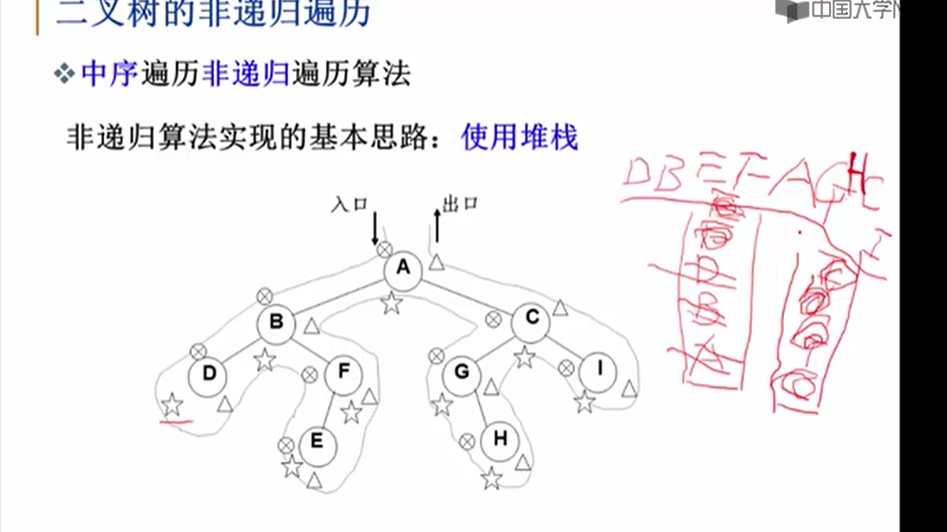

#### 层序遍历

二叉树遍历的核心问题: **二维结构的线性化**(即二维变成线性的解决办法)

	- 从结点访问其左、右儿子结点
 - 访问左儿子后，右儿子结点怎么办
   	- 需要一个存储结构保存暂时不能访问的结点
      	- 存储结构: stack、queue

##### 队列实现

遍历从根结点开始，首先将**根结点入队**，然后开始执行循环，结点出队、访问该结点、其左右儿子入队

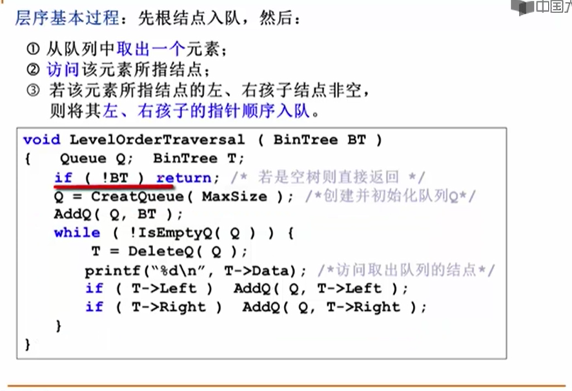

[leetcode例题](https://leetcode-cn.com/problems/maximum-depth-of-binary-tree/solution/er-cha-shu-de-zui-da-shen-du-by-leetcode/)


## 二叉搜索树/二叉查找树(BST,Binary Search Tree)

基本概念: 一棵二叉树，可以为空,如果不为空，满足以下性质:

1. 非空**左子树**的所有**键值小于其根结点**的键值
2. 非空**右子树**的所有**键值大于其根结点**的键值
3. **左、右子树都是二叉搜索树**

Operation：

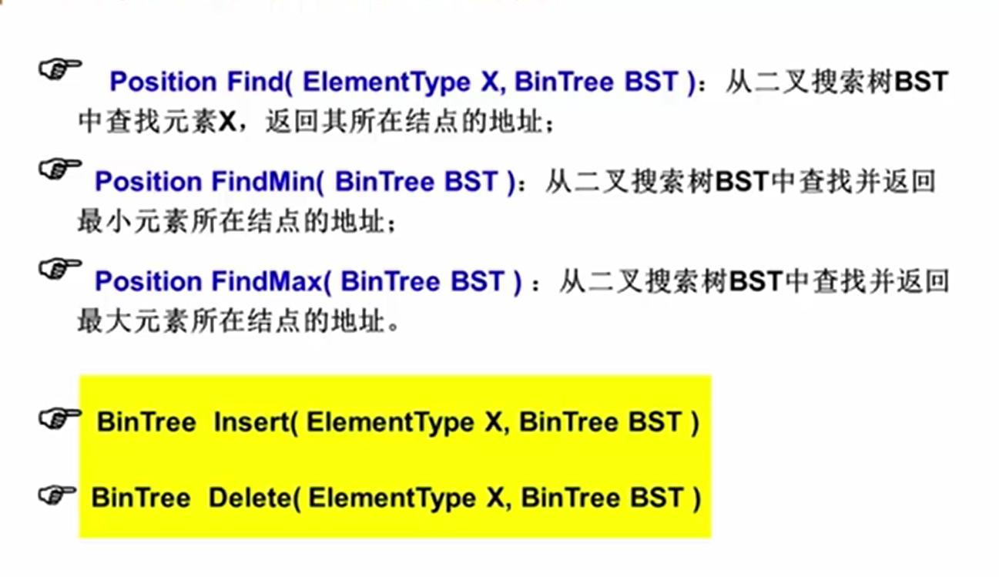

> 查找效率取决于树的高度

### Find

指定值:[例题](https://leetcode-cn.com/problems/search-in-a-binary-search-tree/)

最大值: 递归

最小值: 迭代

### Insert

[例题:](https://leetcode-cn.com/problems/insert-into-a-binary-search-tree/)

### Delect
- 叶节点:直接删除,父指针置为NUll

- 删除只有一个孩子的结点

  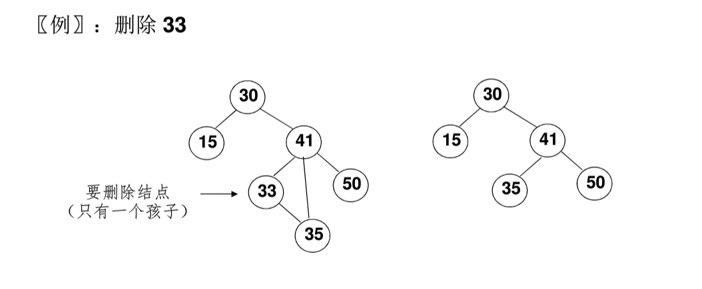

- 删除有左、右两颗子树的结点

  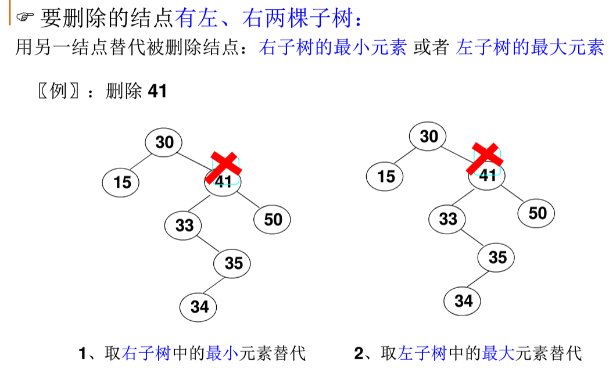

---
```c
BinTree Delete( BinTree BST, ElementType X ) 
{ 
    Position Tmp; 
 
    if( !BST ) 
        printf("要删除的元素未找到"); 
    else {
        if( X < BST->Data ) 
            BST->Left = Delete( BST->Left, X );   /* 从左子树递归删除 */
        else if( X > BST->Data ) 
            BST->Right = Delete( BST->Right, X ); /* 从右子树递归删除 */
        else { /* BST就是要删除的结点 */
            /* 如果被删除结点有左右两个子结点 */ 
            if( BST->Left && BST->Right ) {
                /* 从右子树中找最小的元素填充删除结点 */
                Tmp = FindMin( BST->Right );
                BST->Data = Tmp->Data;
                /* 从右子树中删除最小元素 */
                BST->Right = Delete( BST->Right, BST->Data );
            }
            else { /* 被删除结点有一个或无子结点 */
                Tmp = BST; 
                if( !BST->Left )       /* 只有右孩子或无子结点 */
                    BST = BST->Right; 
                else                   /* 只有左孩子 */
                    BST = BST->Left;
                free( Tmp );
            }
        }
    }
    return BST;
}
```
[例题](https://leetcode-cn.com/problems/delete-node-in-a-bst/)

### 验证是否二叉搜索树BST
[例题](https://leetcode-cn.com/problems/validate-binary-search-tree/)

# 平衡二叉树(Balanced Binary Tree)(AVL树)

平衡因子(Balance Factor): **BF(T) = h<sub>L</sub> - h<sub>R</sub>** 其中h<sub>L</sub>h<sub>R</sub>分别为T的左、右子树的高度

平衡因子:左右两棵子树的高度差

**平衡二叉树**:

- 首先是满足 二叉搜索树/二叉查找树

- 空树，或者任一结点左、右子树的高度差的绝对值不超过1,即`|BR(T)| <=1`

### 插入

- RR 右右
- LL 左左
- RL 右左
- LR 左右

```c
typedef struct AVLNode *Position;
typedef Position AVLTree; /* AVL树类型 */
struct AVLNode{
    ElementType Data; /* 结点数据 */
    AVLTree Left;     /* 指向左子树 */
    AVLTree Right;    /* 指向右子树 */
    int Height;       /* 树高 */
};
 
int Max ( int a, int b )
{
    return a > b ? a : b;
}
 
AVLTree SingleLeftRotation ( AVLTree A )
{ /* 注意：A必须有一个左子结点B */
  /* 将A与B做左单旋，更新A与B的高度，返回新的根结点B */     
 
    AVLTree B = A->Left;
    A->Left = B->Right;
    B->Right = A;
    A->Height = Max( GetHeight(A->Left), GetHeight(A->Right) ) + 1;
    B->Height = Max( GetHeight(B->Left), A->Height ) + 1;
  
    return B;
}
 
AVLTree DoubleLeftRightRotation ( AVLTree A )
{ /* 注意：A必须有一个左子结点B，且B必须有一个右子结点C */
  /* 将A、B与C做两次单旋，返回新的根结点C */
     
    /* 将B与C做右单旋，C被返回 */
    A->Left = SingleRightRotation(A->Left);
    /* 将A与C做左单旋，C被返回 */
    return SingleLeftRotation(A);
}
 
/*************************************/
/* 对称的右单旋与右-左双旋请自己实现 */
/*************************************/
 
AVLTree Insert( AVLTree T, ElementType X )
{ /* 将X插入AVL树T中，并且返回调整后的AVL树 */
    if ( !T ) { /* 若插入空树，则新建包含一个结点的树 */
        T = (AVLTree)malloc(sizeof(struct AVLNode));
        T->Data = X;
        T->Height = 0;
        T->Left = T->Right = NULL;
    } /* if (插入空树) 结束 */
 
    else if ( X < T->Data ) {
        /* 插入T的左子树 */
        T->Left = Insert( T->Left, X);
        /* 如果需要左旋 */
        if ( GetHeight(T->Left)-GetHeight(T->Right) == 2 )
            if ( X < T->Left->Data ) 
               T = SingleLeftRotation(T);      /* 左单旋 */
            else 
               T = DoubleLeftRightRotation(T); /* 左-右双旋 */
    } /* else if (插入左子树) 结束 */
     
    else if ( X > T->Data ) {
        /* 插入T的右子树 */
        T->Right = Insert( T->Right, X );
        /* 如果需要右旋 */
        if ( GetHeight(T->Left)-GetHeight(T->Right) == -2 )
            if ( X > T->Right->Data ) 
               T = SingleRightRotation(T);     /* 右单旋 */
            else 
               T = DoubleRightLeftRotation(T); /* 右-左双旋 */
    } /* else if (插入右子树) 结束 */
 
    /* else X == T->Data，无须插入 */
 
    /* 别忘了更新树高 */
    T->Height = Max( GetHeight(T->Left), GetHeight(T->Right) ) + 1;
     
    return T;
}
```

