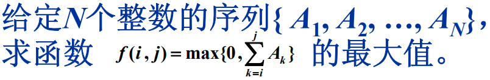

# 分而治之 递归 
分治法是把任意大小问题尽可能地等分成两个子问题的递归算法 


# 在线处理 // 也叫贪心 //也有前缀和的思想	

```c
int MaxSubseqSum4( int A[], int N )  
{   int ThisSum, MaxSum;
    int i;
    ThisSum = MaxSum = 0;
    for( i = 0; i < N; i++ ) {
          ThisSum += A[i]; /* 向右累加 */
          if( ThisSum > MaxSum )
                  MaxSum = ThisSum; /* 发现更大和则更新当前结果 */
          else if( ThisSum < 0 ) /* 如果当前子列和为负 */
                  ThisSum = 0; /* 则不可能使后面的部分和增大，抛弃之 */
    }
    return MaxSum;  
}

// 支持负数的最大子列和 [-2,-1]
func maxSubArray(nums []int) int {
    // 在线处理 比 动态规划 分而治之好
    ans := nums[0]
    cur := 0
    for _,v := range nums{
        if cur > 0 {
             cur += v
        }else {
            cur = v
        }
      ans = max(ans,cur)
    }
    return ans
}
func max(a,b int) int {
    if a > b {
        return a
    }
    return b
}
```

# 例子



```go
// MaxSubseqSum3 算法三
func MaxSubseqSum3 (seq []int)  (maxnum int) {
	/* 保持与前2种算法相同的函数接口 */
	N := len(seq)
	return DivideAndConquer(seq,0,N-1)

}
/*DivideAndConquer 分治法： 
先分，然后再治
递归调用 
*/
func DivideAndConquer(array []int, left,right int )  int {
	var leftSum, rightSum int = 0,0
    //递归终止：
	if  left == right {
		if left > 0 {
			return array[left]
		}
		return 0 
	} 
	// 分
	mid := (left+right)/2 /* 找到中分点 */
	/* 递归求得两边子列的最大和 */
	// 4 -3 5 -2 -1 2 6 -2
	// 第一次返回值 leftSum 4 rightSum 0 
	// 跨越边界的子列和的值为4，解决这个子问题的，他返回的解应该是4
	leftSum = DivideAndConquer(array,left,mid)
	rightSum = DivideAndConquer(array,mid+1,right)
	/* 下面求跨分界线的最大子列和 */
	var leftBorderSum,  maxLeftBorder int = 0,0 //最小值为0的话 负数会无法计算
	var rightBorderSum,  maxRightBorder int = 0,0
	for i := mid ;i>=0;i--{ /* 从中线向左扫描 */
        leftBorderSum += array[i];  
        if(leftBorderSum>maxLeftBorder){
            maxLeftBorder = leftBorderSum;    
        }
    }/* 左边扫描结束 */
 
    for i := mid + 1;i<=right;i++ {
        rightBorderSum += array[i]; 
        if(rightBorderSum>maxRightBorder){
            maxRightBorder = rightBorderSum;  
        }
	}
	/* 下面返回"治"的结果 */
    return Max(leftSum,rightSum,maxRightBorder+maxLeftBorder); 
}
// Max /* 返回3个整数中的最大值 */
func Max(x, y,z int) int {
    if x > y {
		if x > z {
			return x
		}
		return z
	}
	if y > z {
		return y
	}
	return z

}
```

# 例子2

```java
class Solution {
    private int countInRange(int[] nums, int num, int lo, int hi) {
        int count = 0;
        for (int i = lo; i <= hi; i++) {
            if (nums[i] == num) {
                count++;
            }
        }
        return count;
    }

    private int majorityElementRec(int[] nums, int lo, int hi) {
        // base case; the only element in an array of size 1 is the majority
        // element.
        if (lo == hi) {
            return nums[lo];
        }

        // recurse on left and right halves of this slice.
        int mid = (hi-lo)/2 + lo;
        int left = majorityElementRec(nums, lo, mid);
        int right = majorityElementRec(nums, mid+1, hi);

        // if the two halves agree on the majority element, return it.
        if (left == right) {
            return left;
        }

        // otherwise, count each element and return the "winner".
        int leftCount = countInRange(nums, left, lo, hi);
        int rightCount = countInRange(nums, right, lo, hi);

        return leftCount > rightCount ? left : right;
    }

    public int majorityElement(int[] nums) {
        return majorityElementRec(nums, 0, nums.length-1);
    }
}
```

作者：LeetCode-Solution
链接：https://leetcode-cn.com/problems/majority-element/solution/duo-shu-yuan-su-by-leetcode-solution/