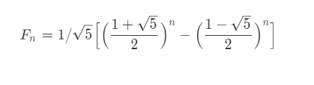
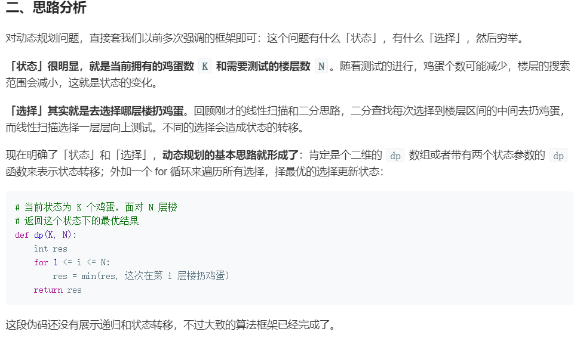

斐波那契数列数学算法公式




「动态规划」告诉了我们另一种求解问题的思路。我们学习编程，习惯了自顶向下求解问题（递归），在自顶向下求解问题的过程中，发现了重复子问题，我们再加上缓存。而「动态规划」告诉我们，其实有一类问题我们可以从一个最简单的情况开始考虑，通过逐步递推，每一步都记住当前问题的答案，得到最终问题的答案，即「动态规划」告诉了我们「自底向上」思考问题的思路。

也就是说「动态规划」告诉我们的新的思路是：不是直接针对问题求解，由于我们找到了这个问题最开始的样子，因此后面在求解的过程中，每一步都可以参考之前的结果（在处理最优化问题的时候，叫「最优子结构」），由于之前的结果有重复计算（「重复子问题」），因此必须记录下来。

这种感觉不同于「记忆化递归」，「记忆化递归」是直接面对问题求解，遇到一个问题解决了以后，就记下来，随时可能面对新问题。而「动态规划」由于我们发现了这个问题「最初」的样子，因此每一步参考的以前的结果都是知道的，就像我们去考试，所有的考题我们都见过，并且已经计算出了答案一样，我们只需要参考以前做题的答案，就能得到这一题的答案，这是「状态转移」。应用「最优子结构」是同一回事，即：综合以前计算的结果，直接得到当前的最优值。

「动态规划」的内涵和外延很丰富，不是几句话和几个问题能够理解清楚的，需要我们做一些经典的问题去慢慢理解它，和掌握「动态规划」问题思考的方向。

作者：liweiwei1419
链接：https://leetcode-cn.com/problems/the-masseuse-lcci/solution/dong-tai-gui-hua-by-liweiwei1419-8/

# 递归

1. 找到最小子问题(即共性)
2. 确定退出条件

[leetcode的一道例题](https://leetcode-cn.com/problems/merge-two-sorted-lists/solution/he-bing-liang-ge-you-xu-lian-biao-by-leetcode-solu/)

# 动态规划dynamic programming简称dp

1. 问题拆分小问题  [这点和递归的最小子问题差不多]
2. 建议状态转移方程 [从小到大可以转化为从大到小，从多维空间压缩到一维空间，要活用] 
3. 缓存并复用以往结果【**注意:复用**】
4. 按顺序从小到大计算

思考方向: **这个问题有什么「状态」，有什么「选择」，然后穷举。**

 **取决于该问题是否能用动态规划解决的是这些”小问题“会不会被被重复调用。**

-  **状态定义** 其实是需要思考在解决一个问题的时候我们做了什么事情，然后得出了什么样的答案，对于这个问题，当前问题的答案就是当前的状态，基于上面的问题拆解，你可以发现两个相邻的问题的联系其实是 `后一个问题的答案 = 前一个问题的答案 + 1`，这里，状态的每次变化就是 +1。

```python
def fib(n):
	results = list(range(n+1)) # 用于缓存以往结果,以便复用(目标2)
	for i in range(n+1): # 按顺序从小到大算(目标3)
		if i<2 :
			result[i] =i
		else:
			# 使用状态转移方程(目标1),同时复用以往结果(目标2)
			result[i] = result [i-1] + result[i+1]
	return results[-1]
if __name__ == '__main__':
    result = fib()
```

动态规划问题通常用于计算多阶段决策问题的最优解。
- 多阶段，是指解决一个问题有多个步骤；
- 最优解，是指「最优子结构」。
动态规划有三个概念很重要：
- 重复子问题：因为重复计算，所以需要「空间换时间」，记录子问题的最优解；
- 最优子结构：规模较大的问题的最优解，由各个子问题的最优解得到；
- 无后效性: 「动态规划」通常不关心过程，只关心「阶段结果」，这个「阶段结果」就是我们设计的「状态」。什么算法关心过程呢？「回溯算法」，「回溯算法」需要记录过程，复杂度通常较高。

动态规划有两个特别关键的步骤：
- 设计状态：
  - 有些题目问啥，就设计成什么；
  - 如果不行，只要有利于状态转移，很多时候，就可以设计成状态；
  - 根据过往经验；
  - 还有一部分问题是需要在思考的过程中调整的，例如本题。
- 推导状态转移方程：通常是由问题本身决定的。
  

动态规划问题思考的两个方向：
- 自顶向下：即「递归 + 记忆化」，入门的时候优先考虑这样做；
- 自底向上：即「递归」，从一个最小的问题开始，逐步得到最终规模问题的解。后面问题见得多了，优先考虑这样做，绝大部分动态规划问题可以「自底向上」通过递推得到。

作者：liweiwei1419
链接：https://leetcode-cn.com/problems/maximum-product-subarray/solution/dong-tai-gui-hua-li-jie-wu-hou-xiao-xing-by-liweiw/
来源：力扣（LeetCode）
著作权归作者所有。商业转载请联系作者获得授权，非商业转载请注明出处。

----

「动态规划」的两个思考方向：

自顶向下求解，称之为「记忆化递归」：初学的时候，建议先写「记忆化递归」的代码，然后把代码改成「自底向上」的「递推」求解；
自底向上求解，称之为「递推」或者就叫「动态规划」：在基础的「动态规划」问题里，绝大多数都可以从这个角度入手，做多了以后建议先从这个角度先思考，实在难以解决再考虑「记忆化递归」。
说明：《算法导论》上把「记忆化递归」也归为「动态规划」的概念里。不管是「记忆化递归」还是「动态规划」，在这中间很关键的点是：如何拆分问题。这就涉及到「状态」的定义，「状态」我个人的理解是：求解一个问题所处的阶段，这个定义是非常关键的，在解题的时候一定要定义清楚，不能是模糊不清的。

作者：liweiwei1419
链接：https://leetcode-cn.com/problems/super-egg-drop/solution/dong-tai-gui-hua-zhi-jie-shi-guan-fang-ti-jie-fang/
来源：力扣（LeetCode）
著作权归作者所有。商业转载请联系作者获得授权，非商业转载请注明出处。


### 如何建立状态转移方程

[leetcode题解](https://leetcode-cn.com/problems/triangle/solution/go-dp-ti-jie-by-ivan1/)


--------------------

[leetcode题解2](https://leetcode-cn.com/problems/super-egg-drop/solution/ji-ben-dong-tai-gui-hua-jie-fa-by-labuladong/)



# 常见例题

### n 皇后问题


```go
package main
import "fmt"
// N 皇后问题
var N int
var queenPos []int

func main() {
	// fmt.Scan(&N)
	N = 4
	queenPos = make([]int, N)
	//for i := 0; i < len(queenPos); i++ {
	//	queenPos[i] = 1
	//}
	Nqueen(0)
}

// Nqueen 假设0~k行的皇后都已经拜访好了
func Nqueen(k int) { // 在0~k-1行皇后已经摆好的情况下，摆第K行及k行后的皇后
	var i int   // 在这里坑了许久
	if k == N { // N个皇后已经摆好了
		for i = 0; i < N; i++ {
			fmt.Println("位置", queenPos[i])
		}
		return

	}
	for i = 0; i < N; i++ { // 尝试当前第K个皇后的位置
		var j int
		for j = 0; j < k; j++ {
			// 和已经摆好的k个皇后的位置比较，看是否冲突
			if queenPos[j] == i || Abs(queenPos[j]-i) == Abs(k-j) {  // Abs(queenPos[j]-i)  这里i写成了1 坑了很长时间
				break // 冲突，测试下一个位置
			}
		}
		if j == k { // 当前选的位置i 不冲突
			queenPos[k] = i // 将第k个皇后放在该位置
			// fmt.Println(queenPos)
			Nqueen(k + 1)
		}
		// fmt.Println(queenPos)
	}

}
// Abs _
func Abs(n int) int {
	if n < 0 {
		// fmt.Println("绝对值", n, -n)
		return -n
	}
	return n

}
```

